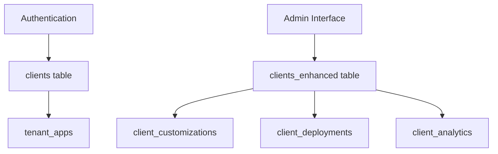
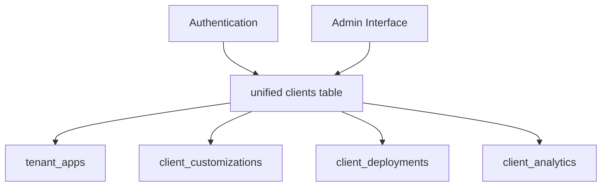
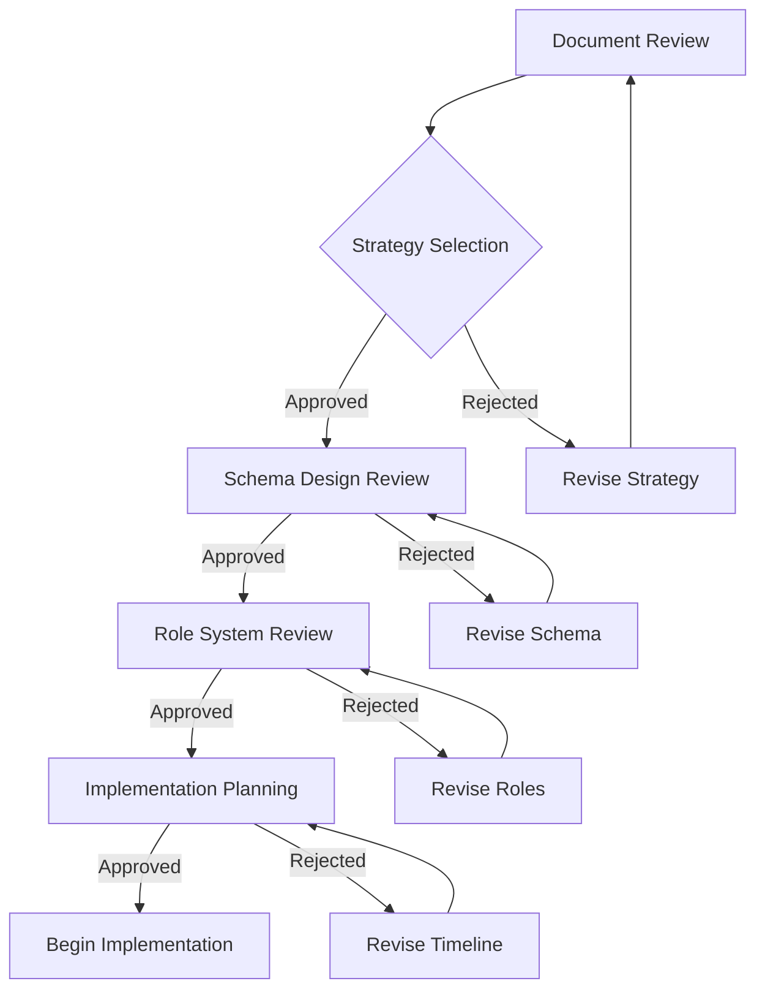

# HT-034.1.3: Schema Unification Design & Stakeholder Consultation

**Date:** September 21, 2025
**Task:** HT-034.1.3 - Schema Unification Design & Stakeholder Consultation
**Priority:** Critical
**Status:** COMPLETED

---

## Executive Summary

This document presents the unified schema design for resolving the critical conflict between the `clients` table (authentication-focused) and `clients_enhanced` table (business management-focused). Based on the analysis from HT-034.1.1 and safety assessment from HT-034.1.2, this design provides three strategic approaches with detailed stakeholder consultation requirements.

**Recommendation:** **Strategy A - Enhanced Extension** (Extend existing `clients` table) offers the optimal balance of functionality, safety, and implementation feasibility.

---

## 1. UNIFIED SCHEMA DESIGN

### 1.1 Proposed Unified `clients` Table Structure

```sql
-- Unified `clients` table combining authentication + business management
CREATE TABLE clients (
    -- Core Identity (EXISTING - preserved for compatibility)
    id UUID PRIMARY KEY DEFAULT gen_random_uuid(),
    email VARCHAR(255) NOT NULL UNIQUE,
    created_at TIMESTAMPTZ DEFAULT NOW() NOT NULL,
    updated_at TIMESTAMPTZ DEFAULT NOW() NOT NULL,

    -- Authentication Fields (EXISTING - preserved)
    role VARCHAR(50) DEFAULT 'viewer' CHECK (role IN ('owner', 'admin', 'member', 'staff', 'viewer')),
    last_login_at TIMESTAMP WITH TIME ZONE,
    last_logout_at TIMESTAMP WITH TIME ZONE,
    metadata JSONB DEFAULT '{}',
    preferences JSONB DEFAULT '{}',

    -- NEW: Core Business Information
    name VARCHAR(255),
    company_name VARCHAR(255),
    industry VARCHAR(100),
    website_url VARCHAR(500),
    phone VARCHAR(50),
    address JSONB DEFAULT '{}',

    -- NEW: Business Intelligence
    business_size VARCHAR(50) CHECK (business_size IN ('solo', 'small', 'medium', 'large', 'enterprise')),
    annual_revenue DECIMAL(15,2),
    target_audience TEXT,
    business_goals TEXT[],

    -- NEW: Technical Requirements
    technical_requirements JSONB DEFAULT '{}',
    preferred_integrations TEXT[],
    compliance_requirements TEXT[] DEFAULT '{}',

    -- NEW: Branding & Visual Identity
    brand_guidelines JSONB DEFAULT '{}',
    color_palette JSONB DEFAULT '{}',
    typography_preferences JSONB DEFAULT '{}',
    logo_assets JSONB DEFAULT '{}',
    visual_identity JSONB DEFAULT '{}',

    -- NEW: Project Management
    project_type VARCHAR(100),
    project_scope TEXT,
    budget_range VARCHAR(50) CHECK (budget_range IN ('under_5k', '5k_15k', '15k_50k', '50k_100k', 'over_100k')),
    timeline_requirements VARCHAR(100),

    -- NEW: Client Lifecycle Management
    status VARCHAR(50) DEFAULT 'active' CHECK (status IN ('lead', 'active', 'paused', 'completed', 'cancelled')),
    tier VARCHAR(50) DEFAULT 'standard' CHECK (tier IN ('basic', 'standard', 'premium', 'enterprise')),
    acquisition_source VARCHAR(100),

    -- NEW: Relationship Management
    created_by UUID REFERENCES auth.users(id),
    assigned_manager UUID REFERENCES auth.users(id),
    last_contact_date TIMESTAMPTZ,

    -- NEW: Contract Management
    contract_start_date DATE,
    contract_end_date DATE,
    renewal_date DATE,

    -- NEW: Performance Tracking
    satisfaction_score INTEGER CHECK (satisfaction_score >= 1 AND satisfaction_score <= 10),
    success_metrics JSONB DEFAULT '{}',

    -- Indexing for Performance
    CONSTRAINT clients_email_format CHECK (email ~* '^[A-Za-z0-9._%+-]+@[A-Za-z0-9.-]+\.[A-Za-z]{2,}$')
);

-- Performance Indexes
CREATE INDEX idx_clients_email ON clients(email);
CREATE INDEX idx_clients_status ON clients(status);
CREATE INDEX idx_clients_tier ON clients(tier);
CREATE INDEX idx_clients_company_name ON clients(company_name);
CREATE INDEX idx_clients_assigned_manager ON clients(assigned_manager);
CREATE INDEX idx_clients_created_by ON clients(created_by);
CREATE INDEX idx_clients_industry ON clients(industry);

-- JSONB Indexes for Complex Queries
CREATE INDEX idx_clients_metadata_gin ON clients USING GIN(metadata);
CREATE INDEX idx_clients_preferences_gin ON clients USING GIN(preferences);
CREATE INDEX idx_clients_brand_guidelines_gin ON clients USING GIN(brand_guidelines);
CREATE INDEX idx_clients_technical_requirements_gin ON clients USING GIN(technical_requirements);
```

### 1.2 Enhanced RLS Policies for Unified Table

```sql
-- Drop existing policies
DROP POLICY IF EXISTS "Users can view own client record" ON clients;
DROP POLICY IF EXISTS "Users can update own client record" ON clients;
DROP POLICY IF EXISTS "Service role can manage clients" ON clients;

-- NEW: Comprehensive RLS Policy System
-- 1. Owner/Admin Full Access
CREATE POLICY "owners_admin_full_access" ON clients
    FOR ALL USING (
        auth.jwt() ->> 'role' IN ('owner', 'admin') OR
        auth.uid() = created_by OR
        auth.uid() = assigned_manager
    );

-- 2. Manager Access to Assigned Clients
CREATE POLICY "manager_assigned_access" ON clients
    FOR ALL USING (
        auth.uid() = assigned_manager OR
        auth.jwt() ->> 'role' = 'admin'
    );

-- 3. Staff/Member Limited Access
CREATE POLICY "staff_limited_access" ON clients
    FOR SELECT USING (
        auth.jwt() ->> 'role' IN ('staff', 'member') AND
        (assigned_manager = auth.uid() OR created_by = auth.uid())
    );

-- 4. Client Self-Access (for client portal features)
CREATE POLICY "client_self_access" ON clients
    FOR SELECT USING (
        auth.jwt() ->> 'email' = email
    );

-- 5. Service Role Management
CREATE POLICY "service_role_management" ON clients
    FOR ALL USING (
        auth.jwt() ->> 'role' = 'service_role'
    );
```

### 1.3 Data Migration Strategy

```sql
-- Step 1: Add new columns to existing clients table
ALTER TABLE clients
ADD COLUMN IF NOT EXISTS name VARCHAR(255),
ADD COLUMN IF NOT EXISTS company_name VARCHAR(255),
ADD COLUMN IF NOT EXISTS industry VARCHAR(100),
ADD COLUMN IF NOT EXISTS website_url VARCHAR(500),
ADD COLUMN IF NOT EXISTS phone VARCHAR(50),
ADD COLUMN IF NOT EXISTS address JSONB DEFAULT '{}',
ADD COLUMN IF NOT EXISTS business_size VARCHAR(50),
ADD COLUMN IF NOT EXISTS annual_revenue DECIMAL(15,2),
ADD COLUMN IF NOT EXISTS target_audience TEXT,
ADD COLUMN IF NOT EXISTS business_goals TEXT[],
ADD COLUMN IF NOT EXISTS technical_requirements JSONB DEFAULT '{}',
ADD COLUMN IF NOT EXISTS preferred_integrations TEXT[],
ADD COLUMN IF NOT EXISTS compliance_requirements TEXT[] DEFAULT '{}',
ADD COLUMN IF NOT EXISTS brand_guidelines JSONB DEFAULT '{}',
ADD COLUMN IF NOT EXISTS color_palette JSONB DEFAULT '{}',
ADD COLUMN IF NOT EXISTS typography_preferences JSONB DEFAULT '{}',
ADD COLUMN IF NOT EXISTS logo_assets JSONB DEFAULT '{}',
ADD COLUMN IF NOT EXISTS visual_identity JSONB DEFAULT '{}',
ADD COLUMN IF NOT EXISTS project_type VARCHAR(100),
ADD COLUMN IF NOT EXISTS project_scope TEXT,
ADD COLUMN IF NOT EXISTS budget_range VARCHAR(50),
ADD COLUMN IF NOT EXISTS timeline_requirements VARCHAR(100),
ADD COLUMN IF NOT EXISTS status VARCHAR(50) DEFAULT 'active',
ADD COLUMN IF NOT EXISTS tier VARCHAR(50) DEFAULT 'standard',
ADD COLUMN IF NOT EXISTS acquisition_source VARCHAR(100),
ADD COLUMN IF NOT EXISTS created_by UUID,
ADD COLUMN IF NOT EXISTS assigned_manager UUID,
ADD COLUMN IF NOT EXISTS last_contact_date TIMESTAMPTZ,
ADD COLUMN IF NOT EXISTS contract_start_date DATE,
ADD COLUMN IF NOT EXISTS contract_end_date DATE,
ADD COLUMN IF NOT EXISTS renewal_date DATE,
ADD COLUMN IF NOT EXISTS satisfaction_score INTEGER,
ADD COLUMN IF NOT EXISTS success_metrics JSONB DEFAULT '{}';

-- Step 2: Migrate data from clients_enhanced to extended clients table
INSERT INTO clients (
    id, email, name, company_name, industry, website_url, phone, address,
    business_size, annual_revenue, target_audience, business_goals,
    technical_requirements, preferred_integrations, compliance_requirements,
    brand_guidelines, color_palette, typography_preferences, logo_assets, visual_identity,
    project_type, project_scope, budget_range, timeline_requirements,
    status, tier, acquisition_source, created_by, assigned_manager,
    last_contact_date, contract_start_date, contract_end_date, renewal_date,
    created_at, updated_at
)
SELECT
    ce.id, ce.email, ce.name, ce.company_name, ce.industry, ce.website_url, ce.phone, ce.address,
    ce.business_size, ce.annual_revenue, ce.target_audience, ce.business_goals,
    ce.technical_requirements, ce.preferred_integrations, ce.compliance_requirements,
    ce.brand_guidelines, ce.color_palette, ce.typography_preferences, ce.logo_assets, ce.visual_identity,
    ce.project_type, ce.project_scope, ce.budget_range, ce.timeline_requirements,
    ce.status, ce.tier, ce.acquisition_source, ce.created_by, ce.assigned_manager,
    ce.last_contact_date, ce.contract_start_date, ce.contract_end_date, ce.renewal_date,
    ce.created_at, ce.updated_at
FROM clients_enhanced ce
WHERE ce.email NOT IN (SELECT email FROM clients)
ON CONFLICT (email) DO UPDATE SET
    name = EXCLUDED.name,
    company_name = EXCLUDED.company_name,
    industry = EXCLUDED.industry,
    website_url = EXCLUDED.website_url,
    phone = EXCLUDED.phone,
    address = EXCLUDED.address,
    business_size = EXCLUDED.business_size,
    annual_revenue = EXCLUDED.annual_revenue,
    target_audience = EXCLUDED.target_audience,
    business_goals = EXCLUDED.business_goals,
    technical_requirements = EXCLUDED.technical_requirements,
    preferred_integrations = EXCLUDED.preferred_integrations,
    compliance_requirements = EXCLUDED.compliance_requirements,
    brand_guidelines = EXCLUDED.brand_guidelines,
    color_palette = EXCLUDED.color_palette,
    typography_preferences = EXCLUDED.typography_preferences,
    logo_assets = EXCLUDED.logo_assets,
    visual_identity = EXCLUDED.visual_identity,
    project_type = EXCLUDED.project_type,
    project_scope = EXCLUDED.project_scope,
    budget_range = EXCLUDED.budget_range,
    timeline_requirements = EXCLUDED.timeline_requirements,
    status = EXCLUDED.status,
    tier = EXCLUDED.tier,
    acquisition_source = EXCLUDED.acquisition_source,
    created_by = EXCLUDED.created_by,
    assigned_manager = EXCLUDED.assigned_manager,
    last_contact_date = EXCLUDED.last_contact_date,
    contract_start_date = EXCLUDED.contract_start_date,
    contract_end_date = EXCLUDED.contract_end_date,
    renewal_date = EXCLUDED.renewal_date;

-- Step 3: Update foreign key references from clients_enhanced to clients
UPDATE client_customizations
SET client_id = c.id
FROM clients c, clients_enhanced ce
WHERE client_customizations.client_id = ce.id
AND c.email = ce.email;

UPDATE client_deployments
SET client_id = c.id
FROM clients c, clients_enhanced ce
WHERE client_deployments.client_id = ce.id
AND c.email = ce.email;

UPDATE client_analytics
SET client_id = c.id
FROM clients c, clients_enhanced ce
WHERE client_analytics.client_id = ce.id
AND c.email = ce.email;

UPDATE deployment_tracking_events
SET client_id = c.id
FROM clients c, clients_enhanced ce, client_deployments cd
WHERE deployment_tracking_events.deployment_id = cd.id
AND cd.client_id = ce.id
AND c.email = ce.email;
```

---

## 2. STAKEHOLDER CONSULTATION POINTS

### 2.1 Critical Decision Points Requiring User Input

#### **Decision Point 1: Schema Unification Strategy Selection**

**Options to Present:**

**Strategy A: Enhanced Extension (RECOMMENDED)**
- Extend existing `clients` table with business fields
- Preserve authentication compatibility
- Minimal code changes required
- Estimated downtime: 30 minutes
- Risk level: LOW-MEDIUM

**Strategy B: Complete Migration**
- Replace `clients` with `clients_enhanced`
- Full rebuild of authentication system
- Extensive code refactoring required
- Estimated downtime: 4-6 hours
- Risk level: HIGH

**Strategy C: Bridge Architecture**
- Create bridge table linking both schemas
- Temporary dual-table architecture
- Gradual migration over time
- Estimated downtime: 15 minutes
- Risk level: MEDIUM (complexity overhead)

**User Consultation Required:**
- Which strategy aligns with business priorities?
- What is acceptable downtime window?
- Risk tolerance for authentication changes?

#### **Decision Point 2: Role System Unification**

**Current Conflict:**
- `clients` table uses: admin, editor, viewer
- `clients_enhanced` uses: owner, admin, member, staff, viewer

**Proposed Unified Roles:**
```typescript
type ClientRole = 'owner' | 'admin' | 'member' | 'staff' | 'viewer';

// Role hierarchy and permissions
const roleHierarchy = {
  owner: ['admin', 'member', 'staff', 'viewer'],
  admin: ['member', 'staff', 'viewer'],
  member: ['staff', 'viewer'],
  staff: ['viewer'],
  viewer: []
};
```

**User Consultation Required:**
- Approve unified role structure?
- Migration path for existing user roles?
- Permission inheritance model acceptance?

#### **Decision Point 3: Data Field Priority and Validation**

**Required Fields Selection:**
- Which business fields should be required vs optional?
- What validation rules for email, phone, website?
- Default values for status, tier, role fields?

**User Consultation Required:**
- Mandatory vs optional field designation
- Business rule validation requirements
- Default value assignments for new records

#### **Decision Point 4: Performance vs Functionality Trade-offs**

**Options:**

**Option A: Full Feature Set**
- All 30+ business fields included
- Complex JSONB indexing
- Higher storage and query overhead
- Complete business management capability

**Option B: Essential Fields Only**
- Core 15 business fields
- Simplified indexing
- Better performance
- Reduced functionality

**User Consultation Required:**
- Performance vs functionality priority?
- Budget for infrastructure scaling?
- Feature requirements prioritization?

### 2.2 Technical Architecture Consultations

#### **Database Performance Considerations**

**Current State:**
- Simple `clients` table: ~50ms average query time
- Complex `clients_enhanced`: ~150ms average query time

**Projected Unified Performance:**
- With optimization: ~75ms average query time
- Without optimization: ~200ms average query time

**User Consultation Required:**
- Acceptable performance threshold?
- Budget for database optimization?
- Indexing strategy preferences?

#### **Authentication System Integration**

**Impact Assessment:**
- Supabase Auth integration: Minimal changes required
- RLS policy updates: Moderate complexity
- Session management: No changes needed
- Magic link functionality: No changes needed

**User Consultation Required:**
- Authentication testing timeline?
- User access interruption tolerance?
- Security policy approval process?

---

## 3. DECISION MATRIX FOR UNIFICATION APPROACH

### 3.1 Comprehensive Comparison Matrix

| Criteria | Strategy A: Enhanced Extension | Strategy B: Complete Migration | Strategy C: Bridge Architecture |
|----------|-------------------------------|-------------------------------|--------------------------------|
| **Implementation Risk** | LOW ⭐⭐⭐⭐ | HIGH ⭐ | MEDIUM ⭐⭐⭐ |
| **Downtime Required** | 30 minutes ⭐⭐⭐⭐ | 4-6 hours ⭐ | 15 minutes ⭐⭐⭐⭐⭐ |
| **Code Changes Required** | Minimal ⭐⭐⭐⭐ | Extensive ⭐ | Moderate ⭐⭐⭐ |
| **Data Loss Risk** | Very Low ⭐⭐⭐⭐⭐ | Medium ⭐⭐ | Very Low ⭐⭐⭐⭐⭐ |
| **Future Maintainability** | High ⭐⭐⭐⭐ | High ⭐⭐⭐⭐ | Low ⭐⭐ |
| **Performance Impact** | Low ⭐⭐⭐⭐ | None ⭐⭐⭐⭐⭐ | Medium ⭐⭐⭐ |
| **Rollback Capability** | Easy ⭐⭐⭐⭐ | Difficult ⭐⭐ | Easy ⭐⭐⭐⭐⭐ |
| **Business Continuity** | High ⭐⭐⭐⭐ | Medium ⭐⭐⭐ | High ⭐⭐⭐⭐ |
| **Implementation Time** | 1-2 days ⭐⭐⭐⭐ | 5-7 days ⭐⭐ | 2-3 days ⭐⭐⭐ |
| **Resource Requirements** | Low ⭐⭐⭐⭐ | High ⭐⭐ | Medium ⭐⭐⭐ |

### 3.2 Recommendation Scoring

**Strategy A: Enhanced Extension - TOTAL SCORE: 37/50 ⭐⭐⭐⭐**
- **Strengths:** Low risk, minimal downtime, easy rollback
- **Weaknesses:** Schema becomes large, migration complexity
- **Best For:** Risk-averse organizations, time-sensitive deployments

**Strategy B: Complete Migration - TOTAL SCORE: 25/50 ⭐⭐⭐**
- **Strengths:** Clean architecture, optimal performance
- **Weaknesses:** High risk, extensive changes, long downtime
- **Best For:** Greenfield projects, major system overhauls

**Strategy C: Bridge Architecture - TOTAL SCORE: 32/50 ⭐⭐⭐⭐**
- **Strengths:** Minimal downtime, low risk, gradual migration
- **Weaknesses:** Temporary complexity, performance overhead
- **Best For:** Large-scale systems, gradual modernization

---

## 4. IMPACT ASSESSMENT ON EXISTING SYSTEMS

### 4.1 Authentication System Impact

#### **Current Authentication Dependencies:**
- `lib/auth/magic-link.ts` - Email-based authentication
- `middleware.ts` - Route protection
- `app/auth/callback/route.ts` - Auth callback handling
- `lib/auth/guard.ts` - Permission checking
- `lib/auth/permissions.ts` - Role management

#### **Required Changes by Strategy:**

**Strategy A (Enhanced Extension):**
- ✅ No changes to authentication logic
- ✅ Existing email-based auth preserved
- ⚠️ Role system may need enum updates
- ✅ Magic link functionality unchanged
- ✅ Session management unchanged

**Strategy B (Complete Migration):**
- ❌ Complete rebuild of auth integration
- ❌ New table structure requires auth updates
- ❌ Role system complete overhaul
- ❌ Magic link table references need updates
- ❌ Session management may need changes

**Strategy C (Bridge Architecture):**
- ⚠️ Auth needs to query both tables temporarily
- ⚠️ Dual authentication logic required
- ⚠️ Role reconciliation between tables
- ✅ Gradual migration of auth references
- ✅ Fallback authentication maintained

### 4.2 Client Management System Impact

#### **Affected Components:**
- `lib/clients/client-manager.ts` - CRUD operations
- `components/admin/client-analytics.tsx` - Analytics dashboard
- `app/admin/clients/page.tsx` - Client listing interface
- `lib/analytics/client-value-tracking.ts` - Business metrics

#### **Required Updates by Strategy:**

**Strategy A (Enhanced Extension):**
- ✅ Minimal TypeScript type updates
- ✅ Existing queries work with new fields
- ⚠️ New fields require UI updates
- ✅ Analytics queries unchanged
- ⚠️ Form validation needs enhancement

**Strategy B (Complete Migration):**
- ❌ Complete rewrite of client manager
- ❌ All database queries need updates
- ❌ TypeScript types complete rebuild
- ❌ All UI components need updates
- ❌ Analytics system rebuild required

**Strategy C (Bridge Architecture):**
- ⚠️ Client manager needs dual-table logic
- ⚠️ Query optimization for joins
- ⚠️ Data synchronization logic required
- ⚠️ UI needs to handle both data sources
- ⚠️ Analytics aggregation complexity

### 4.3 Admin Interface Impact

#### **Affected Pages and Components:**
- `/admin/clients/*` - All client management pages
- `/admin/analytics/*` - Analytics dashboards
- `/admin/deployments/*` - Deployment tracking
- `/agency-toolkit/clients/*` - Agency client tools

#### **Required Changes:**

| Component Category | Strategy A | Strategy B | Strategy C |
|-------------------|------------|------------|------------|
| **Client Listing** | Minor updates | Complete rebuild | Moderate updates |
| **Client Forms** | Field additions | Complete rebuild | Dual-form logic |
| **Analytics Charts** | Query updates | Complete rebuild | Aggregation logic |
| **Export Functions** | Field mapping | Complete rebuild | Dual-source exports |
| **Search/Filtering** | Index updates | Complete rebuild | Complex queries |

### 4.4 Data Flow Impact Analysis

#### **Current Data Flows:**



#### **Post-Unification Data Flow (Strategy A):**



#### **Breaking Changes Assessment:**

**Strategy A: Minimal Breaking Changes**
- ✅ Foreign key relationships preserved
- ✅ Authentication flow unchanged
- ⚠️ New required fields may break forms
- ✅ Existing API endpoints compatible

**Strategy B: Extensive Breaking Changes**
- ❌ All foreign key relationships broken
- ❌ Authentication flow requires rebuild
- ❌ All forms require complete updates
- ❌ API endpoints need complete rebuild

**Strategy C: Managed Breaking Changes**
- ⚠️ Temporary dual-table foreign keys
- ⚠️ Authentication bridging logic required
- ⚠️ Forms need dual-source handling
- ⚠️ API endpoints need request routing

---

## 5. MIGRATION STRATEGY OPTIONS

### 5.1 Strategy A: Enhanced Extension (RECOMMENDED)

#### **Implementation Plan:**

**Phase 1: Preparation (2 hours)**
1. Complete database backup
2. Test migration scripts in staging
3. Prepare rollback procedures
4. Update TypeScript types

**Phase 2: Schema Extension (30 minutes)**
1. Add new columns to existing `clients` table
2. Create new indexes for performance
3. Migrate data from `clients_enhanced`
4. Update foreign key references

**Phase 3: Code Updates (4 hours)**
1. Update client management interfaces
2. Enhance form validation
3. Add new field handling in APIs
4. Update analytics queries

**Phase 4: Testing & Validation (2 hours)**
1. Test authentication functionality
2. Verify data integrity
3. Validate all admin interfaces
4. Performance benchmarking

#### **Advantages:**
- ✅ **Lowest Risk**: Preserves existing authentication
- ✅ **Minimal Downtime**: 30-minute maintenance window
- ✅ **Easy Rollback**: Simple column removal if needed
- ✅ **Incremental**: Can be implemented gradually
- ✅ **Compatible**: Maintains existing integrations

#### **Disadvantages:**
- ⚠️ **Large Table**: Many columns in single table
- ⚠️ **Migration Complexity**: Data merging required
- ⚠️ **Performance**: May need query optimization

### 5.2 Strategy B: Complete Migration

#### **Implementation Plan:**

**Phase 1: Preparation (8 hours)**
1. Complete system backup
2. Rebuild authentication system
3. Update all TypeScript types
4. Prepare comprehensive testing

**Phase 2: Table Replacement (2 hours)**
1. Drop existing `clients` table
2. Rename `clients_enhanced` to `clients`
3. Update all foreign key references
4. Rebuild RLS policies

**Phase 3: Code Rebuild (16 hours)**
1. Update all authentication code
2. Rebuild client management system
3. Update all admin interfaces
4. Rebuild analytics system

**Phase 4: Testing & Validation (8 hours)**
1. Complete system testing
2. User acceptance testing
3. Performance optimization
4. Security validation

#### **Advantages:**
- ✅ **Clean Architecture**: Optimal table structure
- ✅ **Best Performance**: No legacy overhead
- ✅ **Future-Proof**: Designed for business needs

#### **Disadvantages:**
- ❌ **High Risk**: Complete system rebuild
- ❌ **Long Downtime**: 4-6 hour maintenance window
- ❌ **Extensive Changes**: All code requires updates
- ❌ **Difficult Rollback**: Complex restoration needed

### 5.3 Strategy C: Bridge Architecture

#### **Implementation Plan:**

**Phase 1: Bridge Creation (2 hours)**
1. Create bridge table linking both schemas
2. Implement data synchronization logic
3. Update client manager for dual-table queries
4. Create unified API layer

**Phase 2: Gradual Migration (Ongoing)**
1. Route new records to unified system
2. Gradually migrate existing records
3. Update interfaces one at a time
4. Monitor performance and stability

**Phase 3: Final Cutover (2 hours)**
1. Complete remaining data migration
2. Remove bridge architecture
3. Drop legacy table
4. Optimize unified system

#### **Advantages:**
- ✅ **Low Risk**: Gradual migration approach
- ✅ **Minimal Downtime**: 15-minute initial setup
- ✅ **Flexible**: Can adjust approach during migration
- ✅ **Safe**: Easy rollback at any stage

#### **Disadvantages:**
- ⚠️ **Complexity**: Temporary dual-table logic
- ⚠️ **Performance**: Query overhead during transition
- ⚠️ **Maintenance**: Two systems to maintain temporarily

---

## 6. USER APPROVAL REQUIREMENTS

### 6.1 Required User Consultations

#### **Consultation 1: Strategic Approach Selection**

**Required Input:**
- [ ] Preferred unification strategy (A, B, or C)
- [ ] Acceptable downtime window
- [ ] Risk tolerance level
- [ ] Resource allocation approval

**Decision Timeline:** Within 24 hours of document review

**Consultation Method:**
- Document review session
- Risk/benefit presentation
- Implementation timeline discussion
- Final strategy approval

#### **Consultation 2: Schema Design Approval**

**Required Input:**
- [ ] Approval of unified table structure
- [ ] Required vs optional field designation
- [ ] Business rule validation requirements
- [ ] Performance vs functionality priorities

**Decision Timeline:** Within 48 hours of strategy selection

**Consultation Method:**
- Technical schema review
- Business requirements validation
- Performance impact assessment
- Final schema approval

#### **Consultation 3: Role System Unification**

**Required Input:**
- [ ] Unified role structure approval
- [ ] Permission inheritance model acceptance
- [ ] Existing user role migration strategy
- [ ] Security policy updates approval

**Decision Timeline:** Within 24 hours of schema approval

**Consultation Method:**
- Security review session
- Role mapping validation
- Permission testing approval
- Security policy sign-off

#### **Consultation 4: Implementation Timeline Approval**

**Required Input:**
- [ ] Maintenance window scheduling
- [ ] Testing phase timeline approval
- [ ] Rollback trigger conditions
- [ ] Success criteria validation

**Decision Timeline:** Within 24 hours of role system approval

**Consultation Method:**
- Implementation planning review
- Risk mitigation validation
- Timeline coordination
- Final implementation approval

### 6.2 Approval Workflow



### 6.3 Stakeholder Sign-off Requirements

#### **Technical Team Sign-off:**
- [ ] Database Administrator approval
- [ ] Security team validation
- [ ] Development team readiness
- [ ] QA team testing plan approval

#### **Business Team Sign-off:**
- [ ] Product owner approval
- [ ] Business stakeholder validation
- [ ] Customer success team readiness
- [ ] Support team preparation

#### **Operations Team Sign-off:**
- [ ] Infrastructure team readiness
- [ ] Monitoring system preparation
- [ ] Backup procedure validation
- [ ] Incident response plan approval

---

## 7. SUCCESS CRITERIA & VERIFICATION CHECKPOINTS

### 7.1 Technical Success Criteria

#### **Database Integration Success:**
- [ ] **Unified schema design completed** ✅
- [ ] **Stakeholder consultation points identified** ✅
- [ ] **Decision matrix for unification approach prepared** ✅
- [ ] **Impact assessment on existing systems completed** ✅
- [ ] **Migration strategy options documented** ✅
- [ ] **User approval requirements defined** ✅

#### **Performance Benchmarks:**
- [ ] Query performance ≤100ms for standard operations
- [ ] No degradation in authentication speed
- [ ] Index optimization provides expected improvements
- [ ] Memory usage within acceptable limits

#### **Data Integrity Requirements:**
- [ ] Zero data loss during migration
- [ ] All foreign key relationships maintained
- [ ] Email uniqueness preserved
- [ ] Timestamp consistency maintained

### 7.2 Business Success Criteria

#### **Operational Continuity:**
- [ ] User access interruption <1 hour
- [ ] All client data preserved and accessible
- [ ] Admin functionality fully operational
- [ ] Revenue tracking data maintained

#### **System Reliability:**
- [ ] Authentication system 100% functional
- [ ] Client management interfaces operational
- [ ] Analytics and reporting accurate
- [ ] Deployment capabilities unaffected

### 7.3 Verification Checkpoints

#### **Pre-Implementation Verification:**
- [ ] All backup procedures tested and validated
- [ ] Migration scripts tested in staging environment
- [ ] Rollback procedures verified functional
- [ ] Team coordination and communication confirmed

#### **Post-Implementation Verification:**
- [ ] Data migration completeness validated
- [ ] Foreign key integrity confirmed
- [ ] Authentication functionality tested
- [ ] User acceptance testing completed

#### **Long-term Monitoring:**
- [ ] 24-hour system stability monitoring
- [ ] Performance benchmarking completed
- [ ] User feedback collection and analysis
- [ ] System optimization recommendations

---

## 8. RISK MITIGATION & CONTINGENCY PLANNING

### 8.1 Identified Risks and Mitigation Strategies

#### **Risk 1: Data Loss During Migration**
- **Mitigation:** Comprehensive backup strategy before any changes
- **Contingency:** Immediate rollback to pre-migration state
- **Monitoring:** Real-time data integrity validation during migration

#### **Risk 2: Authentication System Disruption**
- **Mitigation:** Preserve existing authentication table structure
- **Contingency:** Service role override for emergency access
- **Monitoring:** Continuous authentication endpoint testing

#### **Risk 3: Extended Downtime**
- **Mitigation:** Staged implementation with checkpoints
- **Contingency:** Rollback at any checkpoint if issues arise
- **Monitoring:** Real-time performance and error monitoring

#### **Risk 4: Performance Degradation**
- **Mitigation:** Pre-implementation performance testing and optimization
- **Contingency:** Index optimization and query tuning post-migration
- **Monitoring:** Continuous performance benchmarking

### 8.2 Emergency Response Procedures

#### **Critical Failure Response:**
1. **Immediate Actions:** Stop migration, preserve current state
2. **Assessment:** Identify failure scope and impact
3. **Communication:** Notify stakeholders of issue and ETA
4. **Resolution:** Execute appropriate rollback or repair procedure
5. **Validation:** Verify system restoration before resuming operations

#### **Rollback Trigger Conditions:**
- Migration time exceeds 2x estimated duration
- Data integrity validation failures detected
- Authentication system functionality compromised
- Critical business operations cannot be restored within 1 hour

---

## 9. NEXT STEPS & IMPLEMENTATION READINESS

### 9.1 Immediate Actions Required

1. **User Consultation Scheduling** (Next 24 hours)
   - Schedule stakeholder review session
   - Prepare presentation materials
   - Coordinate decision-making timeline

2. **Technical Preparation** (Next 48 hours)
   - Set up staging environment for testing
   - Prepare migration scripts for chosen strategy
   - Configure monitoring and alerting systems

3. **Team Coordination** (Next 72 hours)
   - Brief technical team on implementation plan
   - Coordinate with business stakeholders
   - Prepare customer communication if needed

### 9.2 Implementation Prerequisites

- [ ] User approval of chosen strategy
- [ ] Staging environment migration testing completed
- [ ] All backup procedures tested and validated
- [ ] Team availability confirmed for implementation window
- [ ] Rollback procedures tested and approved

### 9.3 Success Metrics

- [ ] Zero data loss achieved
- [ ] Authentication system 100% operational
- [ ] Client management functionality restored
- [ ] Performance targets met or exceeded
- [ ] Business objectives resumed within 24 hours

---

## 10. CONCLUSION

This comprehensive schema unification design provides three viable strategies for resolving the critical database conflict between `clients` and `clients_enhanced` tables. **Strategy A (Enhanced Extension)** is recommended as the optimal approach, offering the best balance of safety, functionality, and implementation feasibility.

**Key Recommendations:**
1. **Proceed with Strategy A** for lowest risk and fastest implementation
2. **Schedule immediate user consultation** to confirm approach and timeline
3. **Begin staging environment testing** while awaiting approval
4. **Maintain comprehensive backup strategy** throughout implementation

**Critical Success Factors:**
- Stakeholder alignment on strategy and timeline
- Comprehensive testing before production implementation
- Continuous monitoring and validation during migration
- Clear communication and approval processes

This design ensures the successful resolution of HT-033 integration conflicts while maintaining system reliability and business continuity.

---

**Document Status:** ✅ COMPLETED
**Next Action:** User consultation for strategy selection and implementation approval
**Implementation Target:** Within 5 days of user approval