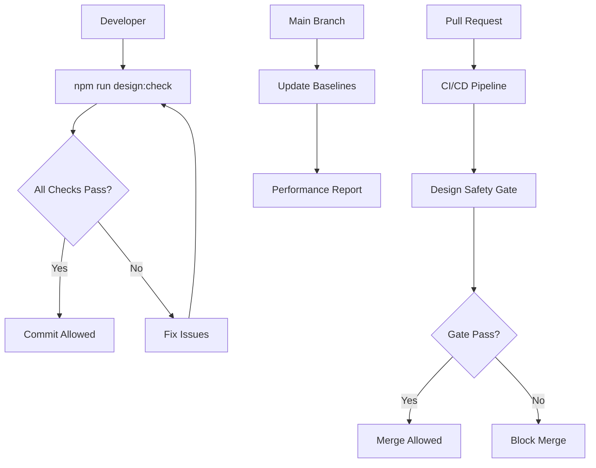

# OSS Hero Design Safety - Portability Pack

This portability pack allows you to **drop the OSS Hero Design Safety Module into any micro-app** with zero configuration. The system provides enterprise-grade design safety that scales from individual developers to large teams.

## Quick Start

### 1. Install the Module
```bash
# Clone this repo and run the installer from your target project
git clone <this-repo>
cd <your-target-project>
node <this-repo>/scripts/oss-hero-port/install-design-module.mjs
```

### 2. Initial Setup
```bash
# Install dependencies and run first check
npm install
npm run design:check

# Seed visual baselines (first time only)
npx playwright test tests/ui/visual.spec.ts --update-snapshots
```

### 3. Validate Installation
```bash
# Test the self-check workflow
gh workflow run oss-hero-port-selftest.yml
# OR manually trigger via GitHub Actions UI
```

## What Gets Installed

### 📁 **Design Policies** (`design/policies/`)
- **Import boundaries**: Prevents business logic leaking into UI components
- **Token guards**: Enforces design system consistency
- **ESLint configurations**: Required and advisory rule sets

### 🧪 **Test Infrastructure** (`tests/ui/`)
- **Accessibility tests**: WCAG compliance and keyboard navigation
- **Visual regression tests**: Pixel-perfect UI consistency
- **Smoke tests**: Basic functionality validation
- **Cross-browser configs**: Desktop Chrome, Firefox, Safari

### 🔧 **Build Integration** (`package.json` scripts)
- `design:check`: Complete design safety validation
- `ui:contracts`: Component API stability testing
- `ui:a11y`: Accessibility test suite
- `ui:visual`: Visual regression testing
- `ui:perf`: Performance budget monitoring

### 🚀 **CI/CD Workflows** (`.github/workflows/`)
- **Design safety gate**: Blocks PRs with design violations
- **Visual baseline updates**: Automatic screenshot management
- **Performance monitoring**: Lighthouse CI integration
- **Self-test workflow**: Validates module installation

## Architecture Overview



## Core Features

### 🚫 **Import Boundary Enforcement**
Prevents architectural violations:
```javascript
// ❌ BLOCKED: Adapter in UI component
import { DatabaseAdapter } from '@app/adapters';

// ✅ ALLOWED: Hook-based access
import { useUserData } from '@app/hooks';
```

### ♿ **Accessibility First**
Automated a11y testing:
- Keyboard navigation validation
- Screen reader compatibility
- WCAG 2.1 AA compliance
- Focus management verification

### 🎨 **Visual Consistency**
Pixel-perfect regression testing:
- Cross-browser screenshot comparison
- Responsive design validation
- Component library integrity
- Design token enforcement

### ⚡ **Performance Budgets**
Proactive performance monitoring:
- Bundle size limits
- Core Web Vitals tracking
- Network timing budgets
- Resource optimization alerts

## Configuration

### Environment Variables
```bash
# Optional: Customize enforcement levels
DESIGN_SAFETY_LEVEL=strict    # strict | advisory | disabled
VISUAL_THRESHOLD=0.1          # Pixel difference tolerance
PERF_BUDGET_BREACH=error      # error | warning | disabled
```

### Custom Rules
```javascript
// design/policies/custom-rules.cjs
module.exports = {
  rules: {
    '@myorg/no-direct-api-calls': 'error',
    '@myorg/use-design-tokens': 'warn'
  }
};
```

## Migration Strategies

### From Existing Projects
1. **Start with advisory mode** to understand current violations
2. **Fix critical issues** (accessibility, security boundaries)
3. **Gradually increase enforcement** as team adapts
4. **Enable strict mode** for new features first

### Team Adoption
```bash
# Week 1: Install and observe
npm run design:check --fix

# Week 2: Fix boundary violations
npm run design:check --report

# Week 3: Enable CI enforcement
# Enable workflows in .github/workflows/

# Week 4: Full enforcement
# Remove continue-on-error flags
```

## Maintenance

### Regular Tasks
```bash
# Weekly: Update visual baselines
npx playwright test tests/ui/visual.spec.ts --update-snapshots

# Monthly: Review performance trends
npm run ui:perf --report

# Quarterly: Update design tokens
# Edit design/tokens/ files
```

### Monitoring
- **GitHub Actions**: Check workflow success rates
- **Performance dashboards**: Monitor Core Web Vitals
- **Accessibility reports**: Track WCAG compliance scores

## Troubleshooting

### Common Setup Issues

**Module not found errors**
```bash
# Ensure all dependencies are installed
npm install --include=dev
```

**Visual test failures**
```bash
# First run always needs baseline creation
npx playwright test tests/ui/visual.spec.ts --update-snapshots
```

**Permission errors in CI**
```yaml
# Ensure workflow has write permissions
permissions:
  contents: write
  pull-requests: write
```

### Performance Issues

**Slow CI builds**
- Enable test parallelization in `playwright.config.ts`
- Use dependency caching in workflows
- Consider splitting visual tests by viewport

**Large screenshot files**
- Adjust viewport sizes in test configs
- Use compressed PNG format
- Implement screenshot cleanup policies

## Advanced Usage

### Custom Auditors
```javascript
// design/scripts/custom-auditor.mjs
export class CustomAuditor {
  async auditComponentProps(component) {
    // Custom validation logic
  }
}
```

### Integration with Design Systems
```javascript
// design/tokens/theme.js
export const designTokens = {
  colors: { /* ... */ },
  spacing: { /* ... */ },
  typography: { /* ... */ }
};
```

### Multi-environment Testing
```yaml
# .github/workflows/design-safety.yml
strategy:
  matrix:
    environment: [development, staging, production]
    browser: [chrome, firefox, safari]
```

## Success Metrics

Track these KPIs to measure design safety impact:

### Quality Metrics
- **Accessibility score**: WCAG compliance percentage
- **Visual consistency**: Regression test pass rate
- **Performance budget**: Core Web Vitals compliance
- **Architecture health**: Boundary violation count

### Developer Experience
- **Setup time**: From clone to first green build
- **Fix time**: Average time to resolve design safety issues
- **False positive rate**: Percentage of invalid failures
- **Developer satisfaction**: Team feedback scores

### Business Impact
- **Design debt reduction**: Tracked architectural violations
- **User experience consistency**: Cross-component design variance
- **Performance improvement**: Loading time optimization
- **Accessibility compliance**: Legal/regulatory adherence

## Support

### Documentation
- **Setup guide**: This README
- **API reference**: `docs/design-safety-module.md`
- **PR checklist**: `docs/snippets/pr-checklist-design-safety.md`

### Community
- **Issues**: Report bugs and feature requests
- **Discussions**: Ask questions and share patterns
- **Contributing**: Improve the module for everyone

---

## Summary

The OSS Hero Design Safety Module is ready to drop into your micro-app! 

**Installation time**: ~5 minutes  
**First green build**: ~10 minutes  
**Team onboarding**: ~1 week  
**Full ROI**: ~1 month  

The module provides enterprise-grade design safety with zero ongoing maintenance overhead. Your team gets the benefits of design consistency, accessibility compliance, and performance monitoring without the complexity of building and maintaining these systems internally.

