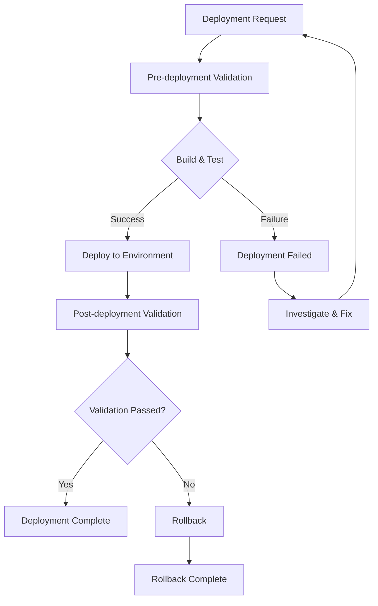

# Design System Deployment Documentation

## Overview

This document provides comprehensive guidance for deploying the design system across different environments. The deployment system includes automated validation, monitoring, and rollback capabilities to ensure reliable and safe deployments.

## Table of Contents

1. [Deployment Architecture](#deployment-architecture)
2. [Environment Configuration](#environment-configuration)
3. [Deployment Process](#deployment-process)
4. [Validation and Testing](#validation-and-testing)
5. [Monitoring and Alerting](#monitoring-and-alerting)
6. [Rollback Procedures](#rollback-procedures)
7. [Troubleshooting](#troubleshooting)
8. [Best Practices](#best-practices)

## Deployment Architecture

### Components

- **Deployment Script**: `scripts/design-system-deployment.ts`
- **Validation Script**: `scripts/design-system-validation-deployment.ts`
- **Monitoring Script**: `scripts/design-system-monitoring.ts`
- **Rollback Script**: `scripts/design-system-rollback.ts`
- **Configuration**: `design-system-deployment.config.ts`

### Workflow



## Environment Configuration

### Development Environment

- **URL**: `http://localhost:3000`
- **Health Check**: `http://localhost:3000/api/health`
- **Build Command**: `npm run build`
- **Deploy Command**: `npm run dev`
- **Rollback Strategy**: Immediate
- **Validation Checks**: Basic (unit tests, linting, type checking)

### Staging Environment

- **URL**: `https://staging.example.com`
- **Health Check**: `https://staging.example.com/api/health`
- **Build Command**: `npm run build:staging`
- **Deploy Command**: `npm run deploy:staging`
- **Rollback Strategy**: Gradual (10% every 5 minutes)
- **Validation Checks**: Comprehensive (all tests, performance, security)

### Production Environment

- **URL**: `https://example.com`
- **Health Check**: `https://example.com/api/health`
- **Build Command**: `npm run build:production`
- **Deploy Command**: `npm run deploy:production`
- **Rollback Strategy**: Immediate
- **Validation Checks**: Full (all tests, performance, security, compliance)

## Deployment Process

### 1. Pre-deployment

```bash
# Validate deployment prerequisites
npm run design-system:validate

# Run comprehensive tests
npm run test:all

# Check security vulnerabilities
npm audit --audit-level=moderate
```

### 2. Build and Test

```bash
# Build the application
npm run build

# Run test suite
npm run design-system:test

# Run visual regression tests
npm run design-system:test:visual

# Run accessibility tests
npm run test:accessibility:comprehensive

# Run performance tests
npm run test:performance:lighthouse

# Run security tests
npm run test:security:comprehensive
```

### 3. Deploy

```bash
# Deploy to development
npm run deploy:dev

# Deploy to staging
npm run deploy:staging

# Deploy to production
npm run deploy:production
```

### 4. Post-deployment Validation

```bash
# Validate deployment
npm run design-system:validate:deployment

# Monitor system
npm run design-system:monitor

# Check health
curl -f https://example.com/api/health
```

## Validation and Testing

### Automated Validation

The deployment system includes comprehensive validation checks:

#### Build Validation
- Build artifacts existence
- Build size limits
- Build error detection

#### Test Validation
- Unit test coverage (minimum 80%)
- Integration test results
- Visual regression test results
- Accessibility test results
- Performance test results
- Security test results

#### Performance Validation
- Response time thresholds
- Page load time limits
- Lighthouse performance scores
- Core Web Vitals metrics

#### Security Validation
- Vulnerability scanning
- Secret detection
- Security policy compliance
- Penetration testing results

#### Accessibility Validation
- WCAG compliance levels
- Keyboard navigation
- Screen reader compatibility
- Color contrast ratios

### Manual Validation

#### Smoke Tests
- Critical user journeys
- Key functionality verification
- Basic performance checks

#### User Acceptance Testing
- Stakeholder approval
- User experience validation
- Business requirement verification

## Monitoring and Alerting

### Metrics Collection

#### Performance Metrics
- Response time
- Page load time
- First Contentful Paint (FCP)
- Largest Contentful Paint (LCP)
- Cumulative Layout Shift (CLS)
- First Input Delay (FID)

#### Error Metrics
- Error rate
- 4xx client errors
- 5xx server errors
- JavaScript errors

#### Security Metrics
- Security vulnerabilities
- Failed login attempts
- Suspicious activity

#### Availability Metrics
- Uptime percentage
- Availability percentage
- Health check status

#### Resource Metrics
- CPU usage
- Memory usage
- Disk usage
- Network usage

### Alerting

#### Alert Types
- **Performance**: Response time, page load time, Core Web Vitals
- **Error**: Error rate, client errors, server errors
- **Security**: Vulnerabilities, failed logins, suspicious activity
- **Availability**: Uptime, health check failures

#### Alert Channels
- Slack notifications
- Email alerts
- PagerDuty integration
- Webhook notifications

#### Alert Thresholds
- **Critical**: Immediate response required
- **High**: Response within 1 hour
- **Medium**: Response within 4 hours
- **Low**: Response within 24 hours

## Rollback Procedures

### Rollback Strategies

#### Immediate Rollback
- **Use Case**: Critical failures, security issues, performance degradation
- **Process**: Complete rollback to previous version
- **Time**: 2-5 minutes
- **Risk**: High (complete service interruption)

#### Gradual Rollback
- **Use Case**: Performance issues, user experience problems
- **Process**: Rollback traffic in increments (10% every 5 minutes)
- **Time**: 30-60 minutes
- **Risk**: Medium (partial service impact)

#### Manual Rollback
- **Use Case**: Complex issues requiring human intervention
- **Process**: Manual approval and execution
- **Time**: Variable
- **Risk**: Low (controlled process)

### Rollback Process

1. **Pre-rollback Validation**
   - Check target version existence
   - Verify system health
   - Validate rollback prerequisites

2. **Rollback Execution**
   - Create backup of current state
   - Switch to target version
   - Restart services

3. **Post-rollback Validation**
   - Health check verification
   - Smoke test execution
   - Performance validation
   - Security validation
   - Accessibility validation

### Rollback Commands

```bash
# Immediate rollback
npm run rollback:immediate

# Gradual rollback
npm run rollback:gradual

# Manual rollback
npm run rollback:manual

# Rollback to specific version
npm run rollback:version 1.2.3
```

## Troubleshooting

### Common Issues

#### Build Failures
- **Cause**: Compilation errors, dependency issues
- **Solution**: Fix compilation errors, update dependencies
- **Prevention**: Pre-deployment validation, dependency scanning

#### Test Failures
- **Cause**: Test code issues, environment problems
- **Solution**: Fix test code, verify environment setup
- **Prevention**: Comprehensive test coverage, environment validation

#### Deployment Failures
- **Cause**: Infrastructure issues, configuration problems
- **Solution**: Check infrastructure, verify configuration
- **Prevention**: Infrastructure monitoring, configuration validation

#### Performance Degradation
- **Cause**: Code changes, resource constraints
- **Solution**: Optimize code, scale resources
- **Prevention**: Performance testing, resource monitoring

#### Security Issues
- **Cause**: Vulnerabilities, configuration problems
- **Solution**: Patch vulnerabilities, fix configuration
- **Prevention**: Security scanning, compliance checks

### Debugging Steps

1. **Check Logs**
   - Build logs
   - Test logs
   - Deployment logs
   - Application logs

2. **Verify Configuration**
   - Environment variables
   - Configuration files
   - Dependencies

3. **Test Components**
   - Individual components
   - Integration points
   - External services

4. **Monitor Metrics**
   - Performance metrics
   - Error metrics
   - Resource metrics

## Best Practices

### Pre-deployment

- **Code Review**: Ensure all changes are reviewed
- **Testing**: Run comprehensive test suite
- **Validation**: Verify all validation checks pass
- **Documentation**: Update documentation for changes

### During Deployment

- **Monitoring**: Monitor deployment progress
- **Validation**: Verify each deployment step
- **Rollback**: Be prepared to rollback if issues arise
- **Communication**: Keep team informed of progress

### Post-deployment

- **Monitoring**: Monitor system performance
- **Validation**: Verify deployment success
- **Documentation**: Update deployment records
- **Feedback**: Collect user feedback

### Continuous Improvement

- **Metrics**: Track deployment metrics
- **Analysis**: Analyze deployment patterns
- **Optimization**: Optimize deployment process
- **Training**: Train team on procedures

## Security Considerations

### Access Control
- **Authentication**: Multi-factor authentication required
- **Authorization**: Role-based access control
- **Audit**: Comprehensive audit logging

### Data Protection
- **Encryption**: Data encryption in transit and at rest
- **Privacy**: Personal data protection compliance
- **Backup**: Secure backup procedures

### Compliance
- **Standards**: Industry standard compliance
- **Regulations**: Regulatory requirement adherence
- **Policies**: Security policy enforcement

## Performance Optimization

### Build Optimization
- **Code Splitting**: Optimize bundle sizes
- **Tree Shaking**: Remove unused code
- **Compression**: Enable compression
- **Caching**: Implement caching strategies

### Runtime Optimization
- **CDN**: Use content delivery networks
- **Caching**: Implement browser caching
- **Compression**: Enable gzip compression
- **Minification**: Minify assets

### Monitoring Optimization
- **Metrics**: Collect relevant metrics
- **Alerting**: Set appropriate thresholds
- **Analysis**: Regular performance analysis
- **Optimization**: Continuous optimization

## Conclusion

This deployment system provides a comprehensive, automated, and reliable approach to deploying the design system. By following these procedures and best practices, teams can ensure successful deployments while maintaining system stability and performance.

For additional support or questions, please refer to the troubleshooting section or contact the development team.
