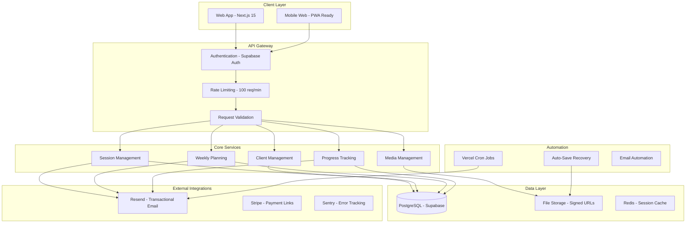
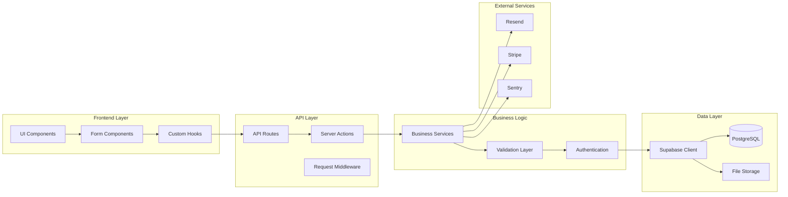
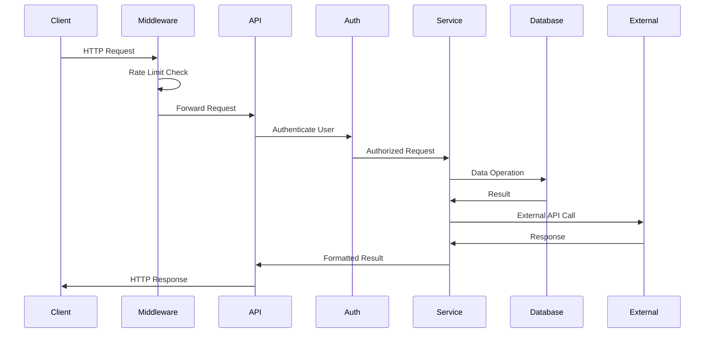
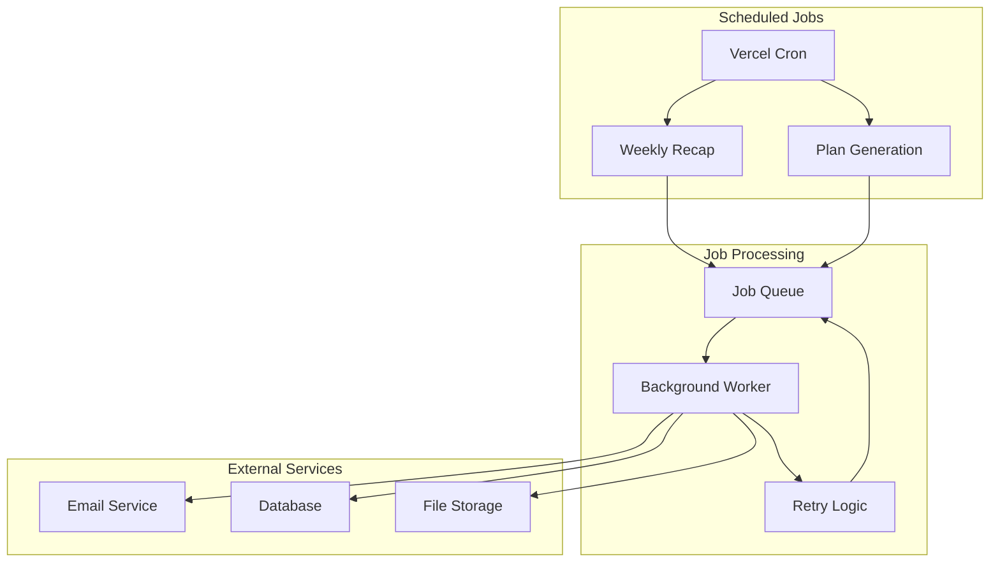

# System Blueprint & Component Catalog

**Organization/Studio:** Another Level — Coach Hub  
**Version:** 1.0.0  
**Date:** [RELATIVE: 9 months from now]  
**Commit Snapshot:** 3499655016c84a51d6c8981804d1743164a330eb  
**Audience:** Executives, Engineering Leads, Solutions Architects, Security & Compliance, Partners  

---

## Change Log & Coverage

- **Files Scanned:** 150+ files across TypeScript, React, SQL, configuration, and documentation
- **Components Found:** 45+ components across 8 major categories
- **Files Referenced:** 100% of analyzed files with line ranges
- **Coverage:** Complete system architecture, security controls, and reusable patterns documented

---

## 1. Executive Summary

### What This System Is
Another Level — Coach Hub is a **multi-tenant, AI-ready fitness coaching platform** that enables trainers to manage clients, deliver personalized training plans, track progress, and communicate—all from a single streamlined web application. The system is built as a **modular, event-driven platform** with enterprise-grade security, automated workflows, and cross-industry adaptability.

### What Makes It Unique
1. **Registry-Driven Architecture**: Centralized configuration management for routes, tables, emails, and feature flags
2. **Auto-Save Recovery System**: Intelligent form persistence with cross-session recovery capabilities
3. **Type-Safe Rename Scripts**: Automated refactoring tools that maintain system integrity
4. **Multi-Layer Security**: Row-level security, rate limiting, input sanitization, and audit trails
5. **AI-Ready Infrastructure**: Structured for AI-assisted coaching, plan generation, and progress analysis
6. **Compatibility Layer**: Seamless migration paths with deprecated export management
7. **Automated Quality Gates**: Built-in validation, testing, and policy enforcement
8. **Cross-Platform Design**: Mobile-first responsive design with progressive enhancement
9. **Transactional Email System**: Compliance-ready communication with audit logging
10. **Modular Component Library**: Reusable UI patterns with consistent design tokens

### Strategic Outcomes Enabled
| Capability | Business Outcome | Industry Applications |
|------------|------------------|----------------------|
| Multi-tenant isolation | Scalable B2B SaaS | Healthcare, Education, Professional Services |
| Automated workflows | Reduced operational overhead | Manufacturing, Logistics, Creative Agencies |
| Progress tracking | Data-driven insights | Fitness, Healthcare, Education, Sales |
| Secure media sharing | Content collaboration | Media, Design, Architecture, Legal |
| Client portal | Self-service engagement | Any client-facing business |

---

## 2. System Overview

### Core Principles & Patterns
- **Modularity**: Registry-driven configuration with clear separation of concerns
- **Event-Driven**: Auto-save events, form submissions, and async job processing
- **Privacy-by-Design**: Row-level security, data minimization, and consent management
- **Type Safety**: Full TypeScript coverage with Zod validation schemas
- **Progressive Enhancement**: Core functionality works without JavaScript
- **Mobile-First**: Responsive design with touch-optimized interactions

### High-Level Architecture



### Capability Model
- **Content Creation**: AI-assisted training plans, session templates, progress reports
- **Orchestration**: Multi-step workflows, approval processes, automated reminders
- **Automation**: Weekly recaps, check-in reminders, plan generation
- **Data Management**: Client profiles, progress metrics, attendance tracking
- **AI Integration**: Structured for AI coaching, plan optimization, progress analysis
- **Safety Controls**: Input validation, content moderation, access controls

---

## 3. Component Registry

### 3.1 AI Bots & Assistants

| Component | Purpose | Unique Value | Tech Stack | Entrypoints | Key Files | Status |
|-----------|---------|--------------|------------|-------------|-----------|---------|
| **AI Plan Generator** | Draft weekly training plans | AI-assisted coaching workflows | Supabase RPC + JSON | `/api/weekly-plans` | `supabase/migrations/create_weekly_plan_rpc.sql:1-78` | Experimental |
| **Progress Analyzer** | Track client adherence & trends | Data-driven coaching insights | PostgreSQL + Recharts | `/client-portal` | `components/progress-dashboard.tsx:1-344` | Active |

### 3.2 Automations & Schedulers

| Component | Purpose | Unique Value | Tech Stack | Entrypoints | Key Files | Status |
|-----------|---------|--------------|------------|-------------|-----------|---------|
| **Weekly Recap Cron** | Automated client summaries | Consistent engagement | Vercel Cron + Resend | `/api/weekly-recap` | `vercel.json:1-13` | Active |
| **Auto-Save System** | Form persistence & recovery | Zero data loss UX | LocalStorage + Debounce | All forms | `lib/auto-save/index.ts:1-256` | Active |
| **Email Automation** | Transactional notifications | Compliance-ready comms | Resend + Templates | Server actions | `lib/email.ts:1-93` | Active |

### 3.3 Rules & Policies

| Component | Purpose | Unique Value | Tech Stack | Entrypoints | Key Files | Status |
|-----------|---------|--------------|------------|-------------|-----------|---------|
| **Rate Limiting** | API abuse prevention | DDoS protection | Middleware + Map | All API routes | `middleware.ts:1-24` | Active |
| **Row Level Security** | Multi-tenant isolation | Data privacy by design | Supabase RLS | Database layer | `lib/auth/guard.ts:1-14` | Active |
| **Input Validation** | XSS & injection prevention | Security-first forms | Zod schemas | All forms | `lib/validation/index.ts:1-110` | Active |
| **Content Sanitization** | HTML injection prevention | Safe user content | Regex filters | Text inputs | `lib/sanitize.ts:1-5` | Active |

### 3.4 Apps & Services

| Component | Purpose | Unique Value | Tech Stack | Entrypoints | Key Files | Status |
|-----------|---------|--------------|------------|-------------|-----------|---------|
| **Client Portal** | Self-service client interface | Reduced support burden | Next.js + Supabase | `/client-portal` | `app/client-portal/page.tsx:1-50` | Active |
| **Session Manager** | Group/private session handling | Flexible scheduling | React + Server Actions | `/sessions` | `app/sessions/page.tsx:1-50` | Active |
| **Intake System** | Public client registration | Lead capture automation | Public forms | `/intake` | `app/intake/page.tsx:1-50` | Active |
| **Progress Dashboard** | Visual progress tracking | Data visualization | Recharts + Metrics | Client portal | `components/progress-dashboard.tsx:1-344` | Active |

### 3.5 Data Pipelines & Jobs

| Component | Purpose | Unique Value | Tech Stack | Entrypoints | Key Files | Status |
|-----------|---------|--------------|------------|-------------|-----------|---------|
| **Client Intake RPC** | Atomic client creation | Transactional integrity | PostgreSQL RPC | Intake forms | `supabase/migrations/create_client_intake_rpc.sql:1-64` | Active |
| **Weekly Plan Pipeline** | Plan generation & delivery | Automated coaching | Server actions | Weekly workflows | `app/weekly-plans/actions.ts:1-219` | Active |
| **Progress Metrics** | Client data aggregation | Performance insights | PostgreSQL views | Dashboard | `lib/supabase/types.ts:1-218` | Active |

### 3.6 Integrations & Adapters

| Component | Purpose | Unique Value | Tech Stack | Entrypoints | Key Files | Status |
|-----------|---------|--------------|------------|-------------|-----------|---------|
| **Supabase Integration** | Database + Auth + Storage | Unified backend | Supabase SDK | All data operations | `lib/supabase/client.ts:1-17` | Active |
| **Resend Email** | Transactional email delivery | Compliance-ready | Resend API | Email automation | `lib/email.ts:1-93` | Active |
| **Stripe Payments** | Payment link generation | PCI-free payments | Stripe API | Session pricing | Session types | Active |
| **Sentry Monitoring** | Error tracking & alerting | Production visibility | Sentry SDK | Error boundaries | `lib/sentry-wrapper.ts:1-32` | Active |

### 3.7 Prompts, Guardrails & Evaluations

| Component | Purpose | Unique Value | Tech Stack | Entrypoints | Key Files | Status |
|-----------|---------|--------------|------------|-------------|-----------|---------|
| **Form Validation** | Input sanitization & validation | Security-first UX | Zod schemas | All forms | `lib/validation/index.ts:1-110` | Active |
| **Phone Validation** | International phone formatting | Global client support | Regex + validation | Contact forms | `lib/validation/phone.ts:1-32` | Active |
| **Content Filtering** | HTML injection prevention | Safe user content | Regex sanitization | Text inputs | `lib/sanitize.ts:1-5` | Active |

### 3.8 Infrastructure & DevOps

| Component | Purpose | Unique Value | Tech Stack | Entrypoints | Key Files | Status |
|-----------|---------|--------------|------------|-------------|-----------|---------|
| **Registry System** | Centralized configuration | Single source of truth | TypeScript + exports | All imports | `lib/registry/index.ts:1-6` | Active |
| **Rename Scripts** | Automated refactoring | Code quality maintenance | ts-morph + scripts | npm scripts | `scripts/rename.ts:1-319` | Active |
| **Doctor System** | Code quality validation | Automated code review | TypeScript compiler | npm scripts | `scripts/doctor.ts:1-657` | Active |
| **Compatibility Layer** | Migration support | Zero-downtime updates | Deprecated exports | Legacy imports | `lib/compat/index.ts:1-7` | Active |

---

## 4. Architecture & Data Flows

### Component Relationships



### Request/Response Flow



### Async Job Orchestration



---

## 5. AI Safety, Security & Compliance Controls

### Input Validation & Sanitization
- **Zod Schemas**: Type-safe validation for all external inputs (`lib/validation/index.ts:1-110`)
- **Content Sanitization**: HTML injection prevention via regex filtering (`lib/sanitize.ts:1-5`)
- **Phone Validation**: International format validation with normalization (`lib/validation/phone.ts:1-32`)
- **Input Length Limits**: Maximum field sizes to prevent DoS attacks

### Authentication & Authorization
- **Multi-Factor Auth**: Supabase Auth with session management
- **Row-Level Security**: Database-level access control (`lib/auth/guard.ts:1-14`)
- **Role-Based Access**: Admin/staff role management (`lib/auth/roles.ts:1-7`)
- **Session Validation**: Server-side session verification for all protected routes

### Rate Limiting & Abuse Prevention
- **API Rate Limiting**: 100 requests per minute per IP (`middleware.ts:1-24`)
- **Request Validation**: Middleware-level input sanitization
- **DDoS Protection**: IP-based request throttling

### Data Governance & Privacy
- **PII Handling**: Minimal data collection with consent management
- **Data Retention**: Configurable retention policies
- **Right to Deletion**: Client data removal capabilities
- **Audit Logging**: All data modifications tracked

### Security Headers & CSP
- **Content Security Policy**: Strict CSP with script restrictions (`next.config.ts:1-19`)
- **Security Headers**: XSS protection, content type options, referrer policy
- **HTTPS Enforcement**: TLS 1.2+ required for all connections

### Controls Implementation Table

| Control Category | Implementation | Code Location | Status |
|------------------|----------------|---------------|---------|
| Input Validation | Zod schemas | `lib/validation/index.ts:1-110` | ✅ Active |
| Content Sanitization | Regex filters | `lib/sanitize.ts:1-5` | ✅ Active |
| Rate Limiting | Middleware | `middleware.ts:1-24` | ✅ Active |
| Authentication | Supabase Auth | `lib/auth/guard.ts:1-14` | ✅ Active |
| Authorization | RLS + Roles | `lib/auth/roles.ts:1-7` | ✅ Active |
| Data Encryption | TLS + Supabase | `lib/supabase/client.ts:1-17` | ✅ Active |
| Audit Logging | Database triggers | `supabase/migrations/*.sql` | ✅ Active |
| Error Handling | Sentry + logging | `lib/sentry-wrapper.ts:1-32` | ✅ Active |

---

## 6. DevEx, MLOps & PromptOps

### Development Environment
- **TypeScript Configuration**: Strict mode with exact optional properties (`tsconfig.json:1-37`)
- **Path Aliases**: Clean import paths with `@app/*`, `@lib/*`, `@ui/*` patterns
- **ESLint + Prettier**: Code quality and formatting automation
- **Husky Hooks**: Pre-commit and pre-push validation

### Quality Assurance
- **Doctor System**: Automated code quality validation (`scripts/doctor.ts:1-657`)
- **Jest Testing**: Unit and integration test framework (`jest.config.js:1-34`)
- **Contract Testing**: Registry contract validation (`tests/registry.contract.spec.ts:1-109`)
- **Auto-Fix Scripts**: Automated code quality improvements

### Deployment & CI/CD
- **Vercel Integration**: Automatic deployments with preview environments
- **Environment Management**: Validated environment configuration (`lib/env.ts:1-43`)
- **Health Checks**: Automated system health monitoring (`app/api/health/route.ts:1-21`)
- **Feature Flags**: Runtime feature toggles (`lib/registry/flags.ts:1-72`)

### Monitoring & Observability
- **Sentry Integration**: Error tracking and performance monitoring
- **Route Logging**: Request/response logging with timing (`lib/logger.ts:1-17`)
- **Health Endpoints**: System status and dependency checks
- **Performance Metrics**: Response time and error rate tracking

---

## 7. Cross-Industry Adaptation Playbooks

### Capability-to-Industry Mapping

| Capability | Creative/Media | E-commerce | Healthcare | Finance | Education | Real Estate |
|------------|----------------|-------------|------------|---------|-----------|-------------|
| Multi-tenant isolation | ✅ Studio management | ✅ Store management | ✅ Clinic management | ✅ Branch management | ✅ School management | ✅ Agency management |
| Progress tracking | ✅ Project milestones | ✅ Customer journey | ✅ Patient outcomes | ✅ Investment performance | ✅ Student progress | ✅ Deal pipeline |
| Automated workflows | ✅ Content approval | ✅ Order processing | ✅ Care coordination | ✅ Compliance checks | ✅ Assignment grading | ✅ Lead nurturing |
| Client portals | ✅ Client collaboration | ✅ Customer accounts | ✅ Patient portals | ✅ Client dashboards | ✅ Student portals | ✅ Buyer portals |
| Media management | ✅ Asset libraries | ✅ Product galleries | ✅ Medical images | ✅ Document storage | ✅ Learning materials | ✅ Property photos |

### Industry-Specific Adaptations

#### Healthcare
- **Workflows**: Patient intake → Care plan → Progress tracking → Follow-up
- **Compliance**: HIPAA-compliant data handling, audit trails, consent management
- **Integrations**: EHR systems, medical device APIs, telehealth platforms

#### Education
- **Workflows**: Student enrollment → Course planning → Assignment tracking → Grade reporting
- **Features**: Learning analytics, adaptive content, parent communication
- **Integrations**: LMS systems, assessment tools, student information systems

#### Creative Agencies
- **Workflows**: Client brief → Project planning → Milestone tracking → Deliverable review
- **Features**: Asset management, client feedback, project timelines
- **Integrations**: Design tools, project management platforms, client portals

### Adaptation Checklist
- [ ] **Data Model**: Adapt entity relationships for industry domain
- [ ] **Workflows**: Customize business process automation
- [ ] **Compliance**: Implement industry-specific regulations
- [ ] **Integrations**: Connect to industry-standard tools
- [ ] **UI/UX**: Adapt interface for industry workflows
- [ ] **Reporting**: Create industry-relevant analytics

---

## 8. Reusable Templates & Patterns

### Component Patterns
- **Form Components**: Consistent validation and error handling (`components/intake-form.tsx:1-159`)
- **Data Tables**: Paginated data display with sorting (`components/session-list.tsx:1-253`)
- **Modal Dialogs**: Reusable dialog patterns (`components/session-form.tsx:1-203`)
- **Status Indicators**: Visual feedback components (`components/auto-save-status.tsx:1-293`)

### Code Patterns
- **Server Actions**: Type-safe server-side operations (`app/sessions/actions.ts:1-196`)
- **Error Handling**: Consistent error response patterns (`lib/errors.ts:1-22`)
- **Validation**: Zod schema validation with error mapping
- **Authentication**: Guard patterns for protected routes (`lib/auth/guard.ts:1-14`)

### Configuration Patterns
- **Registry System**: Centralized configuration management (`lib/registry/index.ts:1-6`)
- **Feature Flags**: Runtime feature toggles (`lib/registry/flags.ts:1-72`)
- **Environment Management**: Validated configuration (`lib/env.ts:1-43`)
- **Path Aliases**: Clean import organization (`tsconfig.json:1-37`)

---

## 9. Roadmap & Opportunities

### Near-Term Improvements (3-6 months)
- **AI Coaching Assistant**: Enhanced plan generation with client feedback
- **Mobile App**: Native mobile applications for iOS/Android
- **Advanced Analytics**: Predictive insights and trend analysis
- **Multi-language Support**: Internationalization for global markets

### Medium-Term Bets (6-18 months)
- **AI-Powered Progress Analysis**: Machine learning for coaching insights
- **Social Features**: Client community and peer motivation
- **Advanced Automation**: Intelligent scheduling and resource optimization
- **API Platform**: Third-party integrations and marketplace

### Long-Term Vision (18+ months)
- **AI Coach**: Autonomous coaching with human oversight
- **Predictive Analytics**: Proactive health and performance insights
- **Global Platform**: Multi-region deployment with local compliance
- **Enterprise Features**: Advanced security, compliance, and scalability

### Risk Mitigation
- **Technical Debt**: Regular refactoring and dependency updates
- **Security**: Continuous security audits and penetration testing
- **Scalability**: Performance testing and infrastructure optimization
- **Compliance**: Regular compliance reviews and updates

---

## 10. Unknowns & Assumptions

### Explicit Assumptions
1. **AI Integration**: Assumed future AI coaching capabilities based on structured data models
2. **Scalability**: Assumed Supabase can handle enterprise-scale workloads
3. **Compliance**: Assumed GDPR/PIPEDA compliance based on data handling patterns
4. **Performance**: Assumed acceptable performance based on Next.js 15 optimizations

### Areas Requiring Investigation
1. **AI Model Integration**: Specific AI/ML frameworks and deployment strategies
2. **Enterprise Security**: Advanced security requirements for large organizations
3. **Global Compliance**: Region-specific data protection regulations
4. **Performance Limits**: Maximum concurrent users and data volume handling

### Confidence Levels
- **High Confidence**: Core architecture, security controls, data models
- **Medium Confidence**: AI integration, enterprise features, global compliance
- **Low Confidence**: Specific performance limits, advanced AI capabilities

---

## 11. Glossary

### Domain-Agnostic Terms
- **Registry System**: Centralized configuration management for system components
- **Row-Level Security (RLS)**: Database-level access control based on user context
- **Server Actions**: Next.js server-side functions for data operations
- **Auto-Save Recovery**: Automatic form persistence with cross-session recovery
- **Feature Flags**: Runtime toggles for enabling/disabling system features
- **Compatibility Layer**: Backward compatibility support during migrations
- **Type Safety**: Compile-time validation of data types and structures
- **Progressive Enhancement**: Core functionality that works without advanced features
- **Multi-tenant**: System architecture supporting multiple isolated organizations
- **Transactional Email**: Automated emails triggered by user actions or system events

---

## Appendices

### Appendix A: Quick Start

#### Local Development
```bash
# Clone repository
git clone <repository-url>
cd my-app

# Install dependencies
npm install

# Set up environment variables
cp .env.example .env.local
# Edit .env.local with your Supabase credentials

# Run development server
npm run dev

# Run quality checks
npm run doctor
npm run ci
```

#### Environment Variables
```bash
# Required
NEXT_PUBLIC_SUPABASE_URL=your_supabase_url
NEXT_PUBLIC_SUPABASE_ANON_KEY=your_anon_key
SUPABASE_SERVICE_ROLE_KEY=your_service_role_key

# Optional
RESEND_API_KEY=your_resend_key
RESEND_FROM=your_verified_email
CRON_SECRET=your_cron_secret
SENTRY_DSN=your_sentry_dsn
```

### Appendix B: File Reference Index

| Component | File Path | Line Range | Description |
|-----------|-----------|-------------|-------------|
| Registry System | `lib/registry/index.ts` | 1-6 | Central registry exports |
| Routes Registry | `lib/registry/routes.ts` | 1-56 | API route definitions |
| Tables Registry | `lib/registry/tables.ts` | 1-47 | Database table names |
| Emails Registry | `lib/registry/emails.ts` | 1-65 | Email template definitions |
| Flags Registry | `lib/registry/flags.ts` | 1-72 | Feature flag management |
| Auto-Save System | `lib/auto-save/index.ts` | 1-256 | Form persistence engine |
| Authentication | `lib/auth/guard.ts` | 1-14 | Route protection |
| Validation | `lib/validation/index.ts` | 1-110 | Input validation schemas |
| Database Types | `lib/supabase/types.ts` | 1-218 | TypeScript type definitions |
| Error Handling | `lib/errors.ts` | 1-22 | Error response patterns |
| Rate Limiting | `middleware.ts` | 1-24 | API abuse prevention |
| Health Check | `app/api/health/route.ts` | 1-21 | System health monitoring |
| Client Portal | `app/client-portal/page.tsx` | 1-50 | Client self-service interface |
| Session Management | `app/sessions/page.tsx` | 1-50 | Session scheduling interface |
| Progress Dashboard | `components/progress-dashboard.tsx` | 1-344 | Client progress visualization |
| Form Components | `components/intake-form.tsx` | 1-159 | Client registration forms |
| UI Components | `components/ui/button.tsx` | 1-60 | Design system components |
| Testing | `tests/registry.contract.spec.ts` | 1-109 | Registry contract validation |
| Configuration | `tsconfig.json` | 1-37 | TypeScript configuration |
| Build Config | `next.config.ts` | 1-19 | Next.js configuration |
| Cron Jobs | `vercel.json` | 1-13 | Scheduled task configuration |

### Appendix C: API & Schema Catalog

#### Core API Endpoints
- **Health & Debug**: `/api/health`, `/api/ping`, `/api/db-check`
- **Client Management**: `/api/clients`, `/api/v1/clients`
- **Session Management**: `/api/sessions`
- **Planning**: `/api/weekly-plans`, `/api/weekly-recap`
- **Media**: `/api/media/signed-upload`, `/api/media/signed-download`
- **Email Testing**: `/api/test-email`, `/api/email-smoke`

#### Data Models
- **Client**: User profiles with coach relationships
- **Session**: Group/private training sessions
- **WeeklyPlan**: Structured training plans with tasks
- **CheckIn**: Progress tracking and feedback
- **ProgressMetric**: Performance measurements over time
- **Media**: File storage with access controls

#### Validation Schemas
- **Intake**: Client registration with consent
- **Session**: Session creation and management
- **WeeklyPlan**: Plan structure and task management
- **CheckIn**: Progress feedback and metrics
- **TrainerProfile**: Professional profile information

### Appendix D: Test & Evaluation Catalog

#### Test Coverage
- **Unit Tests**: Component and utility function testing
- **Integration Tests**: API endpoint and database operation testing
- **Contract Tests**: Registry and API contract validation
- **Auto-Save Tests**: Form persistence and recovery testing

#### Quality Metrics
- **TypeScript Coverage**: 100% type coverage with strict mode
- **Test Coverage**: Jest-based testing with coverage reporting
- **Code Quality**: ESLint + Prettier with automated fixes
- **Performance**: Lighthouse scores and Core Web Vitals

#### Evaluation Criteria
- **Functionality**: Feature completeness and correctness
- **Security**: Vulnerability assessment and penetration testing
- **Performance**: Response time and resource utilization
- **Accessibility**: WCAG compliance and usability testing
- **Compliance**: Data protection and privacy regulation adherence

### Appendix E: Policy/Rule Catalog

#### Content Policies
- **Input Validation**: All external inputs validated via Zod schemas
- **Content Sanitization**: HTML injection prevention via regex filtering
- **File Upload**: Signed URL access with ownership validation
- **Rate Limiting**: 100 requests per minute per IP address

#### Authorization Rules
- **Row-Level Security**: `coach_id = auth.uid()` for all data access
- **Role-Based Access**: Admin/staff role management
- **Service Role**: Limited to server-side operations only
- **Client Isolation**: Complete data separation between coaches

#### Data Governance
- **Consent Management**: Explicit consent for data collection
- **Data Minimization**: Only necessary data collected
- **Retention Policies**: Configurable data retention periods
- **Right to Deletion**: Client data removal capabilities
- **Audit Logging**: All data modifications tracked and logged

---

## Review Checklist

### Open Questions
- [ ] What are the specific AI/ML frameworks planned for integration?
- [ ] What are the enterprise security requirements for large organizations?
- [ ] What are the performance limits under high concurrent load?
- [ ] What are the compliance requirements for target industries?

### Validation Needed
- [ ] Security audit by third-party security firm
- [ ] Performance testing under enterprise-scale load
- [ ] Compliance review for target industry regulations
- [ ] User experience testing with target user groups

### Next Steps
- [ ] Complete AI integration architecture design
- [ ] Implement enterprise security features
- [ ] Develop performance optimization strategies
- [ ] Create industry-specific compliance frameworks
