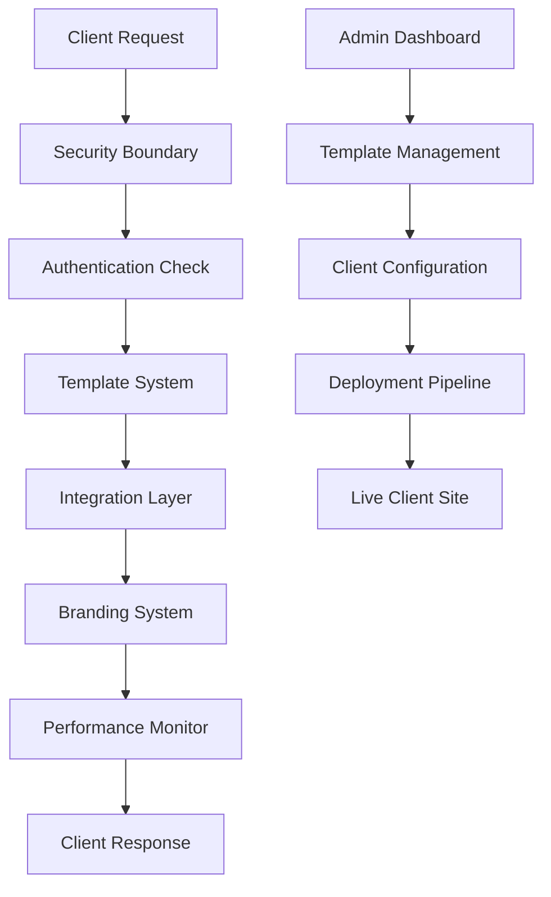

# Agency Toolkit Architecture Guide

**Version:** 1.0.0
**Last Updated:** September 14, 2025
**HT-021.4.4:** Agency Toolkit Documentation & Solo Developer Experience

## Overview

The Agency Toolkit is a comprehensive system for rapid client micro-app delivery, enabling ≤7-day deployment cycles with enterprise-grade security, performance, and customization capabilities.

## Core Architecture

### 🏗️ System Components

```
Agency Toolkit
├── Template System          # Client micro-app templates
├── Integration Layer        # Hooks and external service integrations
├── Security Boundaries      # Multi-tenant isolation and access control
├── Performance Monitor      # Real-time performance tracking
├── Branding System         # Client-specific theming and branding
└── Deployment Pipeline     # Automated deployment and delivery
```

### 📦 Module Structure

```
lib/agency-toolkit/
├── index.ts                     # Central coordination and exports
├── template-system.ts           # Template management and deployment
├── integration-hooks.ts         # External service integration layer
├── client-security.ts          # Multi-tenant security boundaries
├── performance-validator.ts     # Performance testing and validation
└── docs/                       # Architecture and usage documentation
```

## Template System

### Purpose
Manages client-specific templates with theming, component overrides, and deployment configurations.

### Key Features
- **Template Types**: Dashboard, Landing, Auth, Admin, Custom
- **Client Theming**: Brand-aware styling and component customization
- **Component Overrides**: Style, props, replace, extend capabilities
- **Deployment Management**: Preview, staging, production environments

### Usage Example

```typescript
import { templateSystem, DEFAULT_TEMPLATES } from '@/lib/agency-toolkit';

// Create client template
const template = await templateSystem.createTemplate({
  name: 'Client Dashboard',
  category: 'dashboard',
  client: { id: 'acme-corp', name: 'Acme Corporation' },
  layout: DEFAULT_TEMPLATES.DASHBOARD.layout,
  theme: {
    colors: {
      primary: '#2563eb',
      secondary: '#64748b',
      background: '#ffffff',
      foreground: '#0f172a'
    }
  },
  components: {}
});

// Deploy template
const deployment = await templateSystem.deployTemplate(
  template.id,
  'production',
  {
    domain: { custom: true, name: 'dashboard.acme.com', ssl: true },
    env: { NEXT_PUBLIC_CLIENT_ID: 'acme-corp' },
    build: {
      command: 'npm run build',
      outputDir: 'dist',
      nodeVersion: '18'
    }
  }
);
```

## Integration Layer

### Purpose
Provides extensible hooks for client integrations with external services and APIs.

### Hook Types
- **Auth**: Authentication and authorization
- **Data**: Data transformation and validation
- **Payment**: Payment processing integration
- **Notification**: Email, SMS, push notifications
- **Analytics**: Event tracking and reporting
- **Storage**: File and data storage
- **Webhook**: External webhook handling
- **Custom**: Client-specific integrations

### Usage Example

```typescript
import { integrationManager, DEFAULT_INTEGRATION_HOOKS } from '@/lib/agency-toolkit';

// Register payment integration
const paymentHook = await integrationManager.registerHook({
  name: 'Stripe Payment Processing',
  type: 'payment',
  clientId: 'acme-corp',
  config: {
    endpoint: 'https://api.stripe.com',
    auth: {
      type: 'bearer',
      credentials: { token: process.env.STRIPE_SECRET_KEY }
    },
    parameters: {
      currency: 'usd',
      paymentMethods: ['card', 'apple_pay']
    }
  },
  enabled: true,
  priority: 1
});

// Execute hook
const execution = await integrationManager.executeHook(
  paymentHook.id,
  'payment_intent_created',
  { amount: 5000, currency: 'usd' }
);
```

## Security Boundaries

### Purpose
Implements multi-tenant security isolation with configurable policies and access control.

### Security Tiers
- **Basic**: Standard rate limiting and basic auth
- **Standard**: Enhanced auth, audit logging, encryption
- **Premium**: SSO, advanced monitoring, custom policies
- **Enterprise**: Full customization, dedicated resources

### Resource Isolation
- **Database**: Schema-level isolation with row-level security
- **Storage**: Bucket and path prefixing with encryption
- **API**: Rate limiting and endpoint isolation
- **Cache**: Namespace isolation with TTL management

### Usage Example

```typescript
import { clientSecurityManager, DEFAULT_SECURITY_CONFIGS } from '@/lib/agency-toolkit';

// Create security boundary
const securityBoundary = await clientSecurityManager.createSecurityBoundary({
  ...DEFAULT_SECURITY_CONFIGS.STANDARD,
  clientId: 'acme-corp',
  clientName: 'Acme Corporation',
  allowedDomains: ['acme.com', 'dashboard.acme.com'],
  ipWhitelist: ['192.168.1.0/24'], // Optional IP restrictions
});

// Validate access
const accessResult = await clientSecurityManager.validateAccess(
  'acme-corp',
  '/api/client/acme-corp/data',
  'read',
  { ip: '192.168.1.100', userAgent: 'Chrome/91.0', route: '/dashboard' }
);
```

## Performance System

### Performance Targets
- **Component Render Time**: <200ms
- **Bundle Size**: <1MB
- **First Contentful Paint**: <1.8s
- **Largest Contentful Paint**: <2.5s
- **First Input Delay**: <100ms
- **Cumulative Layout Shift**: <0.1
- **Memory Usage**: <50MB
- **Client Customization**: <500ms

### Monitoring Features
- Real-time Core Web Vitals tracking
- Component performance profiling
- Bundle size analysis and optimization
- Memory usage monitoring
- Client theming performance validation

### Usage Example

```typescript
import { PerformanceValidator } from '@/lib/agency-toolkit';

const validator = new PerformanceValidator();

// Validate component performance
const componentMetric = await validator.validateComponentRenderTime(
  'ClientDashboard',
  async () => {
    // Component rendering logic
  }
);

// Run complete validation
const report = await validator.runCompleteValidation();
console.log(`Performance Score: ${report.summary.overallScore}/100`);
```

## Branding System Integration

### Brand-Aware Components
The agency toolkit integrates with the existing branding system for consistent client theming.

### Key Integration Points
- **Theme Inheritance**: Automatic theme propagation to templates
- **Brand Validation**: Ensures consistent brand usage
- **Component Styling**: Brand-aware component styling hooks
- **CSS Generation**: Dynamic CSS variable generation

### Usage Example

```typescript
import { useBrandStyling } from '@/lib/branding';

function ClientComponent() {
  const { getBrandColor, getBrandClasses } = useBrandStyling();

  return (
    <div className={getBrandClasses('rounded-lg p-4')}>
      <h1 style={{ color: getBrandColor('primary') }}>
        Client Dashboard
      </h1>
    </div>
  );
}
```

## Deployment Pipeline

### Environments
- **Preview**: Development and client review
- **Staging**: Pre-production testing
- **Production**: Live client deployment

### Deployment Features
- Automated build and deployment
- Custom domain support with SSL
- Environment variable management
- Performance optimization (CDN, compression)
- Rollback capabilities

## Data Flow



## Technology Stack

### Core Technologies
- **Next.js 14**: React framework with App Router
- **TypeScript**: Type-safe development
- **Tailwind CSS**: Utility-first styling
- **Zustand**: State management

### Infrastructure
- **Vercel**: Deployment platform
- **Supabase**: Database and authentication
- **Stripe**: Payment processing
- **Sentry**: Error monitoring

### Performance
- **Web Vitals**: Performance monitoring
- **Bundle Analyzer**: Size optimization
- **React Profiler**: Component performance

## Development Workflow

1. **Template Creation**: Design and configure client templates
2. **Integration Setup**: Configure external service hooks
3. **Security Configuration**: Set up multi-tenant boundaries
4. **Performance Testing**: Validate performance targets
5. **Client Review**: Preview deployment for client approval
6. **Production Deployment**: Deploy to client domain
7. **Monitoring**: Ongoing performance and security monitoring

## Extensibility

### Adding New Template Types
```typescript
// Define new template in DEFAULT_TEMPLATES
export const CUSTOM_TEMPLATE = {
  name: 'Custom Template',
  description: 'Custom template description',
  category: 'custom' as const,
  layout: {
    // Template layout configuration
  }
};
```

### Creating Custom Hooks
```typescript
// Register custom integration hook
const customHook = await integrationManager.registerHook({
  name: 'Custom Integration',
  type: 'custom',
  clientId: 'client-id',
  config: {
    parameters: {
      customLogic: 'Your custom logic here'
    }
  },
  enabled: true,
  priority: 1
});
```

## Best Practices

### Security
- Always validate client access before operations
- Use environment variables for sensitive data
- Implement proper CORS policies
- Regular security audits and updates

### Performance
- Monitor Core Web Vitals continuously
- Optimize bundle sizes with code splitting
- Use React.memo for pure components
- Implement proper caching strategies

### Development
- Follow TypeScript strict mode
- Write comprehensive tests
- Use proper error boundaries
- Document complex business logic

## Troubleshooting

See [TROUBLESHOOTING.md](./TROUBLESHOOTING.md) for common issues and solutions.

## Performance Guidelines

See [PERFORMANCE.md](./PERFORMANCE.md) for detailed performance optimization guide.

## Client Handover Process

See [CLIENT-HANDOVER.md](./CLIENT-HANDOVER.md) for client delivery procedures.