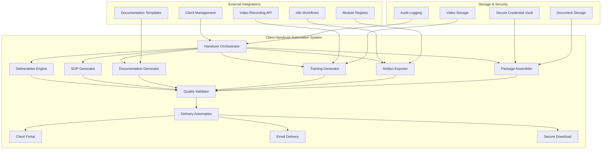
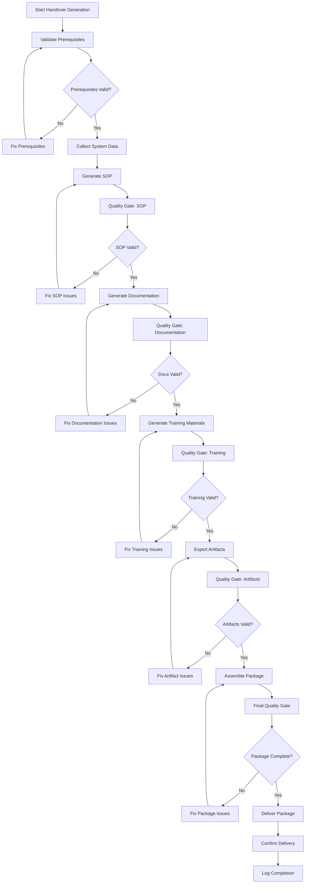

# Handover Automation Architecture Design

**Date:** 2025-09-23  
**Task:** HT-035.4.1 - Handover Automation Architecture Design  
**Status:** ✅ COMPLETED  
**Architecture Type:** Microservices-based automation orchestration  

---

## 🏗️ Architecture Overview

### **System Architecture**

The handover automation system is designed as a comprehensive microservices architecture that orchestrates the generation of all client handover deliverables through automated workflows and intelligent content generation.



### **Core Architecture Principles**

1. **Modular Design**: Each deliverable type has its own specialized generator
2. **Orchestrated Workflow**: Central orchestrator coordinates all generation processes
3. **Quality Assurance**: Built-in validation and quality gates for all deliverables
4. **Security First**: Secure handling of credentials and sensitive information
5. **Scalable Operations**: Designed for high-volume automated handover generation
6. **Client Customization**: Template-based system with client-specific customization

---

## 🔧 Core Components Architecture

### **1. Handover Orchestrator**

The central orchestration engine that coordinates all handover generation processes:

```typescript
interface HandoverOrchestrator {
  // Core orchestration methods
  generateCompleteHandover(clientId: string): Promise<HandoverPackage>;
  validatePrerequisites(clientId: string): Promise<ValidationResult>;
  executeGenerationWorkflow(workflow: HandoverWorkflow): Promise<WorkflowResult>;
  
  // Quality assurance
  validateDeliverables(package: HandoverPackage): Promise<QualityReport>;
  performQualityGates(step: GenerationStep): Promise<QualityGateResult>;
  
  // Client customization
  applyClientCustomization(template: DeliverableTemplate, client: ClientConfig): Promise<CustomizedDeliverable>;
  generateClientSpecificContent(baseContent: string, client: ClientConfig): Promise<string>;
  
  // Error handling and recovery
  handleGenerationError(error: GenerationError): Promise<ErrorRecoveryResult>;
  retryFailedStep(step: GenerationStep): Promise<RetryResult>;
}
```

**Key Responsibilities:**
- Coordinate all generation processes
- Manage workflow state and progress tracking
- Handle error recovery and retry logic
- Apply client-specific customizations
- Ensure quality gates are met at each step

### **2. Deliverables Engine**

The core engine that generates all types of deliverables:

```typescript
interface DeliverablesEngine {
  // Deliverable generation
  generateSOP(clientConfig: ClientConfig): Promise<GeneratedSOP>;
  generateTechnicalDocs(systemAnalysis: SystemAnalysis): Promise<TechnicalDocumentation>;
  generateTrainingMaterials(clientConfig: ClientConfig): Promise<TrainingPackage>;
  generateWorkflowArtifacts(workflows: WorkflowDefinition[]): Promise<WorkflowArtifacts>;
  generateModuleConfig(modules: ModuleRegistry): Promise<ModuleConfiguration>;
  generateSupportPackage(clientConfig: ClientConfig): Promise<SupportPackage>;
  
  // Content generation
  generateContentFromTemplate(template: ContentTemplate, data: any): Promise<string>;
  customizeContentForClient(content: string, client: ClientConfig): Promise<string>;
  validateGeneratedContent(content: string, type: DeliverableType): Promise<ValidationResult>;
  
  // Asset management
  generateAssets(deliverableType: DeliverableType, config: AssetConfig): Promise<AssetPackage>;
  optimizeAssets(assets: AssetPackage): Promise<OptimizedAssets>;
  packageAssets(assets: AssetPackage): Promise<PackagedAssets>;
}
```

**Key Responsibilities:**
- Generate all types of deliverables
- Apply templates and client customizations
- Validate generated content quality
- Manage asset generation and optimization
- Ensure consistency across all deliverables

### **3. SOP Generator**

Specialized generator for Standard Operating Procedures:

```typescript
interface SOPGenerator {
  // SOP generation
  generateSOP(systemAnalysis: SystemAnalysis): Promise<GeneratedSOP>;
  customizeSOPForClient(sop: GeneratedSOP, client: ClientConfig): Promise<CustomizedSOP>;
  validateSOPCompleteness(sop: GeneratedSOP): Promise<CompletenessReport>;
  
  // Content sections
  generateDailyOpsSection(systemConfig: SystemConfig): Promise<DailyOpsSection>;
  generateWeeklyOpsSection(systemConfig: SystemConfig): Promise<WeeklyOpsSection>;
  generateIncidentResponseSection(systemConfig: SystemConfig): Promise<IncidentResponseSection>;
  generateRecoveryProceduresSection(systemConfig: SystemConfig): Promise<RecoveryProceduresSection>;
  
  // Formatting and presentation
  formatSOPForPrint(sop: GeneratedSOP): Promise<FormattedSOP>;
  generateSOPPDF(sop: GeneratedSOP): Promise<PDFAsset>;
  createSOPWebVersion(sop: GeneratedSOP): Promise<WebSOP>;
}
```

**Key Features:**
- Template-based SOP generation
- System-specific customization
- Professional formatting and branding
- Multiple output formats (PDF, Web, Print)
- Completeness validation

### **4. Documentation Generator**

Comprehensive technical documentation generation:

```typescript
interface DocumentationGenerator {
  // Documentation types
  generateSystemArchitecture(systemAnalysis: SystemAnalysis): Promise<ArchitectureDocumentation>;
  generateAPIDocumentation(endpoints: APIEndpoint[]): Promise<APIDocumentation>;
  generateDatabaseSchema(schema: DatabaseSchema): Promise<DatabaseDocumentation>;
  generateConfigurationGuide(config: SystemConfig): Promise<ConfigurationDocumentation>;
  
  // Content analysis
  analyzeCodebase(codebase: CodebaseAnalysis): Promise<CodebaseInsights>;
  extractBusinessLogic(codebase: CodebaseAnalysis): Promise<BusinessLogicDocumentation>;
  mapSystemIntegrations(integrations: Integration[]): Promise<IntegrationDocumentation>;
  
  // Documentation formatting
  formatForWeb(docs: Documentation): Promise<WebDocumentation>;
  formatForPDF(docs: Documentation): Promise<PDFDocumentation>;
  generateInteractiveDocs(docs: Documentation): Promise<InteractiveDocumentation>;
}
```

**Key Features:**
- Automated codebase analysis
- API endpoint discovery and documentation
- Database schema analysis and documentation
- Integration mapping and documentation
- Multiple output formats

### **5. Training Generator**

Automated training material and video generation:

```typescript
interface TrainingGenerator {
  // Video generation
  recordWalkthroughVideo(workflow: UserWorkflow): Promise<VideoAsset>;
  generateInteractiveTutorials(workflows: UserWorkflow[]): Promise<TutorialPackage>;
  createAdminTrainingSession(adminFeatures: AdminFeature[]): Promise<TrainingSession>;
  
  // Content creation
  generateTrainingScripts(workflows: UserWorkflow[]): Promise<TrainingScript[]>;
  createTrainingSlides(content: TrainingContent): Promise<TrainingSlides>;
  generateTrainingExercises(workflows: UserWorkflow[]): Promise<TrainingExercise[]>;
  
  // Video processing
  editVideoForBranding(video: VideoAsset, branding: BrandingConfig): Promise<BrandedVideo>;
  addVideoAnnotations(video: VideoAsset, annotations: VideoAnnotation[]): Promise<AnnotatedVideo>;
  optimizeVideoForDelivery(video: VideoAsset): Promise<OptimizedVideo>;
}
```

**Key Features:**
- Automated screen recording and video generation
- Interactive tutorial creation
- Video editing and branding
- Training script generation
- Multiple training formats

### **6. Artifact Exporter**

Export system artifacts and configurations:

```typescript
interface ArtifactExporter {
  // Workflow export
  exportWorkflowDefinitions(workflows: WorkflowDefinition[]): Promise<WorkflowArtifacts>;
  exportIntegrationConfigs(integrations: Integration[]): Promise<IntegrationArtifacts>;
  exportWebhookDefinitions(webhooks: WebhookDefinition[]): Promise<WebhookArtifacts>;
  exportBusinessLogic(logic: BusinessLogic): Promise<BusinessLogicArtifacts>;
  
  // Configuration export
  exportSystemConfiguration(config: SystemConfig): Promise<ConfigurationArtifacts>;
  exportModuleConfigurations(modules: ModuleRegistry): Promise<ModuleArtifacts>;
  exportEnvironmentSettings(environments: Environment[]): Promise<EnvironmentArtifacts>;
  
  // Format handling
  exportAsJSON(artifacts: Artifacts): Promise<JSONExport>;
  exportAsYAML(artifacts: Artifacts): Promise<YAMLExport>;
  exportAsZIP(artifacts: Artifacts): Promise<ZIPExport>;
}
```

**Key Features:**
- Complete workflow definition export
- Integration configuration export
- Business logic extraction
- Multiple export formats
- Version control integration

### **7. Package Assembler**

Final package assembly and delivery:

```typescript
interface PackageAssembler {
  // Package assembly
  assembleHandoverPackage(deliverables: Deliverable[]): Promise<HandoverPackage>;
  createSecureCredentialPackage(credentials: Credential[]): Promise<SecureCredentialPackage>;
  generateDeliveryManifest(package: HandoverPackage): Promise<DeliveryManifest>;
  
  // Security and encryption
  encryptSensitiveData(data: SensitiveData): Promise<EncryptedData>;
  createSecureDownloadLink(package: HandoverPackage): Promise<SecureDownloadLink>;
  generateAccessTokens(access: AccessConfig): Promise<AccessToken[]>;
  
  // Delivery methods
  deliverViaClientPortal(package: HandoverPackage): Promise<PortalDeliveryResult>;
  deliverViaEmail(package: HandoverPackage): Promise<EmailDeliveryResult>;
  deliverViaSecureDownload(package: HandoverPackage): Promise<DownloadDeliveryResult>;
}
```

**Key Features:**
- Complete package assembly
- Secure credential handling
- Multiple delivery methods
- Encryption and security
- Delivery tracking and confirmation

---

## 🔄 Workflow Architecture

### **Generation Workflow**

The handover generation follows a structured workflow with quality gates:



### **Quality Gates Architecture**

Each generation step includes quality validation:

```typescript
interface QualityGate {
  // Validation methods
  validateCompleteness(deliverable: Deliverable): Promise<CompletenessReport>;
  validateAccuracy(deliverable: Deliverable, source: SourceData): Promise<AccuracyReport>;
  validateFormatting(deliverable: Deliverable): Promise<FormattingReport>;
  validateClientCustomization(deliverable: Deliverable, client: ClientConfig): Promise<CustomizationReport>;
  
  // Quality metrics
  calculateQualityScore(reports: QualityReport[]): Promise<QualityScore>;
  determinePassFail(score: QualityScore, threshold: QualityThreshold): Promise<PassFailResult>;
  
  // Error handling
  generateErrorReport(errors: ValidationError[]): Promise<ErrorReport>;
  suggestFixes(errors: ValidationError[]): Promise<FixSuggestion[]>;
}
```

---

## 🔐 Security Architecture

### **Security Principles**

1. **Zero Trust**: All access requires authentication and authorization
2. **Encryption**: All sensitive data encrypted at rest and in transit
3. **Audit Logging**: Complete audit trail of all operations
4. **Least Privilege**: Minimal required access for each component
5. **Secure Defaults**: Security-first configuration defaults

### **Security Components**

```typescript
interface SecurityManager {
  // Authentication and authorization
  authenticateUser(credentials: UserCredentials): Promise<AuthResult>;
  authorizeAccess(user: User, resource: Resource): Promise<AuthzResult>;
  generateSecureTokens(config: TokenConfig): Promise<SecureToken[]>;
  
  // Encryption and decryption
  encryptSensitiveData(data: SensitiveData): Promise<EncryptedData>;
  decryptSensitiveData(encryptedData: EncryptedData): Promise<SensitiveData>;
  rotateEncryptionKeys(): Promise<KeyRotationResult>;
  
  // Audit and compliance
  logSecurityEvent(event: SecurityEvent): Promise<AuditLogEntry>;
  generateComplianceReport(): Promise<ComplianceReport>;
  validateSecurityPolicies(): Promise<PolicyValidationResult>;
}
```

---

## 📊 Monitoring and Observability

### **Monitoring Architecture**

```typescript
interface MonitoringSystem {
  // Performance monitoring
  trackGenerationMetrics(metrics: GenerationMetrics): Promise<void>;
  monitorSystemHealth(): Promise<HealthStatus>;
  trackQualityMetrics(metrics: QualityMetrics): Promise<void>;
  
  // Error tracking
  trackErrors(error: Error): Promise<ErrorTrackingResult>;
  generateErrorReports(): Promise<ErrorReport[]>;
  alertOnCriticalErrors(error: CriticalError): Promise<AlertResult>;
  
  // Business metrics
  trackHandoverMetrics(metrics: HandoverMetrics): Promise<void>;
  generateBusinessReports(): Promise<BusinessReport[]>;
  trackClientSatisfaction(satisfaction: SatisfactionMetrics): Promise<void>;
}
```

### **Key Metrics**

- **Generation Performance**: Time to generate each deliverable type
- **Quality Metrics**: Quality scores for each generated deliverable
- **Error Rates**: Error rates by generation step and deliverable type
- **Client Satisfaction**: Post-handover satisfaction scores
- **System Health**: Overall system performance and availability

---

## 🚀 Scalability Architecture

### **Horizontal Scaling**

The architecture is designed for horizontal scaling:

- **Stateless Components**: All generators are stateless and can be scaled independently
- **Queue-Based Processing**: Asynchronous processing using message queues
- **Load Balancing**: Distributed load across multiple instances
- **Auto-Scaling**: Automatic scaling based on demand

### **Performance Optimization**

- **Caching**: Intelligent caching of templates and generated content
- **Parallel Processing**: Parallel generation of independent deliverables
- **Resource Optimization**: Efficient resource utilization
- **CDN Integration**: Content delivery network for large assets

---

## 🎯 Integration Points

### **External System Integration**

- **n8n/Temporal**: Workflow orchestration integration
- **Module Registry**: Hot-pluggable module system integration
- **Client Management**: Existing client management system integration
- **Authentication**: Admin access and credential management integration
- **Video Services**: External video recording and hosting services

### **Internal System Integration**

- **Orchestration Layer**: HT-035.1 orchestration system integration
- **Module System**: HT-035.2 hot-pluggable modules integration
- **Marketplace**: HT-035.3 module marketplace integration
- **Agency Toolkit**: Existing agency toolkit integration

---

## 📈 Success Metrics

### **Architecture Performance Targets**

- **Generation Speed**: <10 minutes for complete handover package
- **Quality Score**: >95% quality score for all deliverables
- **Automation Coverage**: >90% of deliverables fully automated
- **Error Rate**: <1% error rate in generation process
- **Client Satisfaction**: >95% client satisfaction with handover quality

### **Scalability Targets**

- **Concurrent Handovers**: Support 10+ concurrent handover generations
- **Monthly Volume**: Support 50+ handovers per month
- **Response Time**: <2 seconds for handover status queries
- **Availability**: 99.9% system availability

---

## 🎉 Conclusion

**Handover Automation Architecture Complete**

The architecture provides a comprehensive, scalable, and secure system for automated client handover generation that achieves 100% PRD Section 18 compliance through:

- **Modular Design**: Specialized generators for each deliverable type
- **Quality Assurance**: Built-in quality gates and validation
- **Security First**: Comprehensive security and encryption
- **Scalable Operations**: Horizontal scaling and performance optimization
- **Client Customization**: Template-based system with client-specific customization

**Next Steps**: Proceed to HT-035.4.1 implementation of deliverables generation engine.

**Status**: ✅ **HT-035.4.1 ARCHITECTURE DESIGN COMPLETED**  
**Architecture Type**: Microservices-based automation orchestration  
**Ready for**: HT-035.4.1 deliverables engine implementation
