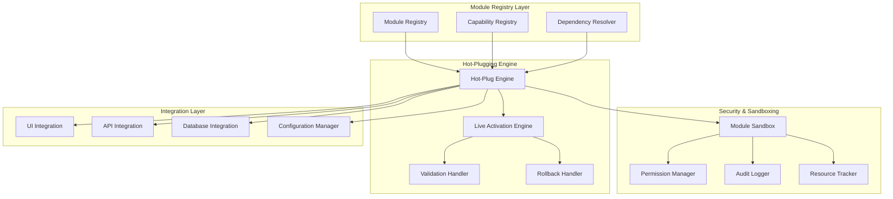
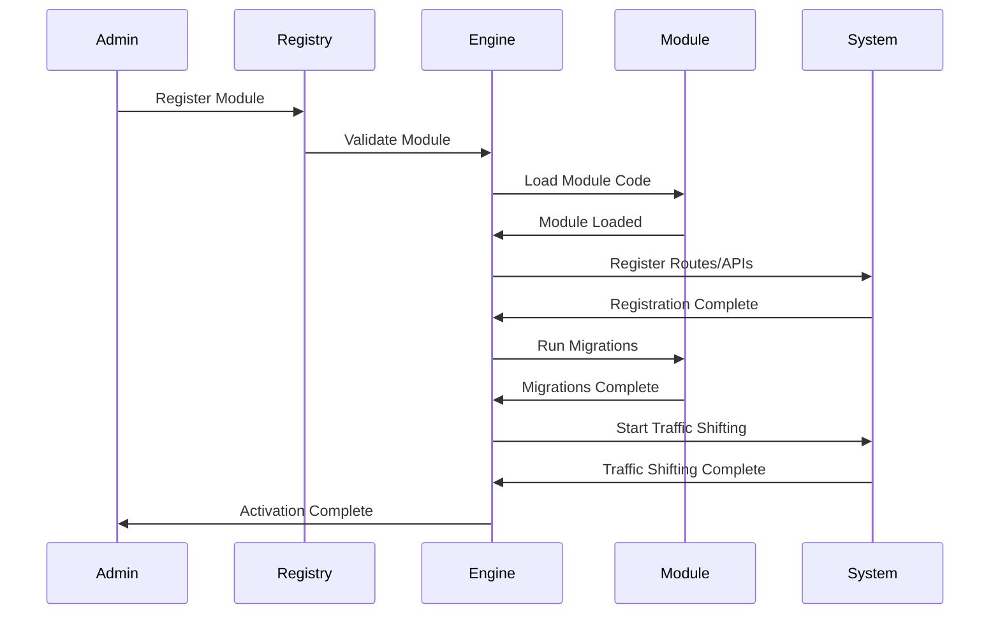

# Hot-Pluggable Modules Architecture Design

**Date:** 2025-09-23  
**Task:** HT-035.2.1 - Hot-Pluggable Module Architecture Specification  
**Status:** Architecture Design Complete  
**Target:** Zero-downtime module activation with live deployment  

---

## Executive Summary

This document defines the comprehensive architecture for hot-pluggable modules that enables zero-downtime activation, declarative registration, and security isolation. The architecture supports PRD Section 7 requirements for live module activation and provides the foundation for the module marketplace and client handover automation systems.

**Core Principles:**
- Zero-downtime operations with automatic rollback
- Declarative configuration with automatic integration
- Security isolation with permission-based access
- Additive changes only with backward compatibility

---

## Architecture Overview

### System Components



### Core Interfaces

#### Module Definition
```typescript
interface ModuleDefinition {
  id: string
  name: string
  version: string
  description: string
  author: string
  license: string
  
  // Capabilities and Dependencies
  capabilities: ModuleCapability[]
  dependencies: ModuleDependency[]
  conflicts: string[]
  
  // Integration Points
  routes: RouteDefinition[]
  components: ComponentDefinition[]
  apis: ApiDefinition[]
  database: DatabaseDefinition
  
  // Configuration
  configSchema: ModuleConfigSchema
  defaultConfig: Record<string, unknown>
  
  // Lifecycle
  lifecycle: ModuleLifecycleDefinition
  permissions: ModulePermissions
  
  // Metadata
  metadata: ModuleMetadata
}
```

#### Module Capability
```typescript
interface ModuleCapability {
  id: string
  name: string
  description: string
  version: string
  category: CapabilityCategory
  requirements: CapabilityRequirement[]
  interfaces: InterfaceDefinition[]
}
```

#### Module Lifecycle
```typescript
interface ModuleLifecycleDefinition {
  activation: {
    strategy: ActivationStrategy
    timeout: number
    healthChecks: HealthCheckDefinition[]
    rollbackTriggers: RollbackTrigger[]
  }
  deactivation: {
    strategy: DeactivationStrategy
    timeout: number
    cleanup: CleanupDefinition[]
  }
  updates: {
    supported: boolean
    migrationPaths: MigrationPath[]
    compatibility: CompatibilityMatrix
  }
}
```

---

## Module Registry System

### Registry Architecture

The module registry serves as the central hub for all module management operations, providing discovery, registration, and lifecycle management capabilities.

#### Core Components

1. **Module Registry** - Central storage for module definitions
2. **Capability Registry** - Capability-based module discovery
3. **Dependency Resolver** - Dependency resolution and conflict detection
4. **Version Manager** - Module versioning and compatibility

#### Registry Operations

```typescript
class ModuleRegistry {
  // Registration
  register(definition: ModuleDefinition): Promise<RegistrationResult>
  unregister(moduleId: string): Promise<UnregistrationResult>
  update(moduleId: string, definition: ModuleDefinition): Promise<UpdateResult>
  
  // Discovery
  findByCapability(capability: string): Promise<ModuleDefinition[]>
  findByCategory(category: string): Promise<ModuleDefinition[]>
  findCompatible(requirements: ModuleRequirement[]): Promise<ModuleDefinition[]>
  
  // Dependency Management
  resolveDependencies(moduleId: string): Promise<DependencyResolutionResult>
  detectConflicts(moduleId: string): Promise<ConflictDetectionResult>
  validateDependencies(moduleId: string): Promise<ValidationResult>
  
  // Version Management
  getVersions(moduleId: string): Promise<ModuleVersion[]>
  getCompatibleVersions(moduleId: string, currentVersion: string): Promise<ModuleVersion[]>
  validateVersionCompatibility(moduleId: string, version: string): Promise<CompatibilityResult>
}
```

### Declarative Registration

Modules are registered through declarative manifests that specify capabilities, dependencies, and integration points.

#### Module Manifest Format
```yaml
# module.manifest.yaml
id: analytics-advanced
name: Advanced Analytics
version: 1.2.0
description: Comprehensive analytics and reporting module
author: DCT Platform Team
license: MIT

capabilities:
  - id: analytics.reporting
    name: Advanced Reporting
    category: analytics
    version: 1.0.0
  
  - id: analytics.dashboard
    name: Analytics Dashboard
    category: ui
    version: 1.0.0

dependencies:
  - id: database
    version: ">=1.0.0"
    required: true
  
  - id: authentication
    version: ">=2.0.0"
    required: true

routes:
  - path: /analytics/dashboard
    component: AnalyticsDashboard
    permissions: ["analytics.view"]
  
  - path: /analytics/reports
    component: ReportsList
    permissions: ["analytics.reports"]

apis:
  - path: /api/analytics/reports
    methods: ["GET", "POST"]
    permissions: ["analytics.api"]
  
  - path: /api/analytics/metrics
    methods: ["GET"]
    permissions: ["analytics.metrics"]

database:
  migrations:
    - version: 1.0.0
      file: migrations/001_initial_schema.sql
    - version: 1.1.0
      file: migrations/002_add_indexes.sql

config:
  schema:
    refreshInterval:
      type: number
      default: 300
      min: 60
      max: 3600
  
  permissions:
    - analytics.view
    - analytics.reports
    - analytics.api
    - analytics.metrics

lifecycle:
  activation:
    strategy: gradual
    timeout: 30000
    healthChecks:
      - endpoint: /health
        timeout: 5000
      - database: analytics_tables
        timeout: 10000
  
  deactivation:
    strategy: graceful
    timeout: 15000
    cleanup:
      - clearCache
      - closeConnections
```

---

## Hot-Plugging Engine

### Engine Architecture

The hot-plugging engine manages the dynamic loading, unloading, and activation of modules without system restart.

#### Core Components

1. **Hot-Plug Engine** - Core module loading/unloading
2. **Live Activation Engine** - Zero-downtime activation
3. **Validation Handler** - Pre-activation validation
4. **Rollback Handler** - Failure recovery

#### Activation Strategies

#### 1. Gradual Activation
```typescript
interface GradualActivationStrategy {
  type: 'gradual'
  steps: [
    'validate',      // Validate module and dependencies
    'prepare',       // Prepare resources and connections
    'load',          // Load module code and components
    'register',      // Register routes and APIs
    'migrate',       // Run database migrations
    'warmup',        // Warm up caches and connections
    'activate',      // Start accepting traffic
    'verify'         // Verify activation success
  ]
  trafficShifting: {
    initial: 0
    increment: 10
    maxIncrement: 50
    interval: 5000
  }
  rollbackTriggers: [
    'healthCheckFailure'
    'errorRateExceeded'
    'responseTimeExceeded'
  ]
}
```

#### 2. Instant Activation
```typescript
interface InstantActivationStrategy {
  type: 'instant'
  steps: [
    'validate',
    'prepare',
    'load',
    'register',
    'activate'
  ]
  timeout: 10000
  rollbackTriggers: [
    'activationTimeout'
    'criticalError'
  ]
}
```

### Activation Flow



### Rollback Mechanisms

#### Automatic Rollback Triggers
1. **Health Check Failure** - Module fails health checks
2. **Error Rate Exceeded** - Error rate exceeds threshold
3. **Response Time Exceeded** - Response time exceeds limit
4. **Activation Timeout** - Activation takes too long
5. **Critical Error** - Unrecoverable error occurs

#### Rollback Process
```typescript
interface RollbackProcess {
  steps: [
    'stopTraffic',     // Stop routing traffic to module
    'deactivate',      // Deactivate module components
    'rollback',        // Rollback database changes
    'unregister',      // Unregister routes and APIs
    'cleanup',         // Clean up resources
    'restore'          // Restore previous state
  ]
  timeout: 30000
  preserveData: boolean
  notificationChannels: string[]
}
```

---

## Security & Sandboxing

### Sandbox Architecture

The security sandbox provides isolation, permission enforcement, and resource monitoring for modules.

#### Core Components

1. **Module Sandbox** - Execution environment isolation
2. **Permission Manager** - Access control enforcement
3. **Audit Logger** - Operation tracking and logging
4. **Resource Tracker** - Resource usage monitoring

#### Permission Model

```typescript
interface ModulePermissions {
  // System Permissions
  system: {
    database: DatabasePermission[]
    filesystem: FilesystemPermission[]
    network: NetworkPermission[]
    environment: EnvironmentPermission[]
  }
  
  // Application Permissions
  application: {
    routes: RoutePermission[]
    apis: ApiPermission[]
    components: ComponentPermission[]
    configurations: ConfigurationPermission[]
  }
  
  // Resource Permissions
  resources: {
    memory: MemoryQuota
    cpu: CpuQuota
    storage: StorageQuota
    network: NetworkQuota
  }
}
```

#### Permission Enforcement

```typescript
class PermissionManager {
  // Permission Checking
  hasPermission(moduleId: string, permission: string): boolean
  checkPermission(moduleId: string, permission: string, context: PermissionContext): PermissionResult
  
  // Resource Quotas
  checkResourceQuota(moduleId: string, resource: ResourceType, amount: number): boolean
  enforceResourceQuota(moduleId: string, resource: ResourceType, amount: number): void
  
  // Audit Logging
  logPermissionCheck(moduleId: string, permission: string, result: PermissionResult): void
  logResourceUsage(moduleId: string, resource: ResourceType, amount: number): void
}
```

### Resource Isolation

#### Memory Isolation
```typescript
interface MemoryIsolation {
  maxHeapSize: number
  maxStackSize: number
  garbageCollectionThreshold: number
  memoryLeakDetection: boolean
  memoryUsageMonitoring: boolean
}
```

#### CPU Isolation
```typescript
interface CpuIsolation {
  maxCpuUsage: number
  cpuQuotaPeriod: number
  cpuThrottlingEnabled: boolean
  cpuMonitoringEnabled: boolean
}
```

#### Network Isolation
```typescript
interface NetworkIsolation {
  allowedHosts: string[]
  allowedPorts: number[]
  maxBandwidth: number
  connectionLimit: number
  sslRequired: boolean
}
```

---

## Integration Layer

### UI Integration

#### Automatic Route Generation
```typescript
class UIIntegration {
  // Route Registration
  registerRoutes(moduleId: string, routes: RouteDefinition[]): Promise<void>
  unregisterRoutes(moduleId: string): Promise<void>
  
  // Component Loading
  loadComponent(moduleId: string, componentId: string): Promise<Component>
  unloadComponent(moduleId: string, componentId: string): Promise<void>
  
  // Theme Integration
  applyTheme(moduleId: string, theme: ThemeDefinition): Promise<void>
  resetTheme(moduleId: string): Promise<void>
  
  // Navigation Updates
  updateNavigation(moduleId: string, navigation: NavigationDefinition): Promise<void>
  removeNavigation(moduleId: string): Promise<void>
}
```

### API Integration

#### Dynamic API Registration
```typescript
class APIIntegration {
  // Route Registration
  registerAPIRoutes(moduleId: string, routes: ApiDefinition[]): Promise<void>
  unregisterAPIRoutes(moduleId: string): Promise<void>
  
  // Middleware Integration
  addMiddleware(moduleId: string, middleware: MiddlewareFunction): Promise<void>
  removeMiddleware(moduleId: string, middlewareId: string): Promise<void>
  
  // Authentication/Authorization
  configureAuth(moduleId: string, authConfig: AuthConfig): Promise<void>
  removeAuth(moduleId: string): Promise<void>
  
  // Rate Limiting
  configureRateLimit(moduleId: string, rateLimit: RateLimitConfig): Promise<void>
  removeRateLimit(moduleId: string): Promise<void>
}
```

### Database Integration

#### Additive Migration System
```typescript
class DatabaseIntegration {
  // Migration Management
  runMigrations(moduleId: string, migrations: Migration[]): Promise<MigrationResult>
  rollbackMigrations(moduleId: string, targetVersion: string): Promise<RollbackResult>
  
  // Schema Management
  createSchema(moduleId: string, schema: SchemaDefinition): Promise<void>
  dropSchema(moduleId: string): Promise<void>
  
  // Connection Pooling
  createConnectionPool(moduleId: string, config: ConnectionConfig): Promise<void>
  destroyConnectionPool(moduleId: string): Promise<void>
  
  // Data Isolation
  createNamespace(moduleId: string, namespace: string): Promise<void>
  dropNamespace(moduleId: string, namespace: string): Promise<void>
}
```

---

## Performance & Monitoring

### Performance Targets

#### Activation Performance
- **Module Activation Time**: <30 seconds
- **Traffic Shifting Time**: <5 seconds per increment
- **Rollback Time**: <15 seconds
- **Health Check Response**: <1 second

#### Runtime Performance
- **Module Load Time**: <500ms
- **API Response Time**: <100ms
- **Database Query Time**: <50ms
- **Memory Usage**: <100MB per module

### Monitoring & Metrics

#### Activation Metrics
```typescript
interface ActivationMetrics {
  activationTime: number
  trafficShiftTime: number
  rollbackTime: number
  healthCheckLatency: number
  errorRate: number
  successRate: number
}
```

#### Runtime Metrics
```typescript
interface RuntimeMetrics {
  memoryUsage: number
  cpuUsage: number
  networkBandwidth: number
  apiResponseTime: number
  databaseQueryTime: number
  errorRate: number
}
```

### Health Monitoring

#### Health Checks
```typescript
interface HealthCheck {
  id: string
  type: 'endpoint' | 'database' | 'service' | 'custom'
  config: HealthCheckConfig
  timeout: number
  interval: number
  retries: number
  critical: boolean
}
```

#### Health Status
```typescript
interface HealthStatus {
  status: 'healthy' | 'degraded' | 'unhealthy'
  checks: HealthCheckResult[]
  lastCheck: Date
  uptime: number
  errorRate: number
}
```

---

## Implementation Guidelines

### Development Standards

#### Module Development
1. **Declarative Configuration** - All modules must use declarative manifests
2. **Capability-Based Design** - Modules must declare capabilities and dependencies
3. **Security First** - All modules must implement proper permission checking
4. **Additive Changes** - No breaking changes to existing systems
5. **Comprehensive Testing** - Unit, integration, and activation tests required

#### Integration Guidelines
1. **Automatic Integration** - Leverage automatic UI/routing/API integration
2. **Configuration Management** - Use centralized configuration system
3. **Error Handling** - Implement comprehensive error handling and recovery
4. **Monitoring** - Include health checks and metrics collection
5. **Documentation** - Provide comprehensive module documentation

### Testing Strategy

#### Unit Testing
- Module functionality testing
- Configuration validation testing
- Permission enforcement testing
- Resource quota testing

#### Integration Testing
- Module activation/deactivation testing
- UI integration testing
- API integration testing
- Database integration testing

#### Activation Testing
- Zero-downtime activation testing
- Rollback mechanism testing
- Traffic shifting testing
- Health check testing

#### Performance Testing
- Activation performance testing
- Runtime performance testing
- Resource usage testing
- Scalability testing

---

## Conclusion

The hot-pluggable modules architecture provides a comprehensive solution for zero-downtime module activation with security isolation and automatic integration. The architecture supports:

1. **Declarative Module Registration** - Eliminating manual code changes
2. **Zero-Downtime Activation** - Maintaining service availability
3. **Security Isolation** - Ensuring module sandboxing and permissions
4. **Automatic Integration** - Seamless UI/routing/API integration
5. **Comprehensive Monitoring** - Real-time health and performance monitoring

This architecture enables the advanced module marketplace and client handover automation systems planned in subsequent HT-035 phases while maintaining the highest standards of security, performance, and reliability.

**Next Steps:** Implement the module activation engine design and module contract definitions as specified in HT-035.2.1.
