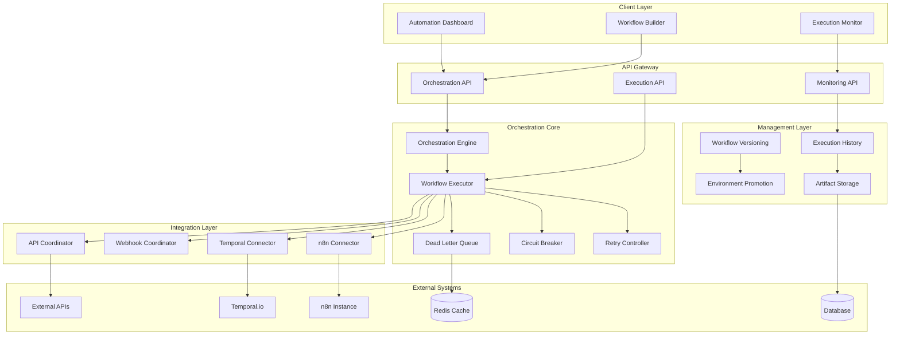

# Orchestration Layer Architecture Design

**Date:** September 23, 2025  
**Task:** HT-035.1.1 - PRD Section 8 Analysis & Orchestration Architecture Design  
**Status:** In Progress  

---

## Executive Summary

This document defines the comprehensive orchestration layer architecture for the DCT Micro-Apps platform, designed to achieve 100% PRD Section 8 compliance through enterprise-grade workflow orchestration, n8n/Temporal integration, and automated execution management.

**Architecture Goal:** Transform the current 50% compliant automation system into a 100% compliant orchestration platform capable of ≤7-day micro-app delivery with full automation.

---

## Architecture Overview

### 1. System Architecture



### 2. Component Architecture

#### **2.1 Orchestration Engine**
```typescript
/**
 * Central orchestration engine for workflow management and execution
 */
export class OrchestrationEngine {
  private workflowRegistry: WorkflowRegistry;
  private executionManager: ExecutionManager;
  private retryController: RetryController;
  private circuitBreaker: CircuitBreaker;
  private deadLetterQueue: DeadLetterQueue;
  
  /**
   * Execute a workflow with full orchestration
   */
  async executeWorkflow(
    workflowId: string, 
    payload: WorkflowPayload,
    options?: ExecutionOptions
  ): Promise<ExecutionResult> {
    // 1. Validate workflow
    const workflow = await this.validateWorkflow(workflowId);
    
    // 2. Create execution context
    const execution = await this.createExecution(workflow, payload, options);
    
    // 3. Apply circuit breaker
    const result = await this.circuitBreaker.execute(async () => {
      return await this.executeWorkflowSteps(execution);
    });
    
    // 4. Handle result
    await this.handleExecutionResult(execution, result);
    
    return result;
  }
  
  /**
   * Create and register a new workflow
   */
  async createWorkflow(definition: WorkflowDefinition): Promise<Workflow> {
    // 1. Validate workflow definition
    await this.validateWorkflowDefinition(definition);
    
    // 2. Create workflow instance
    const workflow = new Workflow(definition);
    
    // 3. Register in workflow registry
    await this.workflowRegistry.register(workflow);
    
    // 4. Setup monitoring and alerting
    await this.setupWorkflowMonitoring(workflow);
    
    return workflow;
  }
}
```

#### **2.2 Workflow Executor**
```typescript
/**
 * Workflow execution engine with retry logic and error handling
 */
export class WorkflowExecutor {
  private stepExecutors: Map<string, StepExecutor>;
  private retryController: RetryController;
  private executionHistory: ExecutionHistory;
  
  /**
   * Execute workflow steps with orchestration
   */
  async executeWorkflowSteps(execution: WorkflowExecution): Promise<ExecutionResult> {
    const results: StepResult[] = [];
    
    for (const step of execution.workflow.steps) {
      try {
        // Execute step with retry logic
        const stepResult = await this.retryController.executeWithRetry(
          () => this.executeStep(step, execution),
          step.retryConfig
        );
        
        results.push(stepResult);
        
        // Update execution status
        await this.updateExecutionStatus(execution.id, 'running', {
          completedSteps: results.length,
          currentStep: step.id
        });
        
      } catch (error) {
        // Handle step failure
        await this.handleStepFailure(execution, step, error);
        throw error;
      }
    }
    
    return {
      success: true,
      results,
      executionId: execution.id,
      duration: Date.now() - execution.startTime
    };
  }
  
  /**
   * Execute individual workflow step
   */
  private async executeStep(
    step: WorkflowStep, 
    execution: WorkflowExecution
  ): Promise<StepResult> {
    const executor = this.stepExecutors.get(step.type);
    if (!executor) {
      throw new Error(`No executor found for step type: ${step.type}`);
    }
    
    return await executor.execute(step, execution);
  }
}
```

#### **2.3 n8n Connector**
```typescript
/**
 * n8n integration connector for workflow orchestration
 */
export class N8nConnector {
  private n8nClient: N8nClient;
  private webhookManager: WebhookManager;
  private workflowCache: WorkflowCache;
  
  /**
   * Create n8n workflow with orchestration
   */
  async createWorkflow(definition: N8nWorkflowDefinition): Promise<N8nWorkflow> {
    // 1. Validate n8n workflow definition
    await this.validateN8nWorkflow(definition);
    
    // 2. Create workflow in n8n
    const n8nWorkflow = await this.n8nClient.createWorkflow(definition);
    
    // 3. Setup webhook endpoints
    const webhooks = await this.setupWebhooks(n8nWorkflow);
    
    // 4. Cache workflow for performance
    await this.workflowCache.set(n8nWorkflow.id, n8nWorkflow);
    
    return {
      ...n8nWorkflow,
      webhooks
    };
  }
  
  /**
   * Execute n8n workflow with orchestration
   */
  async executeWorkflow(
    workflowId: string, 
    payload: any
  ): Promise<ExecutionResult> {
    // 1. Get workflow from cache or n8n
    const workflow = await this.getWorkflow(workflowId);
    
    // 2. Execute workflow in n8n
    const execution = await this.n8nClient.executeWorkflow(workflowId, payload);
    
    // 3. Monitor execution status
    const result = await this.monitorExecution(execution.id);
    
    return result;
  }
  
  /**
   * Setup webhook endpoints for n8n workflow
   */
  private async setupWebhooks(workflow: N8nWorkflow): Promise<Webhook[]> {
    const webhooks: Webhook[] = [];
    
    for (const node of workflow.nodes) {
      if (node.type === 'n8n-nodes-base.webhook') {
        const webhook = await this.webhookManager.createWebhook({
          workflowId: workflow.id,
          nodeId: node.id,
          path: node.parameters.path,
          method: node.parameters.httpMethod,
          authentication: node.parameters.authentication
        });
        
        webhooks.push(webhook);
      }
    }
    
    return webhooks;
  }
}
```

### 3. Integration Patterns

#### **3.1 Webhook Coordination Pattern**
```typescript
/**
 * Coordinated webhook delivery with orchestration
 */
export class WebhookOrchestrationPattern {
  private webhookEmitter: WebhookEmitter;
  private workflowRegistry: WorkflowRegistry;
  private executionManager: ExecutionManager;
  
  /**
   * Coordinate webhook delivery with workflow execution
   */
  async coordinateWebhookDelivery(event: WebhookEvent): Promise<WebhookResult[]> {
    // 1. Get workflows triggered by this event
    const workflows = await this.getWorkflowsForEvent(event.type);
    
    // 2. Execute workflows in parallel with coordination
    const executionPromises = workflows.map(workflow => 
      this.executeWorkflowForEvent(workflow, event)
    );
    
    // 3. Wait for all executions to complete
    const results = await Promise.allSettled(executionPromises);
    
    // 4. Handle partial failures
    await this.handlePartialFailures(results, event);
    
    return results.map(result => 
      result.status === 'fulfilled' ? result.value : null
    );
  }
  
  /**
   * Execute workflow for webhook event
   */
  private async executeWorkflowForEvent(
    workflow: Workflow, 
    event: WebhookEvent
  ): Promise<WebhookResult> {
    try {
      const execution = await this.executionManager.createExecution({
        workflowId: workflow.id,
        trigger: 'webhook',
        payload: event.data,
        metadata: {
          eventType: event.type,
          eventId: event.id,
          timestamp: event.timestamp
        }
      });
      
      const result = await this.executionManager.execute(execution);
      
      return {
        success: true,
        workflowId: workflow.id,
        executionId: execution.id,
        result
      };
      
    } catch (error) {
      return {
        success: false,
        workflowId: workflow.id,
        error: error.message
      };
    }
  }
}
```

#### **3.2 Retry Logic Pattern**
```typescript
/**
 * Advanced retry logic with exponential backoff and jitter
 */
export class RetryController {
  private retryConfig: RetryConfig;
  private executionHistory: ExecutionHistory;
  
  /**
   * Execute operation with retry logic
   */
  async executeWithRetry<T>(
    operation: () => Promise<T>,
    config: RetryConfig
  ): Promise<T> {
    let lastError: Error;
    let attempt = 0;
    
    while (attempt <= config.maxRetries) {
      try {
        const result = await operation();
        
        // Log successful execution
        await this.logRetrySuccess(attempt);
        
        return result;
        
      } catch (error) {
        lastError = error as Error;
        attempt++;
        
        // Check if error is retryable
        if (!this.isRetryableError(error, config.retryableErrors)) {
          throw error;
        }
        
        // Check if we've exceeded max retries
        if (attempt > config.maxRetries) {
          break;
        }
        
        // Calculate delay with exponential backoff and jitter
        const delay = this.calculateDelay(attempt, config);
        
        // Log retry attempt
        await this.logRetryAttempt(attempt, error, delay);
        
        // Wait before retry
        await this.sleep(delay);
      }
    }
    
    // Log final failure
    await this.logRetryFailure(attempt, lastError);
    
    throw lastError;
  }
  
  /**
   * Calculate retry delay with exponential backoff and jitter
   */
  private calculateDelay(attempt: number, config: RetryConfig): number {
    const exponentialDelay = config.baseDelayMs * Math.pow(2, attempt - 1);
    const jitter = Math.random() * config.jitterFactor * config.baseDelayMs;
    const totalDelay = exponentialDelay + jitter;
    
    return Math.min(totalDelay, config.maxDelayMs);
  }
}
```

#### **3.3 Circuit Breaker Pattern**
```typescript
/**
 * Circuit breaker for external service protection
 */
export class CircuitBreaker {
  private state: CircuitState = CircuitState.CLOSED;
  private failures: number = 0;
  private lastFailureTime: number = 0;
  private config: CircuitBreakerConfig;
  
  /**
   * Execute operation with circuit breaker protection
   */
  async execute<T>(operation: () => Promise<T>): Promise<T> {
    // Check circuit state
    if (this.state === CircuitState.OPEN) {
      if (this.shouldAttemptReset()) {
        this.state = CircuitState.HALF_OPEN;
      } else {
        throw new CircuitBreakerOpenError('Circuit breaker is OPEN');
      }
    }
    
    try {
      const result = await operation();
      this.onSuccess();
      return result;
      
    } catch (error) {
      this.onFailure();
      throw error;
    }
  }
  
  /**
   * Handle successful execution
   */
  private onSuccess(): void {
    this.failures = 0;
    this.state = CircuitState.CLOSED;
  }
  
  /**
   * Handle failed execution
   */
  private onFailure(): void {
    this.failures++;
    this.lastFailureTime = Date.now();
    
    if (this.failures >= this.config.failureThreshold) {
      this.state = CircuitState.OPEN;
    }
  }
  
  /**
   * Check if circuit breaker should attempt reset
   */
  private shouldAttemptReset(): boolean {
    return Date.now() - this.lastFailureTime > this.config.recoveryTimeoutMs;
  }
}
```

### 4. Data Models

#### **4.1 Workflow Definition**
```typescript
interface WorkflowDefinition {
  id: string;
  name: string;
  description: string;
  version: string;
  status: 'active' | 'paused' | 'stopped' | 'draft';
  type: 'n8n' | 'temporal' | 'custom';
  
  // Workflow configuration
  config: {
    timeout: number;
    retryPolicy: RetryConfig;
    circuitBreaker: CircuitBreakerConfig;
    concurrency: number;
  };
  
  // Workflow steps
  steps: WorkflowStep[];
  
  // Triggers
  triggers: WorkflowTrigger[];
  
  // Metadata
  metadata: {
    createdBy: string;
    createdAt: Date;
    updatedAt: Date;
    tags: string[];
    environment: 'dev' | 'staging' | 'prod';
  };
}

interface WorkflowStep {
  id: string;
  name: string;
  type: string;
  config: Record<string, any>;
  retryConfig: RetryConfig;
  timeout: number;
  dependencies: string[];
  order: number;
}
```

#### **4.2 Execution Model**
```typescript
interface WorkflowExecution {
  id: string;
  workflowId: string;
  status: 'pending' | 'running' | 'completed' | 'failed' | 'cancelled';
  
  // Execution context
  payload: any;
  trigger: WorkflowTrigger;
  metadata: ExecutionMetadata;
  
  // Timing
  startTime: Date;
  endTime?: Date;
  duration?: number;
  
  // Results
  results: StepResult[];
  errors: ExecutionError[];
  
  // Retry information
  retryCount: number;
  maxRetries: number;
}

interface StepResult {
  stepId: string;
  status: 'pending' | 'running' | 'completed' | 'failed' | 'skipped';
  startTime: Date;
  endTime?: Date;
  duration?: number;
  output?: any;
  error?: string;
}
```

### 5. API Design

#### **5.1 Orchestration API**
```typescript
// POST /api/orchestration/workflows
interface CreateWorkflowRequest {
  name: string;
  description: string;
  type: 'n8n' | 'temporal' | 'custom';
  definition: WorkflowDefinition;
  config: WorkflowConfig;
}

// PUT /api/orchestration/workflows/{id}
interface UpdateWorkflowRequest {
  name?: string;
  description?: string;
  definition?: WorkflowDefinition;
  config?: WorkflowConfig;
}

// POST /api/orchestration/workflows/{id}/execute
interface ExecuteWorkflowRequest {
  payload: any;
  options?: ExecutionOptions;
}

// GET /api/orchestration/executions/{id}
interface ExecutionResponse {
  id: string;
  workflowId: string;
  status: string;
  startTime: Date;
  endTime?: Date;
  duration?: number;
  results: StepResult[];
  errors: ExecutionError[];
}
```

#### **5.2 Monitoring API**
```typescript
// GET /api/orchestration/monitoring/health
interface HealthResponse {
  status: 'healthy' | 'degraded' | 'unhealthy';
  components: {
    orchestrationEngine: ComponentHealth;
    workflowExecutor: ComponentHealth;
    n8nConnector: ComponentHealth;
    circuitBreaker: ComponentHealth;
  };
  metrics: {
    totalWorkflows: number;
    activeExecutions: number;
    successRate: number;
    avgExecutionTime: number;
  };
}

// GET /api/orchestration/monitoring/metrics
interface MetricsResponse {
  executions: {
    total: number;
    successful: number;
    failed: number;
    successRate: number;
  };
  performance: {
    avgExecutionTime: number;
    p95ExecutionTime: number;
    p99ExecutionTime: number;
  };
  reliability: {
    circuitBreakerState: string;
    dlqSize: number;
    retrySuccessRate: number;
  };
}
```

### 6. Deployment Architecture

#### **6.1 Environment Promotion**
```typescript
/**
 * Environment promotion system for workflows
 */
export class EnvironmentPromotion {
  private workflowRegistry: WorkflowRegistry;
  private artifactStorage: ArtifactStorage;
  
  /**
   * Promote workflow from one environment to another
   */
  async promoteWorkflow(
    workflowId: string,
    fromEnv: Environment,
    toEnv: Environment
  ): Promise<Workflow> {
    // 1. Get workflow from source environment
    const sourceWorkflow = await this.workflowRegistry.get(workflowId, fromEnv);
    
    // 2. Validate promotion compatibility
    await this.validatePromotion(sourceWorkflow, toEnv);
    
    // 3. Create workflow in target environment
    const targetWorkflow = await this.createWorkflowInEnvironment(
      sourceWorkflow,
      toEnv
    );
    
    // 4. Export and import artifacts
    await this.promoteArtifacts(sourceWorkflow, targetWorkflow);
    
    // 5. Update workflow registry
    await this.workflowRegistry.register(targetWorkflow, toEnv);
    
    return targetWorkflow;
  }
  
  /**
   * Export workflow artifacts
   */
  async exportWorkflowArtifacts(workflow: Workflow): Promise<WorkflowArtifacts> {
    return {
      workflow: workflow.definition,
      config: workflow.config,
      dependencies: await this.getWorkflowDependencies(workflow),
      environment: workflow.metadata.environment,
      exportedAt: new Date()
    };
  }
}
```

### 7. Monitoring and Observability

#### **7.1 Execution Monitoring**
```typescript
/**
 * Comprehensive execution monitoring and alerting
 */
export class ExecutionMonitor {
  private metricsCollector: MetricsCollector;
  private alertManager: AlertManager;
  private executionHistory: ExecutionHistory;
  
  /**
   * Monitor workflow execution
   */
  async monitorExecution(execution: WorkflowExecution): Promise<void> {
    // 1. Collect execution metrics
    const metrics = await this.collectExecutionMetrics(execution);
    
    // 2. Check for alerts
    await this.checkAlerts(execution, metrics);
    
    // 3. Update execution history
    await this.executionHistory.update(execution);
    
    // 4. Send metrics to monitoring system
    await this.metricsCollector.send(metrics);
  }
  
  /**
   * Collect execution metrics
   */
  private async collectExecutionMetrics(
    execution: WorkflowExecution
  ): Promise<ExecutionMetrics> {
    return {
      executionId: execution.id,
      workflowId: execution.workflowId,
      status: execution.status,
      duration: execution.duration,
      stepCount: execution.results.length,
      successRate: this.calculateSuccessRate(execution.results),
      timestamp: new Date()
    };
  }
}
```

---

## Implementation Phases

### Phase 1: Core Orchestration (Days 1-3)
- [ ] Orchestration Engine implementation
- [ ] Workflow Executor with basic retry logic
- [ ] Integration with existing automation page
- [ ] Basic execution history tracking

### Phase 2: n8n Integration (Days 4-6)
- [ ] n8n Connector implementation
- [ ] Webhook coordination system
- [ ] Circuit breaker integration
- [ ] Enhanced execution monitoring

### Phase 3: Reliability & Performance (Days 7-9)
- [ ] Advanced retry logic with exponential backoff
- [ ] Dead letter queue implementation
- [ ] Performance optimization
- [ ] Comprehensive error handling

### Phase 4: Workflow Management (Days 10-12)
- [ ] Workflow versioning system
- [ ] Environment promotion
- [ ] Artifact storage and management
- [ ] Advanced monitoring and alerting

---

## Success Criteria

### Technical Success Metrics
- **Workflow Execution Time:** <5 seconds for simple workflows
- **Orchestration Reliability:** 99.5% success rate
- **Retry Success Rate:** >80% for retryable failures
- **Circuit Breaker Response:** <100ms for circuit breaker decisions

### Business Success Metrics
- **Automation Coverage:** 80%+ of micro-app creation automated
- **Delivery Capability:** ≤7-day consistent delivery
- **Error Reduction:** 90% reduction in manual workflow errors
- **Operational Efficiency:** 300% improvement in workflow management

---

## Conclusion

This orchestration layer architecture provides a comprehensive foundation for achieving 100% PRD Section 8 compliance. The design leverages existing infrastructure while adding the critical orchestration capabilities needed for enterprise-grade automation.

**Key Architectural Principles:**
1. **Modularity** - Each component has a single responsibility
2. **Reliability** - Built-in retry logic, circuit breakers, and error handling
3. **Scalability** - Designed to handle high-volume workflow execution
4. **Observability** - Comprehensive monitoring and alerting
5. **Extensibility** - Support for multiple orchestration engines (n8n, Temporal)

**Expected Outcome:** A production-ready orchestration platform capable of supporting ≤7-day micro-app delivery with full automation and enterprise-grade reliability.
