# MIT Hero System: Architecture Graph

## Overview
This document provides a comprehensive Mermaid diagram showing how all bots, automations, rules, and workflows interact with each other, queues, databases, and APIs.

## Component Dependency Graph

```mermaid
graph TB
    %% S-Tier Core Systems
    subgraph "S-Tier Core Heroes"
        HUO[Hero Unified Orchestrator<br/>S-Tier: 95/15]
        HEO[Hero Ultimate Optimized<br/>S-Tier: 90/20]
        GS[Guardian System<br/>S-Tier: 88/12]
        DS[Doctor System<br/>S-Tier: 85/18]
        CUH[Cursor AI Universal Header<br/>S-Tier: 92/10]
    end

    %% A-Tier High-Value Systems
    subgraph "A-Tier High-Value Heroes"
        IBO[Intelligent Build Orchestrator<br/>A-Tier: 82/25]
        UHE[Universal Header Enforcer<br/>A-Tier: 80/22]
        MLD[Memory Leak Detector<br/>A-Tier: 78/28]
        SLS[Smart Lint System<br/>A-Tier: 75/20]
        GMC[Git Master Control<br/>A-Tier: 72/30]
        TS[Todo System<br/>A-Tier: 70/15]
        CAAS[Cursor AI Auto Start<br/>A-Tier: 68/18]
        CAAW[Cursor AI Auto Watcher<br/>A-Tier: 65/25]
        PE[Policy Enforcer<br/>A-Tier: 73/20]
        RS[Rename System<br/>A-Tier: 70/22]
    end

    %% B-Tier Utility Systems
    subgraph "B-Tier Utility Heroes"
        BM[Build Monitor<br/>B-Tier: 60/35]
        BS[Build Simple<br/>B-Tier: 55/30]
        PT[Performance Test<br/>B-Tier: 50/25]
        GG[Git Guardian<br/>B-Tier: 58/32]
        SHM[Smart Hook Manager<br/>B-Tier: 52/28]
        GAR[Git Auto Recovery<br/>B-Tier: 55/30]
        PCC[Pre-commit Check<br/>B-Tier: 48/25]
        PPR[Pre-push Runner<br/>B-Tier: 45/30]
        WR[Watch Renames<br/>B-Tier: 50/35]
        GCR[Generate Cursor Report<br/>B-Tier: 42/20]
        GCL[Generate Command Library<br/>B-Tier: 40/15]
        CAC[Cursor AI Commands<br/>B-Tier: 38/18]
        NLG[No Leak Guard<br/>B-Tier: 45/25]
        SST[Safety Smoke Test<br/>B-Tier: 43/28]
        TD[Test Doctor<br/>B-Tier: 40/22]
        DB[Dev Bootstrap<br/>B-Tier: 35/20]
        HC[Hero Cleanup<br/>B-Tier: 30/15]
    end

    %% Windows-Specific Systems
    subgraph "Windows-Specific B-Tier"
        CAWS[Cursor AI Windows Service<br/>B-Tier: 55/40]
        GTS[Guardian Task Scheduler<br/>B-Tier: 50/35]
        GPM2[Guardian PM2<br/>B-Tier: 48/38]
        BP[Branch Protect<br/>B-Tier: 45/30]
        WH[Windows Hooks<br/>B-Tier: 40/25]
        DH[Dev Helper<br/>B-Tier: 35/20]
        RPS[Run PowerShell<br/>B-Tier: 30/15]
    end

    %% Frontend Systems
    subgraph "Frontend B-Tier"
        ASS[Auto Save System<br/>B-Tier: 65/25]
        ASM[Auto Save Manager<br/>B-Tier: 60/30]
        PM[Performance Monitor<br/>B-Tier: 55/35]
        RL[Rate Limiter<br/>B-Tier: 70/20]
        GSRV[Guardian Service<br/>B-Tier: 58/28]
    end

    %% CI/CD Systems
    subgraph "CI/CD B-Tier"
        GCI[GitHub CI Workflow<br/>B-Tier: 60/25]
        HPC[Husky Pre-commit<br/>B-Tier: 45/20]
        HPP[Husky Pre-push<br/>B-Tier: 50/25]
    end

    %% C-Tier Systems
    subgraph "C-Tier Experimental"
        SA[Startup Automation<br/>C-Tier: 40/30]
        AT[Auto Trigger<br/>C-Tier: 35/35]
        UA[Uni Automation<br/>C-Tier: 30/25]
        UW[Uni Wrapper<br/>C-Tier: 25/20]
        GC[Guardian Config<br/>C-Tier: 45/15]
        PS[Package Scripts<br/>C-Tier: 50/10]
        NC[Next.js Config<br/>C-Tier: 40/20]
        TC[TypeScript Config<br/>C-Tier: 35/15]
    end

    %% External Systems
    subgraph "External Dependencies"
        GIT[Git Repository]
        NPM[NPM Registry]
        GH[GitHub Actions]
        WIN[Windows Services]
        PM2[PM2 Process Manager]
        TSCOMP[TypeScript Compiler]
        ESLINT[ESLint]
        NEXT[Next.js Framework]
        REACT[React Framework]
        SUPABASE[Supabase Database]
        SENTRY[Sentry Monitoring]
    end

    %% Core Orchestration Flow
    HUO --> IBO
    HUO --> UHE
    HUO --> MLD
    HUO --> SLS
    HUO --> GMC
    HUO --> GS
    HUO --> DS
    HUO --> CUH

    %% Hero Ultimate Integration
    HEO --> HUO
    HEO --> IBO
    HEO --> GS
    HEO --> DS

    %% Guardian System Integration
    GS --> GSRV
    GS --> GTS
    GS --> GPM2
    GS --> SST
    GS --> GC

    %% Doctor System Integration
    DS --> TD
    DS --> UHE
    DS --> PE
    DS --> TSCOMP

    %% Cursor AI Integration
    CUH --> CAAS
    CUH --> CAAW
    CUH --> CAWS
    CUH --> GCR
    CUH --> CAC
    CUH --> UHE

    %% Build System Integration
    IBO --> BM
    IBO --> BS
    IBO --> PT
    IBO --> NLG
    IBO --> NEXT

    %% Git System Integration
    GMC --> GG
    GMC --> SHM
    GMC --> GAR
    GMC --> GIT
    GMC --> HPC
    GMC --> HPP

    %% Compliance System Integration
    UHE --> PE
    UHE --> PCC
    UHE --> PPR
    UHE --> WR
    UHE --> RS

    %% Frontend Integration
    ASS --> ASM
    PM --> NEXT
    RL --> REACT
    GSRV --> GS

    %% CI/CD Integration
    GCI --> GH
    HPC --> GIT
    HPP --> GIT

    %% Windows Integration
    CAWS --> WIN
    GTS --> WIN
    GPM2 --> PM2
    BP --> GH
    WH --> GIT
    DH --> WIN
    RPS --> WIN

    %% Configuration Integration
    GC --> GS
    PS --> NPM
    NC --> NEXT
    TC --> TSCOMP

    %% External Dependencies
    IBO --> NPM
    SLS --> ESLINT
    MLD --> TSCOMP
    PM --> SENTRY
    GSRV --> SUPABASE

    %% Startup Triggers
    SA --> CUH
    AT --> CUH
    UA --> CUH
    UW --> UA

    %% Health Monitoring
    HUO -.-> GS
    HUO -.-> DS
    HUO -.-> CUH
    GS -.-> GSRV
    DS -.-> UHE

    %% Error Recovery
    GS -.-> GAR
    DS -.-> PE
    IBO -.-> BM
    GMC -.-> GG

    %% Data Flow
    ASS -.-> ASM
    PM -.-> NEXT
    RL -.-> REACT
    GCR -.-> GH

    %% Style Definitions
    classDef sTier fill:#ff6b6b,stroke:#333,stroke-width:3px,color:#fff
    classDef aTier fill:#4ecdc4,stroke:#333,stroke-width:2px,color:#fff
    classDef bTier fill:#45b7d1,stroke:#333,stroke-width:1px,color:#fff
    classDef cTier fill:#96ceb4,stroke:#333,stroke-width:1px,color:#000
    classDef external fill:#f7f1e3,stroke:#333,stroke-width:1px,color:#000

    %% Apply Styles
    class HUO,HEO,GS,DS,CUH sTier
    class IBO,UHE,MLD,SLS,GMC,TS,CAAS,CAAW,PE,RS aTier
    class BM,BS,PT,GG,SHM,GAR,PCC,PPR,WR,GCR,GCL,CAC,NLG,SST,TD,DB,HC,CAWS,GTS,GPM2,BP,WH,DH,RPS,ASS,ASM,PM,RL,GSRV,GCI,HPC,HPP bTier
    class SA,AT,UA,UW,GC,PS,NC,TC cTier
    class GIT,NPM,GH,WIN,PM2,TSCOMP,ESLINT,NEXT,REACT,SUPABASE,SENTRY external
```



## System Interaction Patterns

### 1. Core Orchestration (S-Tier)
- **Hero Unified Orchestrator** acts as the central nervous system
- Coordinates all other hero systems through direct integration
- Provides unified health monitoring and threat response
- Manages system lifecycle and auto-repair capabilities

### 2. Compliance Enforcement (A-Tier)
- **Universal Header Enforcer** ensures code quality standards
- **Policy Enforcer** validates security and governance rules
- **Cursor AI Universal Header** maintains AI compliance
- All compliance systems integrate with Git hooks and CI/CD

### 3. Build & Development (A-Tier)
- **Intelligent Build Orchestrator** manages build processes
- Integrates with **Build Monitor** and **Build Simple**
- Provides memory optimization and performance monitoring
- Connects to **Doctor System** for type safety validation

### 4. Git & Version Control (A-Tier)
- **Git Master Control** orchestrates all Git operations
- Manages **Git Guardian**, **Smart Hook Manager**, and **Git Auto Recovery**
- Integrates with Husky hooks and GitHub Actions
- Provides automated Git health monitoring and recovery

### 5. Performance & Monitoring (A-Tier)
- **Memory Leak Detector** identifies performance issues
- **Performance Monitor** tracks system metrics
- **Rate Limiter** protects API endpoints
- All monitoring systems feed back to core orchestration

### 6. Windows Integration (B-Tier)
- Windows-specific automations integrate with native services
- **Guardian Task Scheduler** and **PM2** provide process management
- **Cursor AI Windows Service** ensures Windows compatibility
- PowerShell scripts handle Windows-specific operations

### 7. Frontend Automation (B-Tier)
- **Auto Save System** provides user experience improvements
- **Performance Monitor** tracks frontend metrics
- **Guardian Service** provides backup API integration
- All frontend systems integrate with Next.js and React

### 8. CI/CD Integration (B-Tier)
- **GitHub CI Workflow** provides automated testing
- **Husky hooks** ensure pre-commit and pre-push validation
- Integrates with **Policy Enforcer** and **Doctor System**
- Provides automated quality gates and compliance checks

## Data Flow Patterns

### 1. Health Monitoring Flow
```
Hero Unified Orchestrator → Guardian System → Guardian Service
                    ↓
              Doctor System → Universal Header Enforcer
                    ↓
              Cursor AI Universal Header → Compliance Systems
```

### 2. Build Optimization Flow
```
Intelligent Build Orchestrator → Build Monitor → Performance Metrics
                    ↓
              Memory Leak Detector → Performance Monitor
                    ↓
              Doctor System → Type Safety Validation
```

### 3. Compliance Enforcement Flow
```
Universal Header Enforcer → Policy Enforcer → Git Hooks
                    ↓
              Cursor AI Universal Header → Auto Watcher
                    ↓
              GitHub Actions → CI/CD Pipeline
```

### 4. Git Management Flow
```
Git Master Control → Git Guardian → Smart Hook Manager
                    ↓
              Git Auto Recovery → Pre-commit/Pre-push
                    ↓
              GitHub Actions → Branch Protection
```

## Integration Points

### 1. File System Integration
- All systems access project files for analysis and modification
- Guardian System creates backup artifacts
- Watch systems monitor file changes
- Configuration files drive system behavior

### 2. Process Management Integration
- Node.js scripts spawn child processes
- Windows services manage long-running processes
- PM2 provides process monitoring and restart
- Task Scheduler handles scheduled operations

### 3. Network Integration
- GitHub API for repository management
- NPM registry for package management
- Supabase for database operations
- Sentry for error monitoring

### 4. Configuration Integration
- Package.json scripts define automation commands
- Guardian config drives backup behavior
- Next.js and TypeScript configs control build process
- Environment variables control system behavior

## Threat Response Patterns

### 1. Reliability Threats
- Guardian System provides backup and recovery
- Git systems provide version control safety
- Build systems include fallback strategies
- All systems include error handling and retry logic

### 2. Quality Threats
- Doctor System validates type safety
- Lint systems enforce code quality
- Policy enforcer validates governance rules
- CI/CD provides automated quality gates

### 3. Security Threats
- Rate limiter protects against abuse
- Policy enforcer validates security rules
- Universal header enforcer prevents violations
- All systems follow security best practices

### 4. Performance Threats
- Memory leak detector identifies issues
- Performance monitor tracks metrics
- Build orchestrator optimizes processes
- All systems include performance monitoring

## System Resilience

### 1. Redundancy
- Multiple backup systems (Guardian + Git)
- Multiple validation systems (Doctor + Lint)
- Multiple monitoring systems (Performance + Memory)
- Multiple compliance systems (Universal Header + Policy)

### 2. Auto-Recovery
- Git auto-recovery for repository issues
- Guardian emergency backup for system failures
- Build system fallbacks for compilation issues
- Process monitoring and restart capabilities

### 3. Health Monitoring
- Continuous health checks across all systems
- Automated threat detection and response
- Performance monitoring and alerting
- Comprehensive logging and observability

---

*Generated by MIT Hero System Analysis - Architecture Mapping*
*Last Updated: [RELATIVE: 7 months from now]*
