# Cursor AI Universal Header: Lifecycle Analysis

## Overview
**Hero Tier:** S  
**Archetype:** Gatekeeper  
**Value Score:** 92/100  
**Risk Score:** 10/100  
**Maturity:** Hardened

The Cursor AI Universal Header system ensures Cursor AI follows universal header rules automatically, providing fully automated, consistent, and precise rule enforcement.

## Full Lifecycle Sequence Diagram

```mermaid
sequenceDiagram
    participant User
    participant CUH as Cursor AI Universal Header
    participant UHE as Universal Header Enforcer
    participant PE as Policy Enforcer
    participant DS as Doctor System
    participant SLS as Smart Lint System
    participant TS as TypeScript Compiler
    participant GIT as Git Repository
    participant FS as File System
    participant CONFIG as Configuration Files
    participant LOG as Logging System

    Note over User,CUH: SYSTEM STARTUP PHASE
    User->>CUH: npm run cursor:header
    CUH->>CUH: Initialize Cursor AI Environment
    CUH->>CUH: Load Custom Timeout Configuration
    CUH->>CONFIG: Check for .promptops.json
    alt Custom Timeouts Found
        CONFIG-->>CUH: Custom Timeouts Loaded
    else Default Timeouts
        CUH->>CUH: Use Default Timeout Configuration
    end
    CUH->>CUH: Start Performance Timer
    CUH-->>User: Cursor AI Universal Header Initialized

    Note over User,CUH: COMPLIANCE AUDIT PHASE
    Note over CUH,UHE: STEP 1: Current State Analysis
    CUH->>CUH: Extract and Analyze Current State
    CUH->>FS: Scan Project Files for Compliance
    CUH->>GIT: Check Git Status and Recent Changes
    CUH->>CONFIG: Validate Configuration Files
    CUH->>CUH: Build Current State Assessment
    CUH-->>CUH: Current State Analysis Complete

    Note over CUH,UHE: STEP 2: Rule Compliance Check
    CUH->>UHE: Execute Universal Header Compliance Check
    UHE->>UHE: Scan for Compliance Violations
    UHE->>UHE: Check Runtime Compliance
    UHE->>UHE: Check Import Alias Compliance
    UHE->>UHE: Check Accessibility Compliance
    UHE->>UHE: Check Security Compliance
    UHE->>UHE: Generate Compliance Report
    UHE-->>CUH: Compliance Check Results

    Note over CUH,PE: STEP 3: Policy Enforcement Check
    CUH->>PE: Execute Policy Enforcement Check
    PE->>PE: Check Import Policy Compliance
    PE->>PE: Check Registry Change Policy
    PE->>PE: Check Rename/Delete Policy
    PE->>PE: Generate Policy Compliance Report
    PE-->>CUH: Policy Compliance Results

    Note over User,CUH: COMPLIANCE DECISION PHASE
    Note over CUH,UHE: STEP 4: Violation Analysis
    CUH->>CUH: Analyze All Compliance Violations
    CUH->>CUH: Categorize Violations by Severity
    CUH->>CUH: Identify Auto-Fixable Issues
    CUH->>CUH: Prioritize Fixes by Impact
    CUH->>CUH: Generate Fix Strategy

    Note over CUH,UHE: STEP 5: Action Determination
    CUH->>CUH: Determine Required Actions
    alt Critical Violations Found
        CUH->>CUH: Activate Critical Compliance Mode
        CUH->>CUH: Prioritize Critical Fixes
    else High Priority Violations
        CUH->>CUH: Activate High Priority Mode
        CUH->>CUH: Prioritize High Impact Fixes
    else Medium Priority Violations
        CUH->>CUH: Activate Standard Mode
        CUH->>CUH: Process Standard Fixes
    else No Violations
        CUH->>CUH: Activate Monitoring Mode
        CUH->>CUH: Continue Compliance Monitoring
    end

    Note over User,CUH: RULE ENFORCEMENT PHASE
    Note over CUH,UHE: STEP 6: Auto-Fix Execution
    alt Auto-Fixable Violations Exist
        CUH->>UHE: Execute Auto-Fixes
        UHE->>UHE: Apply Runtime Fixes
        UHE->>UHE: Apply Import Alias Fixes
        UHE->>UHE: Apply Accessibility Fixes
        UHE->>UHE: Validate Fix Results
        UHE-->>CUH: Auto-Fix Results
    end

    Note over CUH,PE: STEP 7: Policy Enforcement
    alt Policy Violations Exist
        CUH->>PE: Execute Policy Enforcement
        PE->>PE: Apply Import Policy Fixes
        PE->>PE: Apply Registry Policy Fixes
        PE->>PE: Apply Rename/Delete Policy Fixes
        PE->>PE: Validate Policy Fix Results
        PE-->>CUH: Policy Enforcement Results
    end

    Note over User,CUH: COMPLIANCE VERIFICATION PHASE
    Note over CUH,UHE: STEP 8: Post-Fix Verification
    CUH->>UHE: Re-run Compliance Check
    UHE->>UHE: Verify All Fixes Applied
    UHE->>UHE: Check for New Violations
    UHE->>UHE: Generate Post-Fix Report
    UHE-->>CUH: Post-Fix Compliance Status

    Note over CUH,DS: STEP 9: Type Safety Verification
    CUH->>DS: Execute Type Safety Check
    DS->>TS: Run TypeScript Compilation
    TS-->>DS: Compilation Results
    DS->>DS: Analyze Type Safety Status
    DS-->>CUH: Type Safety Report

    Note over CUH,SLS: STEP 10: Code Quality Verification
    CUH->>SLS: Execute Lint Check
    SLS->>SLS: Run ESLint Validation
    SLS->>SLS: Check Code Style Compliance
    SLS->>SLS: Generate Lint Report
    SLS-->>CUH: Lint Compliance Status

    Note over User,CUH: INTEGRATION VERIFICATION PHASE
    Note over CUH,UHE: STEP 11: System Integration Check
    CUH->>CUH: Verify Integration with All Systems
    CUH->>UHE: Validate Universal Header Integration
    CUH->>PE: Validate Policy Enforcer Integration
    CUH->>DS: Validate Doctor System Integration
    CUH->>SLS: Validate Smart Lint Integration
    CUH->>CUH: Generate Integration Status Report

    Note over CUH,UHE: STEP 12: Compliance Report Generation
    CUH->>CUH: Generate Comprehensive Compliance Report
    CUH->>CUH: Include Pre-Fix Status
    CUH->>CUH: Include Post-Fix Status
    CUH->>CUH: Include Auto-Fix Results
    CUH->>CUH: Include Manual Fix Requirements
    CUH->>CUH: Include Recommendations
    CUH->>CUH: Calculate Compliance Score

    Note over User,CUH: OUTPUT DISPLAY PHASE
    CUH->>CUH: Display Compliance Status
    CUH->>CUH: Display Violation Summary
    CUH->>CUH: Display Auto-Fix Results
    CUH->>CUH: Display Manual Fix Requirements
    CUH->>CUH: Display Compliance Score
    CUH->>CUH: Display Recommendations
    CUH->>CUH: Display Performance Metrics

    Note over User,CUH: POST-EXECUTION PHASE
    Note over CUH,LOG: STEP 13: Logging and Cleanup
    CUH->>LOG: Log All Compliance Actions
    CUH->>LOG: Log Fix Results
    CUH->>LOG: Log Performance Metrics
    CUH->>CUH: Save Compliance History
    CUH->>CUH: Update Performance Statistics
    CUH->>CUH: Generate Execution Summary

    Note over User,CUH: COMPLETION PHASE
    CUH->>CUH: Validate All Operations Completed
    CUH->>CUH: Check Final Compliance Status
    alt All Violations Resolved
        CUH->>CUH: Exit with Success Code (0)
        CUH-->>User: Universal Header Compliance Verified
    else Violations Remain
        CUH->>CUH: Exit with Warning Code (1)
        CUH-->>User: Compliance Issues Require Manual Attention
    end

    Note over User,CUH: CONTINUOUS MONITORING PHASE
    loop Continuous (if enabled)
        CUH->>CUH: Monitor for New Violations
        alt New Violation Detected
            CUH->>CUH: Log New Violation
            CUH->>CUH: Assess Violation Severity
            alt Critical Violation
                CUH->>CUH: Trigger Immediate Fix
                CUH->>UHE: Execute Critical Fix
            else Standard Violation
                CUH->>CUH: Queue for Next Run
            end
        end
    end

    Note over User,CUH: ERROR HANDLING PHASE
    loop Continuous
        alt Error Detected
            CUH->>CUH: Log Error with Context
            CUH->>CUH: Determine Error Severity
            alt Critical Error
                CUH->>CUH: Stop Processing
                CUH->>CUH: Generate Error Report
                CUH->>CUH: Exit with Error Code
            else High Priority Error
                CUH->>CUH: Log Error and Continue
                CUH->>CUH: Mark Operation as Failed
                CUH->>CUH: Generate Warning Report
            else Medium Priority Error
                CUH->>CUH: Log Error for Review
                CUH->>CUH: Continue Processing
                CUH->>CUH: Include in Summary
            end
        end
    end

    Note over User,CUH: PERFORMANCE MONITORING PHASE
    loop Every Operation
        CUH->>CUH: Monitor Operation Performance
        CUH->>CUH: Track Execution Time
        CUH->>CUH: Monitor Memory Usage
        CUH->>CUH: Track Fix Success Rate
        CUH->>CUH: Update Performance Metrics
        CUH->>CUH: Generate Performance Report
    end
```



## Key Lifecycle Phases

### 1. System Startup Phase
- **Duration**: 1-3 seconds
- **Purpose**: Initialize Cursor AI environment and load configuration
- **Critical Path**: Environment → Timeouts → Configuration → Timer
- **Failure Handling**: If initialization fails, system exits with error code

### 2. Compliance Audit Phase
- **Duration**: 5-15 seconds
- **Purpose**: Analyze current project state and compliance status
- **Components**: File system scan, Git status, configuration validation
- **Output**: Comprehensive current state assessment

### 3. Compliance Decision Phase
- **Duration**: 2-5 seconds
- **Purpose**: Analyze violations and determine required actions
- **Logic**: Violation categorization, severity assessment, fix prioritization
- **Modes**: Critical, High Priority, Standard, Monitoring

### 4. Rule Enforcement Phase
- **Duration**: 10-30 seconds (depending on violations)
- **Purpose**: Execute auto-fixes and policy enforcement
- **Safety**: All fixes validated before application
- **Rollback**: Automatic rollback of failed fixes

### 5. Compliance Verification Phase
- **Duration**: 15-45 seconds
- **Purpose**: Verify all fixes applied and compliance restored
- **Checks**: Post-fix compliance, type safety, code quality
- **Validation**: Comprehensive verification of all rule sets

### 6. Integration Verification Phase
- **Duration**: 5-10 seconds
- **Purpose**: Verify integration with all dependent systems
- **Systems**: Universal Header, Policy Enforcer, Doctor, Smart Lint
- **Fallback**: Graceful degradation if integrations unavailable

### 7. Continuous Monitoring Phase
- **Duration**: Continuous (if enabled)
- **Purpose**: Monitor for new violations and trigger fixes
- **Triggers**: File changes, Git changes, configuration changes
- **Response**: Immediate or queued based on severity

## Error Handling & Recovery

### 1. Compliance Violation Recovery
```
Violation Detected → Assess Severity → Choose Fix Strategy → Execute Fix → Verify Success
```

### 2. System Error Recovery
```
Error Detected → Log Context → Assess Severity → Choose Response → Execute Recovery → Verify Success
```

### 3. Integration Failure Recovery
```
Integration Failure → Log Issue → Attempt Reconnection → Validate Health → Continue Operation
```

## Performance Characteristics

### 1. Execution Performance
- **Startup**: 1-3 seconds
- **Compliance Audit**: 5-15 seconds
- **Rule Enforcement**: 10-30 seconds
- **Verification**: 15-45 seconds
- **Total Execution**: 30 seconds to 2 minutes (typical project)

### 2. Resource Usage
- **CPU**: 10-25% during analysis, 5-15% during monitoring
- **Memory**: 30-80MB base + 10-20MB during operations
- **Disk I/O**: Minimal (mostly reading configuration and source files)
- **Network**: Minimal (local operations only)

### 3. Scalability
- **Project Size**: Handles projects up to 5,000 files
- **Violation Count**: Processes up to 1,000 violations per run
- **Fix Complexity**: Handles complex multi-rule violations
- **Integration Count**: Manages up to 10 system integrations

## Security & Compliance

### 1. Access Control
- **File Access**: Read-only access to source files
- **Modification Control**: Controlled modifications through rule enforcement
- **Audit Logging**: All operations logged with timestamps and user context

### 2. Data Protection
- **No Secret Storage**: Never stores passwords, API keys, or sensitive data
- **Secure Processing**: All analysis done in memory
- **Clean Exit**: Memory cleared on completion

### 3. Compliance Features
- **Universal Header Compliance**: Enforces all project rules automatically
- **Policy Enforcement**: Validates security and governance policies
- **Type Safety Validation**: Ensures TypeScript compliance
- **Code Quality Assurance**: Maintains linting standards

## Monitoring & Observability

### 1. Compliance Metrics
- **Compliance Score**: Overall project compliance percentage
- **Violation Count**: Total violations detected and resolved
- **Fix Success Rate**: Percentage of successful auto-fixes
- **Rule Coverage**: Percentage of rules actively enforced

### 2. Performance Metrics
- **Execution Time**: Time to complete compliance check
- **Fix Application Rate**: Time to apply fixes
- **Verification Time**: Time to verify compliance
- **Memory Usage**: Peak memory consumption during operations

### 3. Integration Metrics
- **System Health**: Health status of all integrated systems
- **Integration Success**: Success rate of system integrations
- **Communication Latency**: Response time of integrated systems
- **Fallback Usage**: Frequency of fallback mechanisms

## Integration Points

### 1. Universal Header Enforcer
- **Purpose**: Execute compliance checks and auto-fixes
- **Integration**: Direct communication for rule enforcement
- **Dependencies**: Universal Header Enforcer must be available
- **Fallback**: Basic compliance checking if enforcer unavailable

### 2. Policy Enforcer
- **Purpose**: Enforce security and governance policies
- **Integration**: Direct communication for policy validation
- **Dependencies**: Policy Enforcer must be available
- **Fallback**: Policy logging if enforcer unavailable

### 3. Doctor System
- **Purpose**: Validate TypeScript type safety
- **Integration**: Direct communication for type checking
- **Dependencies**: Doctor System must be available
- **Fallback**: Basic TypeScript compilation if doctor unavailable

### 4. Smart Lint System
- **Purpose**: Validate code quality and style compliance
- **Integration**: Direct communication for linting
- **Dependencies**: Smart Lint System must be available
- **Fallback**: Basic ESLint execution if smart lint unavailable

## Failure Modes & Mitigations

### 1. Compliance Check Failures
- **Mode**: Universal Header Enforcer fails to execute
- **Mitigation**: Fallback to basic compliance checking
- **Recovery**: Retry with reduced functionality
- **Escalation**: Notify user of compliance system issues

### 2. Auto-Fix Failures
- **Mode**: Automatic fixes fail to apply correctly
- **Mitigation**: Rollback failed fixes and log issues
- **Recovery**: Provide manual fix instructions
- **Escalation**: Notify user of fix failures

### 3. Integration Failures
- **Mode**: Dependent systems become unavailable
- **Mitigation**: Continue with reduced integration
- **Recovery**: Periodic retry of failed integrations
- **Escalation**: Notify user of integration issues

### 4. Performance Degradation
- **Mode**: System becomes slow or unresponsive
- **Mitigation**: Reduce analysis scope and optimize operations
- **Recovery**: Continue with reduced functionality
- **Escalation**: Notify user of performance issues

## Operational Procedures

### 1. Daily Operations
- **Compliance Check**: Run universal header compliance check
- **Violation Review**: Review detected violations and fix results
- **Performance Review**: Analyze execution performance metrics
- **Integration Review**: Verify integration with all systems

### 2. Weekly Operations
- **Trend Analysis**: Analyze compliance and violation trends
- **Performance Optimization**: Review and optimize execution parameters
- **Integration Testing**: Test integration with all dependent systems
- **Configuration Review**: Review and update compliance rules

### 3. Monthly Operations
- **Full System Test**: Complete compliance check of entire codebase
- **Performance Benchmarking**: Measure performance against baselines
- **Compliance Audit**: Comprehensive compliance review
- **Integration Audit**: Complete integration health assessment

### 4. Emergency Procedures
- **Compliance Failure**: Activate basic compliance checking and notify user
- **System Failure**: Activate error handling and generate error report
- **Performance Crisis**: Reduce analysis scope and optimize operations
- **Integration Crisis**: Activate fallback mechanisms and notify user

---

*Generated by MIT Hero System Analysis - Lifecycle Mapping*
*Last Updated: [RELATIVE: 7 months from now]*
