# Doctor System: Lifecycle Analysis

## Overview
**Hero Tier:** S  
**Archetype:** Analyzer  
**Value Score:** 85/100  
**Risk Score:** 18/100  
**Maturity:** Hardened

The Doctor System provides comprehensive TypeScript health checking with import compliance validation, type safety analysis, and automated problem detection.

## Full Lifecycle Sequence Diagram

```mermaid
sequenceDiagram
    participant User
    participant DS as Doctor System
    participant TS as TypeScript Compiler
    participant TM as ts-morph Project
    participant FS as File System
    participant UHE as Universal Header Enforcer
    participant PE as Policy Enforcer
    participant RS as Rename System
    participant GIT as Git Repository
    participant CONFIG as Configuration Files

    Note over User,DS: SYSTEM STARTUP PHASE
    User->>DS: npm run doctor
    DS->>DS: Initialize Doctor Options
    DS->>DS: Set Timeout (default: 120s)
    DS->>DS: Set Batch Size (default: 25)
    DS->>DS: Set Max Files (default: 500)
    DS->>DS: Create ts-morph Project
    DS->>TM: Initialize with tsconfig.json
    TM-->>DS: Project Created Successfully
    DS->>DS: Start Performance Timer
    DS-->>User: Doctor System Initialized

    Note over User,DS: SOURCE FILE ANALYSIS PHASE
    Note over DS,TM: STEP 1: Safe File Addition
    DS->>DS: Check if Max Files Exceeded
    alt Max Files Exceeded
        DS->>DS: Reduce Batch Size Dynamically
        DS->>DS: Adjust Timeout for Safety
    end
    DS->>TM: Add Source Files Safely
    DS->>DS: Check Timeout Before Each Batch
    alt Timeout Exceeded
        DS->>DS: Throw Timeout Error
        DS-->>User: Operation Timed Out
    end
    TM-->>DS: Source Files Added Successfully

    Note over DS,TM: STEP 2: Exports Index Building
    DS->>DS: Build Exports Index Safely
    DS->>TM: Get All Source Files
    DS->>DS: Process Files in Batches
    loop For Each File
        DS->>DS: Check Timeout
        DS->>TM: Extract Export Information
        DS->>DS: Build Exports Map
        DS->>DS: Handle Export Errors Gracefully
    end
    DS->>DS: Validate Exports Index Integrity
    TM-->>DS: Exports Index Built Successfully

    Note over User,DS: COMPLIANCE VALIDATION PHASE
    Note over DS,UHE: STEP 3: Import Path Compliance
    DS->>DS: Check Import Path Compliance
    DS->>TM: Scan All Import Statements
    DS->>DS: Validate Against Universal Header Rules
    DS->>DS: Check for Relative Import Violations
    DS->>DS: Validate Alias Usage (@app/*, @lib/*, etc.)
    DS->>DS: Generate Compliance Report
    alt Compliance Violations Found
        DS->>DS: Log Violations with Details
        DS->>DS: Categorize by Severity
        DS->>DS: Generate Fix Recommendations
    end

    Note over DS,TS: STEP 4: TypeScript Diagnostics
    DS->>DS: Run TypeScript Diagnostics Safely
    DS->>TS: Execute Type Check with Timeout
    TS->>DS: Return Diagnostic Results
    DS->>DS: Parse Diagnostic Information
    DS->>DS: Categorize Errors by Type
    DS->>DS: Map Errors to Source Files
    DS->>DS: Generate Error Summary Report

    Note over User,DS: PROBLEM ANALYSIS PHASE
    Note over DS,PE: STEP 5: Problem Categorization
    DS->>DS: Analyze All Detected Issues
    DS->>DS: Categorize by Problem Type
    DS->>DS: Assign Severity Levels
    DS->>DS: Group Related Issues
    DS->>DS: Identify Root Causes
    DS->>DS: Generate Problem Summary

    Note over DS,UHE: STEP 6: Auto-Fix Analysis
    alt Auto-Fix Enabled
        DS->>DS: Identify Auto-Fixable Issues
        DS->>DS: Prioritize Fixes by Impact
        DS->>DS: Execute Safe Auto-Fixes
        DS->>DS: Validate Fix Results
        DS->>DS: Log All Auto-Fix Actions
    end

    Note over User,DS: REPORT GENERATION PHASE
    Note over DS,User: STEP 7: Comprehensive Reporting
    DS->>DS: Generate Compliance Report
    DS->>DS: Generate TypeScript Error Report
    DS->>DS: Generate Import Violation Report
    DS->>DS: Generate Auto-Fix Report
    DS->>DS: Calculate Overall Health Score
    DS->>DS: Generate Recommendations
    DS->>DS: Format Output for User

    Note over User,DS: OUTPUT DISPLAY PHASE
    DS->>DS: Display Import Violations
    DS->>DS: Display TypeScript Errors
    DS->>DS: Display Compliance Status
    DS->>DS: Display Auto-Fix Results
    DS->>DS: Display Health Score
    DS->>DS: Display Recommendations
    DS->>DS: Display Performance Metrics

    Note over User,DS: INTEGRATION PHASE
    Note over DS,UHE: STEP 8: System Integration
    DS->>UHE: Share Compliance Violations
    UHE-->>DS: Acknowledgment Received
    DS->>PE: Share Policy Violations
    PE-->>DS: Acknowledgment Received
    DS->>RS: Share Rename Recommendations
    RS-->>DS: Acknowledgment Received

    Note over User,DS: PERFORMANCE MONITORING PHASE
    DS->>DS: Calculate Execution Time
    DS->>DS: Monitor Memory Usage
    DS->>DS: Track File Processing Rate
    DS->>DS: Measure TypeScript Compilation Time
    DS->>DS: Generate Performance Report

    Note over User,DS: ERROR HANDLING PHASE
    loop Continuous
        alt Error Detected
            DS->>DS: Log Error with Context
            DS->>DS: Determine Error Severity
            alt Critical Error
                DS->>DS: Stop Processing
                DS->>DS: Generate Error Report
                DS->>DS: Exit with Error Code
            else High Priority Error
                DS->>DS: Log Error and Continue
                DS->>DS: Mark File as Problematic
                DS->>DS: Generate Warning Report
            else Medium Priority Error
                DS->>DS: Log Error for Review
                DS->>DS: Continue Processing
                DS->>DS: Include in Summary
            end
        end
    end

    Note over User,DS: CLEANUP PHASE
    DS->>DS: Release Memory Resources
    DS->>TM: Close ts-morph Project
    DS->>DS: Clean Up Temporary Files
    DS->>DS: Save Performance Metrics
    DS->>DS: Generate Final Report

    Note over User,DS: COMPLETION PHASE
    DS->>DS: Validate All Operations Completed
    DS->>DS: Check Exit Conditions
    alt All Operations Successful
        DS->>DS: Exit with Success Code (0)
        DS-->>User: Doctor System Completed Successfully
    else Errors Detected
        DS->>DS: Exit with Error Code (1)
        DS-->>User: Doctor System Completed with Errors
    end

    Note over User,DS: POST-EXECUTION PHASE
    alt Auto-Fix Enabled
        DS->>DS: Verify Auto-Fixes Applied
        DS->>DS: Generate Fix Validation Report
        DS->>DS: Log Fix Results
    end
    DS->>DS: Save Execution Log
    DS->>DS: Update Performance History
    DS->>DS: Generate Summary Statistics
```



## Key Lifecycle Phases

### 1. System Startup Phase
- **Duration**: 2-5 seconds
- **Purpose**: Initialize TypeScript analysis environment
- **Critical Path**: Options → ts-morph Project → Configuration
- **Failure Handling**: If initialization fails, system exits with error code

### 2. Source File Analysis Phase
- **Duration**: 10-30 seconds (depending on project size)
- **Purpose**: Safely add and analyze project source files
- **Safety Features**: Timeout protection, batch processing, memory management
- **Fallback**: Dynamic batch size adjustment if memory issues detected

### 3. Compliance Validation Phase
- **Duration**: 5-15 seconds
- **Purpose**: Validate import paths and compliance with universal header rules
- **Checks**: Relative import violations, alias usage, policy compliance
- **Output**: Detailed violation report with fix recommendations

### 4. TypeScript Diagnostics Phase
- **Duration**: 15-60 seconds (depending on project complexity)
- **Purpose**: Execute TypeScript compiler diagnostics
- **Features**: Timeout protection, error categorization, file mapping
- **Safety**: Graceful handling of compilation failures

### 5. Problem Analysis Phase
- **Duration**: 5-10 seconds
- **Purpose**: Analyze and categorize all detected issues
- **Features**: Problem grouping, root cause analysis, severity assignment
- **Output**: Structured problem summary with actionable insights

### 6. Auto-Fix Phase
- **Duration**: 10-30 seconds (if enabled)
- **Purpose**: Automatically fix fixable issues
- **Safety**: Validation of all fixes before application
- **Rollback**: Automatic rollback of failed fixes

### 7. Report Generation Phase
- **Duration**: 2-5 seconds
- **Purpose**: Generate comprehensive analysis reports
- **Reports**: Compliance, TypeScript errors, import violations, auto-fixes
- **Metrics**: Health score, performance metrics, recommendations

## Error Handling & Recovery

### 1. Timeout Protection
```
Timeout Exceeded → Stop Processing → Generate Partial Report → Exit Gracefully
```

### 2. Memory Management
```
Memory Issue → Reduce Batch Size → Retry Operation → Continue Processing
```

### 3. File Processing Errors
```
File Error → Log Error → Mark File → Continue Processing → Include in Summary
```

### 4. TypeScript Compilation Errors
```
Compilation Error → Parse Error → Categorize → Map to Files → Generate Report
```

## Performance Characteristics

### 1. Processing Performance
- **File Addition**: 100-500 files per second
- **TypeScript Compilation**: 50-200 files per second
- **Import Analysis**: 200-1000 imports per second
- **Total Execution**: 30 seconds to 5 minutes (typical project)

### 2. Resource Usage
- **CPU**: 20-40% during compilation, 5-15% during analysis
- **Memory**: 100-500MB base + 10-50MB per 100 files
- **Disk I/O**: Minimal (mostly reading source files)
- **Network**: None (local operations only)

### 3. Scalability
- **Project Size**: Handles projects up to 10,000 files
- **Batch Processing**: Configurable batch sizes (10-100 files)
- **Timeout Protection**: Configurable timeouts (30s to 10 minutes)
- **Memory Management**: Automatic memory optimization

## Security & Compliance

### 1. Access Control
- **File Access**: Read-only access to source files
- **No Modifications**: Never modifies source files (unless auto-fix enabled)
- **Audit Logging**: All operations logged with timestamps

### 2. Data Protection
- **No Secret Storage**: Never stores passwords, API keys, or sensitive data
- **Secure Processing**: All analysis done in memory
- **Clean Exit**: Memory cleared on completion

### 3. Compliance Features
- **Universal Header Compliance**: Validates against all project rules
- **Import Policy Enforcement**: Ensures proper import alias usage
- **Type Safety Validation**: Comprehensive TypeScript error detection

## Monitoring & Observability

### 1. Performance Metrics
- **Execution Time**: Total time to complete analysis
- **File Processing Rate**: Files processed per second
- **Memory Usage**: Peak memory consumption
- **TypeScript Compilation Time**: Time spent in TypeScript compiler

### 2. Quality Metrics
- **Compliance Score**: Percentage of compliant imports
- **Type Safety Score**: Percentage of type-safe code
- **Error Density**: Errors per file
- **Fix Success Rate**: Percentage of successful auto-fixes

### 3. Operational Metrics
- **Success Rate**: Percentage of successful executions
- **Timeout Frequency**: Frequency of timeout occurrences
- **Memory Issues**: Frequency of memory-related problems
- **Integration Success**: Success rate of system integrations

## Integration Points

### 1. Universal Header Enforcer
- **Purpose**: Share compliance violations for enforcement
- **Integration**: Direct communication of violation details
- **Dependencies**: Universal Header Enforcer must be available
- **Fallback**: Log violations if enforcer unavailable

### 2. Policy Enforcer
- **Purpose**: Share policy violations for enforcement
- **Integration**: Direct communication of policy issues
- **Dependencies**: Policy Enforcer must be available
- **Fallback**: Log violations if enforcer unavailable

### 3. Rename System
- **Purpose**: Share rename recommendations for implementation
- **Integration**: Direct communication of rename suggestions
- **Dependencies**: Rename System must be available
- **Fallback**: Log recommendations if system unavailable

### 4. TypeScript Compiler
- **Purpose**: Execute TypeScript diagnostics and type checking
- **Integration**: Direct TypeScript compiler execution
- **Dependencies**: TypeScript must be properly configured
- **Fallback**: Graceful handling of compilation failures

## Failure Modes & Mitigations

### 1. Timeout Failures
- **Mode**: Analysis takes longer than configured timeout
- **Mitigation**: Configurable timeout with graceful exit
- **Recovery**: Partial results provided to user
- **Escalation**: User can increase timeout and retry

### 2. Memory Exhaustion
- **Mode**: Insufficient memory for large project analysis
- **Mitigation**: Dynamic batch size reduction
- **Recovery**: Continue with smaller batches
- **Escalation**: User can reduce max files and retry

### 3. TypeScript Compilation Failures
- **Mode**: TypeScript compiler fails or hangs
- **Mitigation**: Timeout protection and error handling
- **Recovery**: Graceful degradation with partial results
- **Escalation**: User can investigate TypeScript configuration

### 4. File System Errors
- **Mode**: Unable to read or process source files
- **Mitigation**: Graceful error handling and logging
- **Recovery**: Skip problematic files and continue
- **Escalation**: User can investigate file system issues

## Operational Procedures

### 1. Daily Operations
- **Health Check**: Run doctor system to check code health
- **Compliance Review**: Review import compliance violations
- **Type Safety Check**: Review TypeScript error reports
- **Performance Review**: Analyze execution performance metrics

### 2. Weekly Operations
- **Trend Analysis**: Analyze compliance and error trends
- **Performance Optimization**: Review and optimize batch sizes and timeouts
- **Integration Review**: Verify integration with other systems
- **Configuration Review**: Review and update TypeScript configuration

### 3. Monthly Operations
- **Full System Test**: Complete analysis of entire codebase
- **Performance Benchmarking**: Measure performance against baselines
- **Compliance Audit**: Comprehensive compliance review
- **Integration Testing**: Test integration with all dependent systems

### 4. Emergency Procedures
- **System Failure**: Activate error handling and generate error report
- **Performance Crisis**: Reduce batch sizes and increase timeouts
- **Memory Crisis**: Activate memory optimization and cleanup
- **Compliance Violation**: Generate immediate compliance report

---

*Generated by MIT Hero System Analysis - Lifecycle Mapping*
*Last Updated: [RELATIVE: 7 months from now]*
