# Guardian System: Lifecycle Analysis

## Overview
**Hero Tier:** S  
**Archetype:** Guardrail  
**Value Score:** 88/100  
**Risk Score:** 12/100  
**Maturity:** Hardened

The Guardian System provides comprehensive, restorable backups including Git bundles, project snapshots, and optional database dumps.

## Full Lifecycle Sequence Diagram

```mermaid
sequenceDiagram
    participant User
    participant GS as Guardian System
    participant GSRV as Guardian Service
    participant GTS as Guardian Task Scheduler
    participant GPM2 as Guardian PM2
    participant GC as Guardian Config
    participant GIT as Git Repository
    participant FS as File System
    participant DB as Database (Optional)
    participant WIN as Windows Services
    participant PM2 as PM2 Process Manager

    Note over User,GS: SYSTEM STARTUP PHASE
    User->>GS: npm run guardian:start
    GS->>GS: Load Guardian Configuration
    GS->>GC: Read .guardian.config.json
    GC-->>GS: Configuration Loaded
    GS->>GS: Ensure Backup Directories Exist
    GS->>FS: Create .backups/YYYY-MM-DD/HHmmss/
    GS->>FS: Create .backups/meta/
    GS->>GS: Initialize Health Monitoring (60s intervals)
    GS->>GS: Start File Watching (if enabled)
    GS->>GS: Start Git Watching (if enabled)
    GS->>GS: Start Health Watching (if enabled)
    GS->>GS: Start Security Watching (if enabled)
    GS-->>User: Guardian System Started Successfully

    Note over User,GS: AUTOMATED BACKUP PHASE
    loop Every 5 minutes (configurable)
        GS->>GS: Check if Auto-Backup is Enabled
        alt Auto-Backup Enabled
            GS->>GS: Check if Backup is Due
            alt Backup Due
                GS->>GS: Create Backup with Reason: "Scheduled"
                GS->>GS: Execute Backup Workflow
            end
        end
    end

    Note over User,GS: MANUAL BACKUP PHASE
    User->>GS: npm run guardian:backup
    GS->>GS: Create Backup with Reason: "Manual"
    GS->>GS: Execute Backup Workflow

    Note over User,GS: BACKUP WORKFLOW
    Note over GS,DB: STEP 1: Git Bundle Creation
    GS->>GS: Get Backup Path (YYYY-MM-DD/HHmmss)
    GS->>GIT: git bundle create repo.bundle --all
    GIT-->>GS: Git Bundle Created
    GS->>GS: Validate Bundle Size and Integrity
    GS->>GS: Log Git Bundle Success

    Note over GS,DB: STEP 2: Project Snapshot Creation
    GS->>FS: Create Project ZIP (excluding node_modules, .next, etc.)
    FS-->>GS: Project ZIP Created
    GS->>GS: Validate ZIP Size and Integrity
    GS->>GS: Log Project Snapshot Success

    Note over GS,DB: STEP 3: Database Dump (Optional)
    alt Database URL Provided
        GS->>GS: Check if SUPABASE_DB_URL exists
        alt Database URL Found
            GS->>DB: Execute Database Dump
            DB-->>GS: Database Dump Created
            GS->>GS: Validate Database Dump
            GS->>GS: Log Database Dump Success
        else No Database URL
            GS->>GS: Skip Database Dump
            GS->>GS: Log Database Dump Skipped
        end
    end

    Note over GS,DB: STEP 4: Backup Metadata
    GS->>GS: Create Backup Metadata
    GS->>GS: Record Start Time, End Time, Artifacts
    GS->>GS: Calculate Backup Size and Duration
    GS->>GS: Validate All Artifacts
    GS->>GS: Write Metadata to .backups/meta/last.json
    GS->>GS: Log Complete Backup Success

    Note over User,GS: HEALTH MONITORING PHASE
    loop Every 60 seconds
        GS->>GS: Check System Health
        GS->>GS: Validate Backup Directories
        GS->>GS: Check Recent Backup Success
        GS->>GS: Monitor Disk Space
        GS->>GS: Validate Configuration
        GS->>GS: Update Health Status
    end

    Note over User,GS: FILE WATCHING PHASE
    loop Continuous (if enabled)
        alt File Change Detected
            GS->>GS: Log File Change Event
            GS->>GS: Check if Change Triggers Backup
            alt Backup Triggered
                GS->>GS: Create Backup with Reason: "File Change"
                GS->>GS: Execute Backup Workflow
            end
        end
    end

    Note over User,GS: GIT WATCHING PHASE
    loop Continuous (if enabled)
        alt Git Change Detected
            GS->>GS: Log Git Change Event
            GS->>GS: Check if Change Triggers Backup
            alt Backup Triggered
                GS->>GS: Create Backup with Reason: "Git Change"
                GS->>GS: Execute Backup Workflow
            end
        end
    end

    Note over User,GS: HEALTH CHECK PHASE
    User->>GS: npm run guardian:check
    GS->>GS: Generate Health Report
    GS->>GS: Check Backup Status
    GS->>GS: Validate System Health
    GS->>GS: Check Configuration Health
    GS->>GS: Validate Integration Health
    GS-->>User: Health Report Generated

    Note over User,GS: STATUS CHECK PHASE
    User->>GS: npm run guardian:status
    GS->>GS: Read Last Backup Metadata
    GS->>GS: Calculate Backup Statistics
    GS->>GS: Check System Status
    GS->>GS: Validate Integration Status
    GS-->>User: Status Report Generated

    Note over User,GS: EMERGENCY BACKUP PHASE
    User->>GS: npm run guardian:emergency
    GS->>GS: Activate Emergency Mode
    GS->>GS: Create Emergency Backup
    GS->>GS: Execute Backup Workflow with High Priority
    GS->>GS: Validate Emergency Backup Success
    GS->>GS: Log Emergency Backup Event
    GS-->>User: Emergency Backup Results

    Note over User,GS: WINDOWS INTEGRATION PHASE
    User->>GS: npm run guardian:auto:task
    GS->>GTS: Setup Windows Task Scheduler
    GTS->>WIN: Create GuardianBackup Task
    WIN-->>GTS: Task Created Successfully
    GTS->>WIN: Configure Task to Run Every Hour
    GTS->>WIN: Set Task to Run as SYSTEM Account
    GTS->>WIN: Enable Task
    GTS-->>GS: Task Scheduler Setup Complete

    User->>GS: npm run guardian:auto:pm2
    GS->>GPM2: Setup PM2 Process Manager
    GPM2->>PM2: Install PM2 Globally (if needed)
    GPM2->>PM2: Start Guardian with PM2
    PM2-->>GPM2: Guardian Started with PM2
    GPM2->>PM2: Save PM2 Configuration
    GPM2->>PM2: Setup PM2 Startup Script
    GPM2-->>GS: PM2 Setup Complete

    Note over User,GS: BACKUP RESTORATION PHASE
    User->>GS: npm run guardian:restore [backup-id]
    GS->>GS: Validate Backup ID
    GS->>GS: Read Backup Metadata
    GS->>GS: Check Backup Integrity
    alt Backup Valid
        GS->>GS: Execute Restoration Workflow
        GS->>GIT: Restore Git Bundle
        GIT-->>GS: Git Repository Restored
        GS->>FS: Extract Project Snapshot
        FS-->>GS: Project Files Restored
        alt Database Dump Exists
            GS->>DB: Restore Database from Dump
            DB-->>GS: Database Restored
        end
        GS->>GS: Validate Restoration Success
        GS->>GS: Log Restoration Event
        GS-->>User: Restoration Completed Successfully
    else Backup Invalid
        GS->>GS: Log Restoration Failure
        GS-->>User: Restoration Failed - Invalid Backup
    end

    Note over User,GS: BACKUP CLEANUP PHASE
    loop Every 24 hours
        GS->>GS: Check Backup Retention Policy
        GS->>GS: Identify Old Backups for Cleanup
        alt Old Backups Found
            GS->>GS: Delete Old Backups
            GS->>FS: Remove Old Backup Directories
            GS->>GS: Update Backup Statistics
            GS->>GS: Log Cleanup Event
        end
    end

    Note over User,GS: INTEGRATION HEALTH PHASE
    loop Every 5 minutes
        GS->>GS: Check Integration Health
        alt Task Scheduler Integration
            GS->>GTS: Validate Task Scheduler Health
            GTS-->>GS: Task Scheduler Status
        end
        alt PM2 Integration
            GS->>GPM2: Validate PM2 Health
            GPM2-->>GS: PM2 Status
        end
        alt Guardian Service Integration
            GS->>GSRV: Validate Service Health
            GSRV-->>GS: Service Status
        end
        GS->>GS: Update Integration Health Status
    end

    Note over User,GS: CONFIGURATION MANAGEMENT PHASE
    User->>GS: npm run guardian:config
    GS->>GS: Display Current Configuration
    GS->>GS: Show Integration Status
    GS->>GS: Display Backup Statistics
    GS->>GS: Show Health Metrics
    GS-->>User: Configuration Report Generated

    Note over User,GS: SYSTEM SHUTDOWN PHASE
    User->>GS: npm run guardian:stop
    GS->>GS: Stop Health Monitoring
    GS->>GS: Stop File Watching
    GS->>GS: Stop Git Watching
    GS->>GS: Stop Health Watching
    GS->>GS: Stop Security Watching
    GS->>GS: Save System State
    GS->>GS: Close Active Connections
    GS-->>User: Guardian System Stopped Successfully

    Note over User,GS: ERROR HANDLING PHASE
    loop Continuous
        alt Error Detected
            GS->>GS: Log Error with Context
            GS->>GS: Determine Error Severity
            alt Critical Error
                GS->>GS: Activate Emergency Mode
                GS->>GS: Create Emergency Backup
                GS->>GS: Notify User of Critical Issue
            else High Priority Error
                GS->>GS: Attempt Auto-Recovery
                GS->>GS: Log Recovery Attempt
                GS->>GS: Notify User of Issue
            else Medium Priority Error
                GS->>GS: Log Error for Review
                GS->>GS: Continue Normal Operation
            end
        end
    end

    Note over User,GS: PERFORMANCE MONITORING PHASE
    loop Every 10 minutes
        GS->>GS: Monitor Backup Performance
        GS->>GS: Track Backup Duration
        GS->>GS: Monitor Disk Usage
        GS->>GS: Track Error Rates
        GS->>GS: Update Performance Metrics
        GS->>GS: Generate Performance Report
    end
```



## Key Lifecycle Phases

### 1. System Startup Phase
- **Duration**: 2-5 seconds
- **Purpose**: Initialize backup system and start monitoring
- **Critical Path**: Config → Directories → Monitoring → File Watching
- **Failure Handling**: If startup fails, system logs error and exits gracefully

### 2. Automated Backup Phase
- **Frequency**: Every 5 minutes (configurable)
- **Purpose**: Maintain regular backup schedule without user intervention
- **Triggers**: Time-based, file changes, Git changes
- **Fallback**: Continues operation if individual backups fail

### 3. Manual Backup Phase
- **Trigger**: User command or emergency situation
- **Purpose**: Create backup on demand for critical operations
- **Priority**: High priority, bypasses normal scheduling
- **Validation**: Full validation of backup artifacts

### 4. Backup Workflow Phase
- **Duration**: 30 seconds to 5 minutes (depending on project size)
- **Steps**: Git bundle → Project snapshot → Database dump → Metadata
- **Validation**: Each step validated before proceeding
- **Rollback**: Failed backups cleaned up automatically

### 5. Health Monitoring Phase
- **Frequency**: Every 60 seconds
- **Purpose**: Continuous system health assessment
- **Metrics**: Backup success rate, disk space, configuration validity
- **Escalation**: Health issues trigger notifications and recovery

### 6. Windows Integration Phase
- **Purpose**: Provide Windows-specific automation options
- **Options**: Task Scheduler (hourly) or PM2 (continuous)
- **Requirements**: Administrative privileges for Task Scheduler
- **Fallback**: PM2 if Task Scheduler unavailable

### 7. Backup Restoration Phase
- **Purpose**: Restore system from backup artifacts
- **Validation**: Backup integrity checked before restoration
- **Scope**: Git repository, project files, database (if available)
- **Safety**: Restoration logged and validated

## Error Handling & Recovery

### 1. Backup Failure Recovery
```
Backup Failure → Log Error → Determine Cause → Retry Operation → Validate Success
```

### 2. System Error Recovery
```
Error Detected → Assess Severity → Choose Response → Execute Recovery → Verify Success
```

### 3. Integration Failure Recovery
```
Integration Failure → Log Issue → Attempt Reconnection → Validate Health → Continue Operation
```

## Performance Characteristics

### 1. Backup Performance
- **Git Bundle**: 10-30 seconds (depending on repository size)
- **Project Snapshot**: 30 seconds to 2 minutes (depending on project size)
- **Database Dump**: 1-5 minutes (depending on database size)
- **Total Backup Time**: 1-8 minutes (typical project)

### 2. Resource Usage
- **CPU**: 5-15% during backup operations
- **Memory**: 20-50MB base + 10-20MB during operations
- **Disk I/O**: High during backup creation, minimal during monitoring
- **Network**: Minimal (local operations only)

### 3. Scalability
- **Project Size**: Handles projects up to 10GB
- **Backup Frequency**: Configurable from 1 minute to 24 hours
- **Retention Policy**: Configurable backup retention
- **Concurrent Operations**: Single backup operation at a time

## Security & Compliance

### 1. Access Control
- **User Permissions**: Read-only status, admin for backup operations
- **System Isolation**: Backup operations isolated from main system
- **Audit Logging**: All operations logged with timestamps and user context

### 2. Data Protection
- **No Secret Storage**: Never stores passwords, API keys, or sensitive data
- **Secure Storage**: Backup artifacts stored in protected directories
- **Access Logging**: All backup access logged and monitored

### 3. Compliance Features
- **Backup Validation**: All backups validated for integrity
- **Retention Policy**: Configurable backup retention and cleanup
- **Audit Trail**: Complete record of all backup operations

## Monitoring & Observability

### 1. Health Metrics
- **Backup Success Rate**: Percentage of successful backups
- **Backup Duration**: Average time to complete backups
- **Disk Usage**: Backup storage utilization
- **Error Rate**: Frequency and types of backup errors

### 2. Performance Metrics
- **Backup Size**: Average and trend of backup sizes
- **Backup Frequency**: Actual vs. configured backup frequency
- **Restoration Time**: Time to restore from backups
- **Resource Usage**: CPU and memory usage during operations

### 3. Integration Metrics
- **Task Scheduler Health**: Windows Task Scheduler status
- **PM2 Health**: PM2 process manager status
- **Service Health**: Guardian service integration status
- **Configuration Health**: Configuration file validity

## Integration Points

### 1. Guardian Service
- **Purpose**: Next.js API integration for backup operations
- **Integration**: HTTP API for backup triggering and status
- **Dependencies**: Guardian system must be healthy
- **Fallback**: Direct Guardian system calls if service unavailable

### 2. Windows Task Scheduler
- **Purpose**: Automated hourly backups on Windows
- **Integration**: Native Windows service integration
- **Requirements**: Administrative privileges
- **Fallback**: PM2 if Task Scheduler unavailable

### 3. PM2 Process Manager
- **Purpose**: Continuous monitoring and automatic restart
- **Integration**: Node.js process management
- **Features**: Auto-restart, logging, monitoring
- **Fallback**: Direct Guardian system if PM2 unavailable

### 4. File System Integration
- **Purpose**: Project file monitoring and backup creation
- **Integration**: Native file system operations
- **Monitoring**: File change detection and backup triggering
- **Safety**: Backup operations don't interfere with active development

## Failure Modes & Mitigations

### 1. Backup Creation Failures
- **Mode**: Git bundle or project snapshot creation fails
- **Mitigation**: Automatic retry with exponential backoff
- **Recovery**: Cleanup failed artifacts and retry operation
- **Escalation**: Notify user after 3 consecutive failures

### 2. Disk Space Exhaustion
- **Mode**: Insufficient disk space for backup creation
- **Mitigation**: Automatic cleanup of old backups
- **Recovery**: Remove oldest backups and retry operation
- **Escalation**: Notify user if cleanup insufficient

### 3. Configuration Corruption
- **Mode**: Guardian configuration file becomes invalid
- **Mitigation**: Fallback to default configuration
- **Recovery**: Attempt to repair configuration file
- **Escalation**: Notify user of configuration issues

### 4. Integration Failures
- **Mode**: Windows services or PM2 become unavailable
- **Mitigation**: Continue operation with reduced integration
- **Recovery**: Periodic retry of failed integrations
- **Escalation**: Notify user of integration issues

## Operational Procedures

### 1. Daily Operations
- **Backup Verification**: Verify successful completion of scheduled backups
- **Health Check**: Review system health and error logs
- **Performance Review**: Analyze backup performance metrics

### 2. Weekly Operations
- **Backup Validation**: Test restoration from recent backups
- **Cleanup Review**: Review and adjust backup retention policy
- **Performance Analysis**: Analyze backup trends and optimize settings

### 3. Monthly Operations
- **Full System Test**: Complete backup and restoration test
- **Performance Benchmarking**: Measure backup performance against baselines
- **Configuration Review**: Review and update backup configuration

### 4. Emergency Procedures
- **Backup Failure**: Activate emergency backup and investigate cause
- **System Failure**: Activate emergency mode and create backup
- **Data Loss**: Initiate immediate backup and restoration procedures

---

*Generated by MIT Hero System Analysis - Lifecycle Mapping*
*Last Updated: 2025-01-27*
