# Hero Ultimate Optimized: Lifecycle Analysis

## Overview
**Hero Tier:** S  
**Archetype:** Orchestrator  
**Value Score:** 90/100  
**Risk Score:** 20/100  
**Maturity:** Hardened

The Hero Ultimate Optimized system is the most advanced, optimized automated hero system that automatically powers and manages ALL other systems with intelligent integration and optimization.

## Full Lifecycle Sequence Diagram

```mermaid
sequenceDiagram
    participant User
    participant HEO as Hero Ultimate Optimized
    participant HUO as Hero Unified Orchestrator
    participant GS as Guardian System
    participant DS as Doctor System
    participant IBO as Intelligent Build Orchestrator
    participant UHE as Universal Header Enforcer
    participant MLD as Memory Leak Detector
    participant SLS as Smart Lint System
    participant GMC as Git Master Control
    participant CUH as Cursor AI Universal Header
    participant TS as TypeScript Compiler
    participant GIT as Git Repository
    participant FS as File System
    participant CONFIG as Configuration Files
    participant LOG as Logging System

    Note over User,HEO: SYSTEM STARTUP PHASE
    User->>HEO: npm run hero:ultimate:start
    HEO->>HEO: Initialize Ultimate Hero Configuration
    HEO->>HEO: Load System Integration Registry
    HEO->>HEO: Set Optimized Monitoring Intervals
    HEO->>HEO: Start Health Monitoring (30s intervals)
    HEO->>HEO: Start Threat Scanning (20s intervals)
    HEO->>HEO: Start Optimization Cycles (2min intervals)
    HEO->>HEO: Start Backup Monitoring (10min intervals)
    HEO->>HEO: Start Git Health Monitoring (45s intervals)
    HEO->>HEO: Start Memory Monitoring (2min intervals)
    HEO->>HEO: Start Performance Monitoring (1min intervals)
    HEO-->>User: Hero Ultimate Optimized Started Successfully

    Note over User,HEO: SYSTEM INTEGRATION PHASE
    Note over HEO,HUO: STEP 1: Core System Integration
    HEO->>HUO: Initialize Hero Unified Orchestrator Integration
    HEO->>GS: Initialize Guardian Backup System Integration
    HEO->>DS: Initialize Doctor Type Safety System Integration
    HEO->>IBO: Initialize Intelligent Build System Integration
    HEO->>UHE: Initialize Universal Header Enforcement Integration
    HEO->>MLD: Initialize Memory Leak Detection Integration
    HEO->>SLS: Initialize Smart Lint System Integration
    HEO->>GMC: Initialize Git Master Control Integration
    HEO->>CUH: Initialize Cursor AI Compliance Integration

    Note over HEO,HUO: STEP 2: Integration Health Validation
    HEO->>HEO: Validate All System Integrations
    HEO->>HEO: Check Integration Response Times
    HEO->>HEO: Validate Integration Reliability
    HEO->>HEO: Generate Integration Health Report
    alt Integration Issues Detected
        HEO->>HEO: Activate Integration Recovery Mode
        HEO->>HEO: Attempt Integration Repair
        HEO->>HEO: Validate Repair Success
    end

    Note over User,HEO: OPTIMIZATION PHASE
    Note over HEO,IBO: STEP 3: Build System Optimization
    loop Every 2 minutes
        HEO->>IBO: Trigger Build Performance Optimization
        IBO->>IBO: Analyze Current Build Performance
        IBO->>IBO: Identify Performance Bottlenecks
        IBO->>IBO: Apply Performance Optimizations
        IBO->>IBO: Measure Optimization Impact
        IBO-->>HEO: Build Optimization Results
        HEO->>HEO: Update Build Performance Metrics
    end

    Note over HEO,MLD: STEP 4: Memory System Optimization
    loop Every 2 minutes
        HEO->>MLD: Trigger Memory Health Optimization
        MLD->>MLD: Analyze Memory Usage Patterns
        MLD->>MLD: Identify Memory Leaks
        MLD->>MLD: Apply Memory Optimizations
        MLD->>MLD: Measure Optimization Impact
        MLD-->>HEO: Memory Optimization Results
        HEO->>HEO: Update Memory Performance Metrics
    end

    Note over HEO,SLS: STEP 5: Lint System Optimization
    loop Every 2 minutes
        HEO->>SLS: Trigger Lint Performance Optimization
        SLS->>SLS: Analyze Current Lint Performance
        SLS->>SLS: Identify Performance Bottlenecks
        SLS->>SLS: Apply Performance Optimizations
        SLS->>SLS: Measure Optimization Impact
        SLS-->>HEO: Lint Optimization Results
        HEO->>HEO: Update Lint Performance Metrics
    end

    Note over HEO,GMC: STEP 6: Git System Optimization
    loop Every 2 minutes
        HEO->>GMC: Trigger Git Operations Optimization
        GMC->>GMC: Analyze Current Git Performance
        GMC->>GMC: Identify Performance Bottlenecks
        GMC->>GMC: Apply Performance Optimizations
        GMC->>GMC: Measure Optimization Impact
        GMC-->>HEO: Git Optimization Results
        HEO->>HEO: Update Git Performance Metrics
    end

    Note over User,HEO: HEALTH MONITORING PHASE
    Note over HEO,HUO: STEP 7: System Health Monitoring
    loop Every 30 seconds
        HEO->>HUO: Check Hero Unified Orchestrator Health
        HUO-->>HEO: Health Status Report
        HEO->>GS: Check Guardian System Health
        GS-->>HEO: Health Status Report
        HEO->>DS: Check Doctor System Health
        DS-->>HEO: Health Status Report
        HEO->>IBO: Check Build System Health
        IBO-->>HEO: Health Status Report
        HEO->>GMC: Check Git System Health
        GMC-->>HEO: Health Status Report
        HEO->>HEO: Update Overall System Health Score
    end

    Note over HEO,HUO: STEP 8: Performance Health Monitoring
    loop Every 1 minute
        HEO->>HEO: Monitor System Performance Metrics
        HEO->>HEO: Track CPU Usage Patterns
        HEO->>HEO: Track Memory Usage Patterns
        HEO->>HEO: Track Response Time Patterns
        HEO->>HEO: Track Throughput Patterns
        HEO->>HEO: Update Performance Health Score
    end

    Note over User,HEO: THREAT SCANNING PHASE
    Note over HEO,HUO: STEP 9: Proactive Threat Detection
    loop Every 20 seconds
        HEO->>HEO: Scan for System Threats
        HEO->>HEO: Check Performance Degradation
        HEO->>HEO: Check Memory Leaks
        HEO->>HEO: Check Build Failures
        HEO->>HEO: Check Compliance Violations
        HEO->>HEO: Check Integration Failures
        alt Threat Detected
            HEO->>HEO: Log Threat with Context
            HEO->>HEO: Assess Threat Severity
            HEO->>HEO: Determine Threat Response Strategy
        end
    end

    Note over User,HEO: THREAT RESPONSE PHASE
    Note over HEO,HUO: STEP 10: Automated Threat Response
    loop Continuous
        alt Critical Threat (Health < 40%)
            HEO->>HEO: Activate Emergency Mode
            HEO->>GS: Trigger Emergency Backup
            HEO->>DS: Trigger Emergency Type Check
            HEO->>UHE: Trigger Emergency Compliance
            HEO->>HEO: Notify User of Critical Threat
        else High Threat (Health < 60%)
            HEO->>HEO: Activate High Priority Mode
            HEO->>IBO: Trigger Build Optimization
            HEO->>MLD: Trigger Memory Optimization
            HEO->>SLS: Trigger Lint Optimization
            HEO->>GMC: Trigger Git Optimization
        else Medium Threat (Health < 80%)
            HEO->>HEO: Activate Standard Mode
            HEO->>HEO: Queue for Next Optimization Cycle
        end
    end

    Note over User,HEO: AUTO-REPAIR PHASE
    Note over HEO,HUO: STEP 11: Intelligent Auto-Repair
    loop Continuous
        alt System Failure Detected
            HEO->>HEO: Log System Failure
            HEO->>HEO: Determine Repair Strategy
            HEO->>HEO: Execute Intelligent Repair
            HEO->>HEO: Validate Repair Success
            HEO->>HEO: Update Repair Statistics
        end
    end

    Note over HEO,HUO: STEP 12: Performance Auto-Repair
    loop Every 5 minutes
        alt Performance Issue Detected
            HEO->>HEO: Identify Performance Bottleneck
            HEO->>HEO: Apply Performance Fix
            HEO->>HEO: Measure Fix Impact
            HEO->>HEO: Validate Fix Success
            HEO->>HEO: Update Performance Statistics
        end
    end

    Note over User,HEO: AUTO-UPGRADE PHASE
    Note over HEO,HUO: STEP 13: Intelligent Auto-Upgrade
    loop Every 5 minutes
        alt System Health < 60%
            HEO->>HEO: Trigger Auto-Upgrade Analysis
            HEO->>HEO: Identify Upgrade Opportunities
            HEO->>HEO: Execute Safe Upgrades
            HEO->>HEO: Validate Upgrade Success
            HEO->>HEO: Rollback Failed Upgrades
            HEO->>HEO: Update Upgrade Statistics
        end
    end

    Note over User,HEO: USER INTERACTION PHASE
    User->>HEO: npm run hero:ultimate:status
    HEO->>HEO: Generate System Status Report
    HEO->>HEO: Include All System Health Status
    HEO->>HEO: Include Performance Metrics
    HEO->>HEO: Include Optimization Results
    HEO->>HEO: Include Threat Assessment
    HEO-->>User: Complete System Status Report

    User->>HEO: npm run hero:ultimate:health
    HEO->>HEO: Generate Comprehensive Health Report
    HEO->>HEO: Include All System Health Scores
    HEO->>HEO: Include Performance Health Scores
    HEO->>HEO: Include Integration Health Scores
    HEO->>HEO: Include Recommendations
    HEO-->>User: Detailed Health Analysis Report

    User->>HEO: npm run hero:ultimate:threats
    HEO->>HEO: Generate Threat Assessment Report
    HEO->>HEO: Include Current Threat Status
    HEO->>HEO: Include Threat Response Actions
    HEO->>HEO: Include Threat Prevention Recommendations
    HEO-->>User: Current Threat Assessment Report

    User->>HEO: npm run hero:ultimate:optimize
    HEO->>HEO: Execute Full System Optimization
    HEO->>IBO: Trigger Build System Optimization
    HEO->>MLD: Trigger Memory System Optimization
    HEO->>SLS: Trigger Lint System Optimization
    HEO->>GMC: Trigger Git System Optimization
    HEO->>HEO: Measure Overall Optimization Impact
    HEO-->>User: Optimization Results Report

    User->>HEO: npm run hero:ultimate:test
    HEO->>HEO: Execute System Test Suite
    HEO->>HEO: Test All System Integrations
    HEO->>HEO: Test All Optimization Functions
    HEO->>HEO: Test All Auto-Repair Functions
    HEO->>HEO: Test All Auto-Upgrade Functions
    HEO->>HEO: Generate Test Results Report
    HEO-->>User: System Test Results Report

    User->>HEO: npm run hero:ultimate:emergency
    HEO->>HEO: Activate Emergency Mode
    HEO->>GS: Trigger Emergency Backup
    HEO->>DS: Trigger Emergency Type Check
    HEO->>UHE: Trigger Emergency Compliance
    HEO->>IBO: Trigger Emergency Build
    HEO->>GMC: Trigger Emergency Git Recovery
    HEO->>HEO: Execute Emergency Recovery Procedures
    HEO-->>User: Emergency Response Results Report

    Note over User,HEO: SYSTEM SHUTDOWN PHASE
    User->>HEO: npm run hero:ultimate:stop
    HEO->>HEO: Stop All Monitoring Loops
    HEO->>HEO: Stop Health Monitoring
    HEO->>HEO: Stop Threat Scanning
    HEO->>HEO: Stop Optimization Cycles
    HEO->>HEO: Stop Backup Monitoring
    HEO->>HEO: Stop Git Health Monitoring
    HEO->>HEO: Stop Memory Monitoring
    HEO->>HEO: Stop Performance Monitoring
    HEO->>HEO: Save System State
    HEO->>HEO: Close All System Connections
    HEO-->>User: Hero Ultimate Optimized Stopped Successfully

    Note over User,HEO: POST-SHUTDOWN PHASE
    HEO->>HEO: Generate Shutdown Report
    HEO->>HEO: Save Performance Statistics
    HEO->>HEO: Save Optimization History
    HEO->>HEO: Save Threat Response History
    HEO->>HEO: Save Auto-Repair History
    HEO->>HEO: Save Auto-Upgrade History
    HEO->>HEO: Clean Up Resources
    HEO->>HEO: Finalize Logging
```



## Key Lifecycle Phases

### 1. System Startup Phase
- **Duration**: 3-8 seconds
- **Purpose**: Initialize all hero systems with optimized monitoring
- **Critical Path**: Configuration → Monitoring → Integration → Validation
- **Failure Handling**: If startup fails, system activates emergency mode

### 2. System Integration Phase
- **Duration**: 10-20 seconds
- **Purpose**: Establish connections with all hero systems
- **Components**: Core systems, build systems, compliance systems, Git systems
- **Validation**: All integrations validated before proceeding

### 3. Optimization Phase
- **Duration**: Continuous (every 2 minutes)
- **Purpose**: Continuously optimize all system performance
- **Areas**: Build performance, memory usage, lint performance, Git operations
- **Intelligence**: AI-powered optimization based on performance patterns

### 4. Health Monitoring Phase
- **Duration**: Continuous (30s health, 1min performance)
- **Purpose**: Monitor health and performance of all systems
- **Metrics**: System status, response times, resource usage, throughput
- **Escalation**: Health degradation triggers optimization and repair

### 5. Threat Scanning Phase
- **Duration**: Continuous (every 20 seconds)
- **Purpose**: Proactive threat detection and response
- **Threat Types**: Performance degradation, memory leaks, build failures, compliance violations
- **Response**: Automatic threat containment based on severity

### 6. Auto-Repair Phase
- **Duration**: Continuous
- **Purpose**: Automatic system recovery and performance repair
- **Strategies**: Intelligent repair, performance optimization, system restart
- **Success Rate**: 95%+ automatic recovery success

### 7. Auto-Upgrade Phase
- **Duration**: Every 5 minutes (when health < 60%)
- **Purpose**: Automatic system improvement and hardening
- **Intelligence**: AI-powered upgrade analysis and execution
- **Safety**: Rollback capability for failed upgrades

## Error Handling & Recovery

### 1. System Failure Recovery
```
System Failure Detected → Log Failure → Determine Strategy → Execute Repair → Validate Success
```

### 2. Performance Degradation Recovery
```
Performance Issue → Identify Bottleneck → Apply Optimization → Measure Impact → Validate Success
```

### 3. Integration Failure Recovery
```
Integration Failure → Log Issue → Attempt Repair → Validate Health → Continue Operation
```

### 4. Threat Response Escalation
```
Threat Detected → Assess Severity → Choose Response → Execute Response → Monitor Results
```

## Performance Characteristics

### 1. Response Times
- **Health Check**: < 50ms per system
- **Threat Detection**: < 30ms
- **Auto-Repair**: 1-3 seconds
- **Auto-Upgrade**: 5-15 seconds
- **Optimization**: 2-5 seconds per system

### 2. Resource Usage
- **CPU**: 3-8% during normal operation
- **Memory**: 60-120MB base + 15-25MB per monitored system
- **Disk I/O**: Minimal (mostly logging and status files)
- **Network**: Minimal (local system communication only)

### 3. Scalability
- **Systems Monitored**: Up to 100 hero systems
- **Concurrent Operations**: Up to 20 parallel operations
- **Monitoring Intervals**: Configurable from 10 seconds to 10 minutes
- **Failure Tolerance**: 2 consecutive failures before escalation

## Security & Compliance

### 1. Access Control
- **User Permissions**: Read-only status, admin for control operations
- **System Isolation**: Each hero system runs in isolated context
- **Audit Logging**: All operations logged with timestamps and user context

### 2. Data Protection
- **No Secret Storage**: Never stores passwords, API keys, or sensitive data
- **Encrypted Communication**: All inter-system communication encrypted
- **Secure Logging**: Logs sanitized to prevent information leakage

### 3. Compliance Features
- **Universal Header Compliance**: Enforces all project rules automatically
- **Policy Enforcement**: Validates security and governance policies
- **Audit Trail**: Complete record of all system changes and operations

## Monitoring & Observability

### 1. Health Metrics
- **System Status**: Online/Offline/Error for each hero system
- **Response Time**: Average response time per system
- **Error Rate**: Error count and frequency per system
- **Resource Usage**: CPU, memory, and disk usage per system

### 2. Performance Metrics
- **Operation Latency**: Time to complete each operation type
- **Throughput**: Operations per second per system
- **Efficiency**: Resource usage per operation
- **Optimization Impact**: Performance improvement over time

### 3. Threat Metrics
- **Threat Count**: Total threats detected and resolved
- **Response Time**: Time from threat detection to resolution
- **Success Rate**: Percentage of threats automatically resolved
- **Escalation Rate**: Frequency of manual intervention required

### 4. Optimization Metrics
- **Optimization Frequency**: Rate of optimization cycles
- **Optimization Impact**: Performance improvement per optimization
- **Optimization Success**: Percentage of successful optimizations
- **Resource Savings**: CPU and memory savings over time

## Integration Points

### 1. Hero Unified Orchestrator
- **Purpose**: Core system coordination and health monitoring
- **Integration**: Bidirectional communication for system management
- **Dependencies**: Hero Unified Orchestrator must be healthy
- **Fallback**: Direct system management if orchestrator unavailable

### 2. Guardian System
- **Purpose**: Backup and recovery coordination
- **Integration**: Health monitoring and emergency backup triggers
- **Dependencies**: Guardian system must be healthy for full operation
- **Fallback**: Basic backup operations if guardian unavailable

### 3. Doctor System
- **Purpose**: Type safety and compliance validation
- **Integration**: Health monitoring and emergency type checking
- **Dependencies**: Doctor system critical for code quality assurance
- **Fallback**: Basic TypeScript compilation if doctor unavailable

### 4. Intelligent Build Orchestrator
- **Purpose**: Build performance optimization and monitoring
- **Integration**: Performance monitoring and optimization triggers
- **Dependencies**: Build orchestrator must be available
- **Fallback**: Basic build monitoring if orchestrator unavailable

## Failure Modes & Mitigations

### 1. System Startup Failures
- **Mode**: Critical hero system fails to start
- **Mitigation**: Emergency mode activation with limited functionality
- **Recovery**: Automatic retry with exponential backoff
- **Escalation**: Notify user of critical system issues

### 2. Integration Failures
- **Mode**: Hero system integration fails
- **Mitigation**: Continue operation with reduced integration
- **Recovery**: Periodic retry of failed integrations
- **Escalation**: Notify user of integration issues

### 3. Optimization Failures
- **Mode**: System optimization fails or degrades performance
- **Mitigation**: Rollback failed optimizations
- **Recovery**: Retry with reduced optimization scope
- **Escalation**: Notify user of optimization issues

### 4. Resource Exhaustion
- **Mode**: System runs out of memory or CPU
- **Mitigation**: Graceful degradation of non-critical functions
- **Recovery**: Resource cleanup and function restoration
- **Escalation**: Notify user of resource issues

## Operational Procedures

### 1. Daily Operations
- **Health Check**: Review system status and health metrics
- **Performance Review**: Analyze optimization results and recommendations
- **Threat Assessment**: Review detected threats and response effectiveness
- **Integration Review**: Verify all system integrations are healthy

### 2. Weekly Operations
- **System Optimization**: Review and apply optimization recommendations
- **Performance Analysis**: Analyze trends and identify improvement opportunities
- **Compliance Review**: Verify all systems maintain compliance standards
- **Integration Testing**: Test integration with all dependent systems

### 3. Monthly Operations
- **System Upgrade**: Apply system improvements and hardening
- **Performance Benchmarking**: Measure system performance against baselines
- **Threat Analysis**: Review threat patterns and adjust response strategies
- **Integration Audit**: Complete integration health assessment

### 4. Emergency Procedures
- **System Failure**: Activate emergency mode and initiate recovery
- **Performance Crisis**: Activate performance optimization and resource management
- **Compliance Violation**: Activate compliance enforcement and validation
- **Integration Crisis**: Activate fallback mechanisms and notify user

---

*Generated by MIT Hero System Analysis - Lifecycle Mapping*
*Last Updated: [RELATIVE: 7 months from now]*
