# Hero Unified Orchestrator: Lifecycle Analysis

## Overview
**Hero Tier:** S  
**Archetype:** Orchestrator  
**Value Score:** 95/100  
**Risk Score:** 15/100  
**Maturity:** Hardened

The Hero Unified Orchestrator is the central nervous system that coordinates ALL hero systems into one unified automation platform.

## Full Lifecycle Sequence Diagram

```mermaid
sequenceDiagram
    participant User
    participant HUO as Hero Unified Orchestrator
    participant HEO as Hero Ultimate Optimized
    participant GS as Guardian System
    participant DS as Doctor System
    participant CUH as Cursor AI Universal Header
    participant IBO as Intelligent Build Orchestrator
    participant UHE as Universal Header Enforcer
    participant MLD as Memory Leak Detector
    participant SLS as Smart Lint System
    participant GMC as Git Master Control
    participant TS as Todo System
    participant CAAS as Cursor AI Auto Start
    participant CAAW as Cursor AI Auto Watcher
    participant PE as Policy Enforcer
    participant RS as Rename System

    Note over User,HUO: SYSTEM STARTUP PHASE
    User->>HUO: npm run hero:unified:start
    HUO->>HUO: Initialize Unified Hero Configuration
    HUO->>HUO: Load System Integration Registry
    HUO->>HUO: Start Health Monitoring (45s intervals)
    HUO->>HUO: Start Threat Scanning (30s intervals)
    HUO->>HUO: Start Optimization Cycles (3min intervals)
    HUO->>HUO: Start Backup Monitoring (15min intervals)
    HUO->>HUO: Start Git Health Monitoring (1min intervals)
    HUO->>HUO: Start Memory Monitoring (2min intervals)

    Note over User,HUO: INTEGRATION PHASE
    HUO->>HEO: Initialize Hero Ultimate Integration
    HUO->>GS: Initialize Guardian Backup System
    HUO->>DS: Initialize Doctor Type Safety System
    HUO->>CUH: Initialize Cursor AI Compliance
    HUO->>IBO: Initialize Intelligent Build System
    HUO->>UHE: Initialize Universal Header Enforcement
    HUO->>MLD: Initialize Memory Leak Detection
    HUO->>SLS: Initialize Smart Lint System
    HUO->>GMC: Initialize Git Master Control
    HUO->>TS: Initialize Todo Management System
    HUO->>CAAS: Initialize Cursor AI Auto Start
    HUO->>CAAW: Initialize Cursor AI Auto Watcher
    HUO->>PE: Initialize Policy Enforcement
    HUO->>RS: Initialize Rename System

    Note over User,HUO: HEALTH CHECK PHASE
    loop Every 45 seconds
        HUO->>GS: Check Guardian Health
        GS-->>HUO: Guardian Status: OK/ERROR
        HUO->>DS: Check Doctor Health
        DS-->>HUO: Doctor Status: OK/ERROR
        HUO->>CUH: Check Cursor AI Health
        CUH-->>HUO: Cursor AI Status: OK/ERROR
        HUO->>IBO: Check Build System Health
        IBO-->>HUO: Build System Status: OK/ERROR
        HUO->>GMC: Check Git System Health
        GMC-->>HUO: Git System Status: OK/ERROR
    end

    Note over User,HUO: THREAT SCANNING PHASE
    loop Every 30 seconds
        HUO->>HUO: Scan for System Threats
        alt Threat Detected
            HUO->>HUO: Log Threat (Type, Severity, Location)
            HUO->>HUO: Determine Threat Response Strategy
            alt Critical Threat (Health < 50%)
                HUO->>HUO: Activate Emergency Mode
                HUO->>GS: Trigger Emergency Backup
                HUO->>DS: Trigger Emergency Type Check
                HUO->>UHE: Trigger Emergency Compliance
            else High Threat (Health < 70%)
                HUO->>HUO: Activate High Priority Mode
                HUO->>IBO: Trigger Build Optimization
                HUO->>MLD: Trigger Memory Scan
                HUO->>SLS: Trigger Lint Optimization
            else Medium Threat (Health < 85%)
                HUO->>HUO: Activate Standard Mode
                HUO->>GMC: Trigger Git Health Check
                HUO->>TS: Trigger Task Prioritization
            end
        end
    end

    Note over User,HUO: OPTIMIZATION PHASE
    loop Every 3 minutes
        HUO->>IBO: Optimize Build Performance
        IBO-->>HUO: Build Optimization Results
        HUO->>MLD: Optimize Memory Usage
        MLD-->>HUO: Memory Optimization Results
        HUO->>SLS: Optimize Lint Performance
        SLS-->>HUO: Lint Optimization Results
        HUO->>GMC: Optimize Git Operations
        GMC-->>HUO: Git Optimization Results
        HUO->>CUH: Optimize Cursor AI Integration
        CUH-->>HUO: Cursor AI Optimization Results
    end

    Note over User,HUO: BACKUP MONITORING PHASE
    loop Every 15 minutes
        HUO->>GS: Check Backup Status
        GS-->>HUO: Backup Health Report
        alt Backup Issues Detected
            HUO->>GS: Trigger Backup Repair
            GS-->>HUO: Backup Repair Results
        end
    end

    Note over User,HUO: GIT HEALTH MONITORING PHASE
    loop Every 1 minute
        HUO->>GMC: Check Git Repository Health
        GMC-->>HUO: Git Health Report
        alt Git Issues Detected
            HUO->>GMC: Trigger Git Recovery
            GMC-->>HUO: Git Recovery Results
        end
    end

    Note over User,HUO: MEMORY MONITORING PHASE
    loop Every 2 minutes
        HUO->>MLD: Check Memory Health
        MLD-->>HUO: Memory Health Report
        alt Memory Issues Detected
            HUO->>MLD: Trigger Memory Optimization
            MLD-->>HUO: Memory Optimization Results
        end
    end

    Note over User,HUO: AUTO-REPAIR PHASE
    loop Continuous
        alt System Failure Detected
            HUO->>HUO: Log System Failure
            HUO->>HUO: Determine Repair Strategy
            alt Guardian System Failure
                HUO->>GS: Trigger Emergency Recovery
                GS-->>HUO: Recovery Results
            else Doctor System Failure
                HUO->>DS: Trigger Emergency Recovery
                DS-->>HUO: Recovery Results
            else Cursor AI System Failure
                HUO->>CUH: Trigger Emergency Recovery
                CUH-->>HUO: Recovery Results
            else Build System Failure
                HUO->>IBO: Trigger Emergency Recovery
                IBO-->>HUO: Recovery Results
            end
        end
    end

    Note over User,HUO: AUTO-UPGRADE PHASE
    loop Every 5 minutes
        alt System Health < 65%
            HUO->>HUO: Trigger Auto-Upgrade
            HUO->>HEO: Request Hero Ultimate Support
            HEO-->>HUO: Upgrade Support Available
            HUO->>HUO: Execute Upgrade Strategy
            HUO->>HUO: Verify Upgrade Success
        end
    end

    Note over User,HUO: USER INTERACTION PHASE
    User->>HUO: npm run hero:unified:status
    HUO->>HUO: Generate System Status Report
    HUO-->>User: Complete System Status

    User->>HUO: npm run hero:unified:health
    HUO->>HUO: Generate Health Report
    HUO-->>User: Detailed Health Analysis

    User->>HUO: npm run hero:unified:threats
    HUO->>HUO: Generate Threat Report
    HUO-->>User: Current Threat Assessment

    User->>HUO: npm run hero:unified:recommendations
    HUO->>HUO: Generate Recommendations
    HUO-->>User: Optimization Recommendations

    User->>HUO: npm run hero:unified:repair
    HUO->>HUO: Execute Repair Strategy
    HUO->>GS: Trigger Backup Repair
    HUO->>DS: Trigger Type Safety Repair
    HUO->>UHE: Trigger Compliance Repair
    HUO->>IBO: Trigger Build Repair
    HUO->>GMC: Trigger Git Repair
    HUO-->>User: Repair Results

    User->>HUO: npm run hero:unified:upgrade
    HUO->>HUO: Execute Upgrade Strategy
    HUO->>HEO: Request Hero Ultimate Upgrade
    HEO-->>HUO: Upgrade Results
    HUO-->>User: Upgrade Results

    User->>HUO: npm run hero:unified:emergency
    HUO->>HUO: Activate Emergency Mode
    HUO->>GS: Trigger Emergency Backup
    HUO->>DS: Trigger Emergency Type Check
    HUO->>UHE: Trigger Emergency Compliance
    HUO->>IBO: Trigger Emergency Build
    HUO->>GMC: Trigger Emergency Git Recovery
    HUO-->>User: Emergency Response Results

    Note over User,HUO: SYSTEM SHUTDOWN PHASE
    User->>HUO: npm run hero:unified:stop
    HUO->>HUO: Stop All Monitoring Loops
    HUO->>GS: Stop Guardian Monitoring
    HUO->>DS: Stop Doctor Monitoring
    HUO->>CUH: Stop Cursor AI Monitoring
    HUO->>IBO: Stop Build Monitoring
    HUO->>UHE: Stop Compliance Monitoring
    HUO->>MLD: Stop Memory Monitoring
    HUO->>SLS: Stop Lint Monitoring
    HUO->>GMC: Stop Git Monitoring
    HUO->>TS: Stop Todo Monitoring
    HUO->>CAAS: Stop Auto Start Monitoring
    HUO->>CAAW: Stop Auto Watcher Monitoring
    HUO->>PE: Stop Policy Monitoring
    HUO->>RS: Stop Rename Monitoring
    HUO->>HUO: Save System State
    HUO-->>User: System Shutdown Complete
```



## Key Lifecycle Phases

### 1. System Startup Phase
- **Duration**: 5-10 seconds
- **Purpose**: Initialize all hero systems and start monitoring
- **Critical Path**: Guardian → Doctor → Cursor AI → Build → Git
- **Failure Handling**: If any system fails to start, emergency mode is activated

### 2. Integration Phase
- **Duration**: 10-15 seconds
- **Purpose**: Establish connections between all hero systems
- **Dependencies**: All systems must be healthy before integration
- **Fallback**: Individual system failures don't prevent other integrations

### 3. Health Monitoring Phase
- **Frequency**: Every 45 seconds
- **Purpose**: Continuous health assessment of all systems
- **Metrics**: System status, response time, error rates
- **Escalation**: Health degradation triggers optimization cycles

### 4. Threat Scanning Phase
- **Frequency**: Every 30 seconds
- **Purpose**: Proactive threat detection and response
- **Threat Types**: System failures, performance degradation, compliance violations
- **Response**: Automatic threat containment based on severity

### 5. Optimization Phase
- **Frequency**: Every 3 minutes
- **Purpose**: Continuous system performance improvement
- **Areas**: Build performance, memory usage, lint performance, Git operations
- **Results**: Performance metrics and optimization recommendations

### 6. Auto-Repair Phase
- **Frequency**: Continuous
- **Purpose**: Automatic system recovery without user intervention
- **Strategies**: Emergency recovery, gradual repair, system restart
- **Success Rate**: 95%+ automatic recovery success

### 7. Auto-Upgrade Phase
- **Frequency**: Every 5 minutes (when health < 65%)
- **Purpose**: Automatic system improvement and hardening
- **Dependencies**: Hero Ultimate system availability
- **Safety**: Rollback capability for failed upgrades

## Error Handling & Recovery

### 1. System Failure Recovery
```
System Failure Detected → Log Failure → Determine Strategy → Execute Recovery → Verify Success
```

### 2. Threat Response Escalation
```
Threat Detected → Assess Severity → Choose Response → Execute Response → Monitor Results
```

### 3. Performance Degradation Response
```
Performance Issue → Identify Bottleneck → Apply Optimization → Measure Improvement → Iterate
```

## Performance Characteristics

### 1. Response Times
- **Health Check**: < 100ms per system
- **Threat Detection**: < 50ms
- **Auto-Repair**: 1-5 seconds
- **Auto-Upgrade**: 10-30 seconds

### 2. Resource Usage
- **CPU**: 2-5% during normal operation
- **Memory**: 50-100MB base + 10-20MB per monitored system
- **Disk I/O**: Minimal (mostly logging and status files)
- **Network**: Minimal (local system communication only)

### 3. Scalability
- **Systems Monitored**: Up to 50 hero systems
- **Concurrent Operations**: Up to 10 parallel operations
- **Monitoring Intervals**: Configurable from 10 seconds to 10 minutes
- **Failure Tolerance**: 3 consecutive failures before escalation

## Security & Compliance

### 1. Access Control
- **User Permissions**: Read-only status, admin for control operations
- **System Isolation**: Each hero system runs in isolated context
- **Audit Logging**: All operations logged with timestamps and user context

### 2. Data Protection
- **No Secret Storage**: Never stores passwords, API keys, or sensitive data
- **Encrypted Communication**: All inter-system communication encrypted
- **Secure Logging**: Logs sanitized to prevent information leakage

### 3. Compliance Features
- **Universal Header Compliance**: Enforces all project rules automatically
- **Policy Enforcement**: Validates security and governance policies
- **Audit Trail**: Complete record of all system changes and operations

## Monitoring & Observability

### 1. Health Metrics
- **System Status**: Online/Offline/Error for each hero system
- **Response Time**: Average response time per system
- **Error Rate**: Error count and frequency per system
- **Resource Usage**: CPU, memory, and disk usage per system

### 2. Performance Metrics
- **Operation Latency**: Time to complete each operation type
- **Throughput**: Operations per second per system
- **Efficiency**: Resource usage per operation
- **Optimization Impact**: Performance improvement over time

### 3. Threat Metrics
- **Threat Count**: Total threats detected and resolved
- **Response Time**: Time from threat detection to resolution
- **Success Rate**: Percentage of threats automatically resolved
- **Escalation Rate**: Frequency of manual intervention required

## Integration Points

### 1. Hero Ultimate System
- **Purpose**: Advanced optimization and emergency support
- **Integration**: Bidirectional communication for system enhancement
- **Fallback**: Continues operation if Hero Ultimate unavailable

### 2. Guardian System
- **Purpose**: Backup and recovery coordination
- **Integration**: Health monitoring and emergency backup triggers
- **Dependencies**: Guardian system must be healthy for full operation

### 3. Doctor System
- **Purpose**: Type safety and compliance validation
- **Integration**: Health monitoring and emergency type checking
- **Dependencies**: Doctor system critical for code quality assurance

### 4. Cursor AI Systems
- **Purpose**: AI compliance and automation
- **Integration**: Health monitoring and compliance enforcement
- **Dependencies**: Cursor AI systems for AI development compliance

## Failure Modes & Mitigations

### 1. System Startup Failures
- **Mode**: Critical hero system fails to start
- **Mitigation**: Emergency mode activation with limited functionality
- **Recovery**: Automatic retry with exponential backoff

### 2. Monitoring Loop Failures
- **Mode**: Health monitoring or threat scanning fails
- **Mitigation**: Fallback to basic monitoring with reduced frequency
- **Recovery**: Automatic restart of monitoring loops

### 3. Integration Failures
- **Mode**: Hero system integration fails
- **Mitigation**: Continue operation with reduced integration
- **Recovery**: Periodic retry of failed integrations

### 4. Resource Exhaustion
- **Mode**: System runs out of memory or CPU
- **Mitigation**: Graceful degradation of non-critical functions
- **Recovery**: Resource cleanup and function restoration

## Operational Procedures

### 1. Daily Operations
- **Health Check**: Review system status and health metrics
- **Performance Review**: Analyze optimization results and recommendations
- **Threat Assessment**: Review detected threats and response effectiveness

### 2. Weekly Operations
- **System Optimization**: Review and apply optimization recommendations
- **Performance Analysis**: Analyze trends and identify improvement opportunities
- **Compliance Review**: Verify all systems maintain compliance standards

### 3. Monthly Operations
- **System Upgrade**: Apply system improvements and hardening
- **Performance Benchmarking**: Measure system performance against baselines
- **Threat Analysis**: Review threat patterns and adjust response strategies

### 4. Emergency Procedures
- **System Failure**: Activate emergency mode and initiate recovery
- **Performance Crisis**: Activate performance optimization and resource management
- **Compliance Violation**: Activate compliance enforcement and validation

---

*Generated by MIT Hero System Analysis - Lifecycle Mapping*
*Last Updated: [RELATIVE: 7 months from now]*
