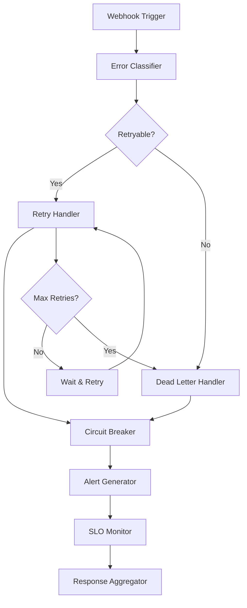
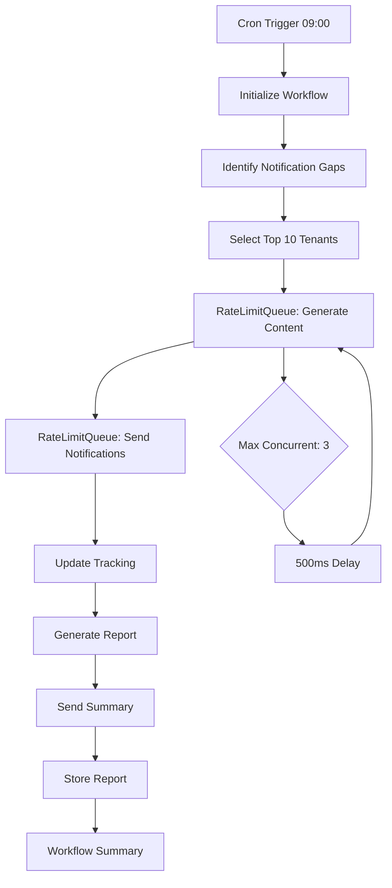
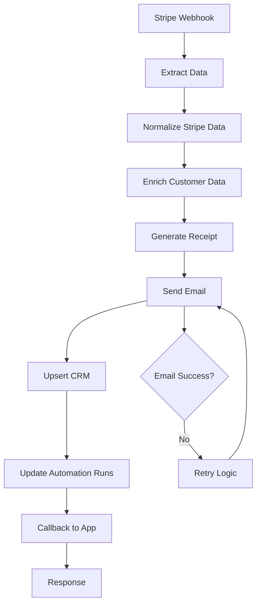

# Safety Systems, Prompt Ops, & Automations
**Date: 2025-08-25**

## Universal Header / Prompt Ops / Design-Safety / Autosave-JIT

### Universal Header Implementation
- **Location**: `UNIVERSAL_HEADER.md` (root), `docs/AI_RULES.md`, `docs/RENAMES.md`
- **Purpose**: Centralized rules and policies for AI-assisted development
- **Key Rules**:
  - Never rename/move directly; use ONLY rename scripts
  - Imports must use ONLY: `@app/*`, `@data/*`, `@lib/*`, `@ui/*`, `@registry/*`, `@compat/*`
  - Process: AUDIT → DECIDE → APPLY minimal diffs → VERIFY
  - Run `npm run doctor && npm run ci` and fix-forward until green
  - If touching `src/registry/*`, append entry to `/docs/CHANGE_JOURNAL.md` in SAME commit
  - Security: Never weaken RLS or expose secrets/keys/env

### Prompt Ops System
- **Location**: `AI_ENTRYPOINT.md`, `docs/PRODUCT_OVERVIEW.md`
- **Purpose**: Standardized AI interaction patterns and task intake
- **Entry Points**: AI entrypoint with mandatory checklist, product overview for context
- **Key Features**: Task extraction, constraint identification, scope definition, deliverable specification

### Design Safety & Autosave-JIT
- **Location**: `app/auto-save-demo/`, `scripts/` (auto-save related)
- **Purpose**: Automatic data persistence and just-in-time processing
- **Key Features**: Real-time saving, conflict resolution, offline support, user experience optimization

## OSS Hero Overview

### Purpose & Scope
OSS Hero is a comprehensive security framework that provides automated safety systems, policy enforcement, and operational safeguards. It replaces the legacy "MIT Hero" system with enhanced security features and automated monitoring.

### Key Components & Guards

#### 1. **Guardian Backup System**
- **Location**: `app/guardian-demo/`, `app/api/guardian/`, `scripts/oss-hero-security.mjs`
- **Purpose**: Continuous health monitoring and automatic backup system
- **Key Features**:
  - Continuous health monitoring every minute
  - Automatic backups every 5 minutes
  - Auto-recovery for common issues
  - Security vulnerability detection
  - Git health monitoring
  - TypeScript/ESLint health checks
  - Emergency backup system

#### 2. **Policy Enforcement**
- **Location**: `scripts/policy-enforcer.ts`, `scripts/oss-hero-security.mjs`
- **Purpose**: Automated policy checking and enforcement
- **Key Features**:
  - Import path validation
  - Registry change tracking
  - Security policy enforcement
  - RLS policy validation

#### 3. **Security Monitoring**
- **Location**: `scripts/oss-hero-security.mjs`, `scripts/security-*.mjs`
- **Purpose**: Continuous security assessment and vulnerability detection
- **Key Features**:
  - Automated security scans
  - Dependency vulnerability checking
  - Secrets hygiene monitoring
  - Security header validation

#### 4. **Feature Rollout Management**
- **Location**: `scripts/oss-hero-rollouts.mjs`, `app/rollouts/`, `app/safe-releases/`
- **Purpose**: Safe, controlled feature deployment with rollback capabilities
- **Key Features**:
  - Blue-green deployments
  - Canary releases
  - Automatic rollback
  - Health monitoring
  - Deployment gates

### Legacy MIT Hero References
**Not Found**: No current references to "MIT Hero" found in the codebase. The system has been fully migrated to OSS Hero with enhanced security features and automated safety systems.

## Automations & n8n

### 1. **Global Error Workflow**
- **File**: `n8n/global-error-workflow.json`
- **Purpose**: Comprehensive error handling, retry logic, and SLO monitoring
- **Triggers**: Webhook (`/global-error-handler`), failed workflow notifications
- **Critical Nodes**:
  - Error Classifier: Analyzes error severity and retry eligibility
  - Retry Handler: Implements exponential backoff (1s, 2s, 4s, 8s, 16s, 30s max)
  - Dead Letter Handler: Sanitizes and stores failed payloads
  - Circuit Breaker: Prevents cascading failures
  - SLO Monitor: Tracks real-time SLO metrics
- **External APIs**: Slack (alerts), GitHub (issues), Supabase (storage)
- **Idempotency/Retry**: Exponential backoff with max 5 retries, circuit breaker pattern
- **Expected Outputs**: Comprehensive execution summary, alerts, SLO reports

### 2. **Notify-10 Gap Fill Workflow**
- **File**: `n8n/notify-10-gap-fill.json`
- **Purpose**: Daily notification gap-filling with rate-limited processing
- **Triggers**: Cron (`0 9 * * *` - daily at 9:00 AM)
- **Critical Nodes**:
  - Gap Identifier: Queries database for notification gaps
  - RateLimitQueue: Controls concurrency (max 3, 500ms delay)
  - NotificationSender: Multi-channel delivery (email, SMS, in-app)
  - Progress Tracker: Real-time execution monitoring
- **External APIs**: Supabase (gap identification), notification services
- **Idempotency/Retry**: Rate-limited processing, error isolation
- **Expected Outputs**: Gap fill report, delivery metrics, performance analysis

### 3. **Stripe Receipt + CRM Mirror Workflow**
- **File**: `n8n/stripe-receipt-crm-mirror.json`
- **Purpose**: Payment success handling with receipt generation and CRM integration
- **Triggers**: Webhook (`/webhook/stripe-receipt`), Stripe payment events
- **Critical Nodes**:
  - Data Extractor: Validates and extracts webhook data
  - Receipt Generator: Creates HTML receipts with tenant branding
  - Email Sender: Delivers receipts via Resend
  - CRM Upserter: Mirrors data to external CRM systems
- **External APIs**: Stripe (webhooks), Resend (email), CRM systems
- **Idempotency/Retry**: Webhook idempotency, email retry logic
- **Expected Outputs**: Receipt delivery confirmation, CRM sync status

### 4. **Circuit Breaker & Rate Limiting Patterns**
- **Implementation**: Built into n8n workflows with configurable thresholds
- **Circuit Breaker Settings**:
  - Stripe API: 3 failures, 30s reset timeout
  - Supabase API: 5 failures, 60s reset timeout
  - Notification Service: 3 failures, 45s reset timeout
  - Webhook Endpoints: 4 failures, 40s reset timeout
- **Rate Limiting**: Max 3 concurrent operations with 500ms delays
- **Backoff Patterns**: Exponential backoff with maximum retry limits

## Operational Notes

### Logging & Monitoring
- **Log Locations**: Built-in logging in n8n workflows, Supabase logs, application logs
- **Error Surfacing**: 
  - Development: Console logs, error boundaries, Guardian dashboard
  - Production: Sentry integration, Guardian monitoring, n8n error workflows
- **Alerting Hooks**: Slack webhooks, GitHub issue creation, email notifications
- **Health Checks**: `/api/health`, `/api/operability/health`, Guardian monitoring

### Security Posture
- **Auth Model**: Supabase Auth with Row Level Security (RLS)
- **Secrets Handling**: Environment variables, no hardcoded secrets
- **Allowed Origins**: Configurable via `OSS_HERO_N8N_ALLOWED_ORIGINS`
- **Uploads**: Secure file handling with ownership validation
- **Risky Surfaces**: Webhook endpoints (protected with HMAC), cron jobs (authenticated)

### Known "Pay Attention" Areas
- **Migrations**: Database schema changes require RLS policy updates
- **Fragile Scripts**: Guardian backup system requires proper configuration
- **Experimental Flags**: TypeScript checking temporarily disabled for OSS Hero migration
- **Environment Variables**: Missing Sentry and notification service configurations
- **Rate Limits**: External API rate limits in n8n workflows
- **Circuit Breakers**: Service failure thresholds and reset timeouts

### Monitoring & Alerting
- **SLO Thresholds**: Defined in n8n workflows with violation detection
- **Health Metrics**: System health, performance, security status
- **Automated Responses**: Circuit breakers, retry logic, emergency rollbacks
- **Escalation Paths**: Slack alerts → GitHub issues → Emergency procedures

### Backup & Recovery
- **Guardian System**: Continuous monitoring and automatic backups
- **Emergency Procedures**: Emergency backup commands, rollback capabilities
- **Data Recovery**: Dead letter storage, investigation tracking, resolution management
- **Disaster Recovery**: Automated recovery procedures, health monitoring
