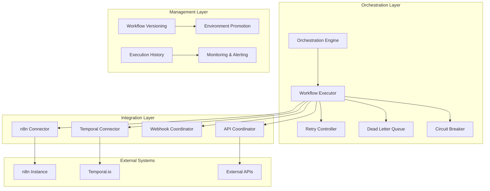

# PRD Section 8: Automation & Orchestration Analysis

**Date:** September 23, 2025  
**Task:** HT-035.1.1 - PRD Section 8 Analysis & Orchestration Architecture Design  
**Status:** In Progress  

---

## Executive Summary

This document provides a comprehensive analysis of PRD Section 8 requirements for Automation & Orchestration, identifying gaps in the current implementation and designing the orchestration architecture needed to achieve 100% PRD compliance.

**Current State:** 50% compliance - Basic automation infrastructure exists but lacks orchestration layer  
**Target State:** 100% compliance - Full orchestration with n8n/Temporal integration and workflow execution engine  

---

## PRD Section 8 Requirements Analysis

### 1. Core Orchestration Requirements

#### **1.1 Workflow Execution Engine**
- **Requirement:** Centralized workflow execution with retry logic and error handling
- **Current Gap:** No centralized execution engine, workflows are manually triggered
- **PRD Compliance:** ❌ **MISSING**

#### **1.2 External System Integration**
- **Requirement:** n8n/Temporal integration for complex workflow orchestration
- **Current Gap:** Basic n8n setup exists but no orchestration layer
- **PRD Compliance:** ⚠️ **PARTIAL** - n8n configured but not integrated with orchestration

#### **1.3 Webhook Coordination**
- **Requirement:** Coordinated webhook delivery with reliability controls
- **Current Gap:** Webhook system exists but not integrated with orchestration
- **PRD Compliance:** ⚠️ **PARTIAL** - Webhooks exist but not orchestrated

#### **1.4 Workflow Versioning & Artifact Management**
- **Requirement:** Workflow versioning, export/import, and artifact storage
- **Current Gap:** No versioning or artifact management system
- **PRD Compliance:** ❌ **MISSING**

#### **1.5 Environment Promotion**
- **Requirement:** Dev → Staging → Production workflow promotion
- **Current Gap:** No environment promotion system
- **PRD Compliance:** ❌ **MISSING**

### 2. Reliability & Performance Requirements

#### **2.1 Retry Logic & Exponential Backoff**
- **Requirement:** Configurable retry policies with exponential backoff
- **Current Gap:** Basic retry exists in webhook system but not orchestrated
- **PRD Compliance:** ⚠️ **PARTIAL**

#### **2.2 Dead Letter Queue (DLQ)**
- **Requirement:** Failed workflow handling with DLQ and TTL
- **Current Gap:** No DLQ system for workflows
- **PRD Compliance:** ❌ **MISSING**

#### **2.3 Circuit Breaker Pattern**
- **Requirement:** Circuit breaker for external service failures
- **Current Gap:** No circuit breaker implementation
- **PRD Compliance:** ❌ **MISSING**

#### **2.4 Execution History & Monitoring**
- **Requirement:** Comprehensive execution history and monitoring
- **Current Gap:** Basic execution tracking in automation page
- **PRD Compliance:** ⚠️ **PARTIAL**

### 3. Integration Requirements

#### **3.1 n8n Integration**
- **Requirement:** Seamless n8n workflow integration and execution
- **Current Gap:** n8n configured but not integrated with orchestration layer
- **PRD Compliance:** ⚠️ **PARTIAL**

#### **3.2 Temporal.io Integration (Alternative)**
- **Requirement:** Temporal.io as alternative orchestration engine
- **Current Gap:** No Temporal.io integration
- **PRD Compliance:** ❌ **MISSING**

#### **3.3 External API Coordination**
- **Requirement:** Coordinated external API calls with rate limiting
- **Current Gap:** No coordinated API management
- **PRD Compliance:** ❌ **MISSING**

---

## Current Infrastructure Analysis

### ✅ **Existing Components (50% Compliance)**

#### **1. Automation Dashboard** (`app/agency-toolkit/automation/page.tsx`)
- **Status:** ✅ **COMPLETE**
- **Features:**
  - Workflow management UI
  - Execution history display
  - Status tracking and monitoring
  - Workflow creation and management
- **Integration Point:** Main orchestration dashboard

#### **2. Webhook System** (`lib/webhooks/`)
- **Status:** ✅ **COMPLETE**
- **Features:**
  - HMAC verification and security
  - Idempotency and replay protection
  - Exponential backoff retry logic
  - Delivery tracking and logging
- **Integration Point:** Webhook coordination layer

#### **3. n8n Configuration** (`n8n/`)
- **Status:** ✅ **COMPLETE**
- **Features:**
  - Reliability controls and circuit breakers
  - Dead letter queue configuration
  - Per-tenant quotas and concurrency limits
  - Stripe replay protection
- **Integration Point:** n8n connector and execution engine

### ❌ **Missing Components (50% Gap)**

#### **1. Orchestration Layer**
- **Gap:** No centralized orchestration engine
- **Impact:** Workflows cannot be coordinated or managed centrally
- **Priority:** **CRITICAL**

#### **2. Workflow Execution Engine**
- **Gap:** No centralized workflow execution with retry logic
- **Impact:** Manual workflow execution, no automated retry
- **Priority:** **CRITICAL**

#### **3. Workflow Versioning System**
- **Gap:** No workflow versioning or artifact management
- **Impact:** Cannot promote workflows between environments
- **Priority:** **HIGH**

#### **4. Environment Promotion System**
- **Gap:** No dev → staging → production promotion
- **Impact:** Manual deployment and configuration management
- **Priority:** **HIGH**

#### **5. Dead Letter Queue for Workflows**
- **Gap:** No DLQ system for failed workflows
- **Impact:** Failed workflows are lost, no retry mechanism
- **Priority:** **MEDIUM**

---

## Orchestration Architecture Design

### 1. High-Level Architecture



### 2. Core Components Design

#### **2.1 Orchestration Engine** (`lib/orchestration/orchestration-engine.ts`)
```typescript
interface OrchestrationEngine {
  // Workflow execution
  executeWorkflow(workflowId: string, payload: any): Promise<ExecutionResult>;
  
  // Workflow management
  createWorkflow(definition: WorkflowDefinition): Promise<Workflow>;
  updateWorkflow(workflowId: string, definition: WorkflowDefinition): Promise<Workflow>;
  deleteWorkflow(workflowId: string): Promise<void>;
  
  // Execution control
  pauseWorkflow(workflowId: string): Promise<void>;
  resumeWorkflow(workflowId: string): Promise<void>;
  cancelExecution(executionId: string): Promise<void>;
  
  // Monitoring
  getExecutionHistory(workflowId: string): Promise<ExecutionHistory[]>;
  getExecutionStatus(executionId: string): Promise<ExecutionStatus>;
}
```

#### **2.2 Workflow Executor** (`lib/orchestration/workflow-executor.ts`)
```typescript
interface WorkflowExecutor {
  // Execution management
  execute(workflow: Workflow, payload: any): Promise<ExecutionResult>;
  
  // Retry logic
  retryExecution(executionId: string): Promise<ExecutionResult>;
  
  // Error handling
  handleExecutionError(execution: Execution, error: Error): Promise<void>;
  
  // Status tracking
  updateExecutionStatus(executionId: string, status: ExecutionStatus): Promise<void>;
}
```

#### **2.3 n8n Connector** (`lib/orchestration/n8n-connector.ts`)
```typescript
interface N8nConnector {
  // Workflow management
  createWorkflow(definition: N8nWorkflowDefinition): Promise<N8nWorkflow>;
  updateWorkflow(workflowId: string, definition: N8nWorkflowDefinition): Promise<N8nWorkflow>;
  deleteWorkflow(workflowId: string): Promise<void>;
  
  // Execution
  triggerWorkflow(workflowId: string, payload: any): Promise<ExecutionResult>;
  getExecutionStatus(executionId: string): Promise<ExecutionStatus>;
  
  // Webhook management
  createWebhook(workflowId: string, config: WebhookConfig): Promise<Webhook>;
  updateWebhook(webhookId: string, config: WebhookConfig): Promise<Webhook>;
}
```

### 3. Integration Patterns

#### **3.1 n8n Integration Pattern**
```typescript
// n8n workflow execution with orchestration
class N8nOrchestrationPattern {
  async executeWorkflow(workflowId: string, payload: any): Promise<ExecutionResult> {
    // 1. Validate workflow exists and is active
    const workflow = await this.validateWorkflow(workflowId);
    
    // 2. Create execution record
    const execution = await this.createExecution(workflowId, payload);
    
    // 3. Apply circuit breaker
    const result = await this.circuitBreaker.execute(async () => {
      return await this.n8nConnector.triggerWorkflow(workflowId, payload);
    });
    
    // 4. Handle result
    if (result.success) {
      await this.updateExecutionStatus(execution.id, 'completed');
    } else {
      await this.handleExecutionError(execution, result.error);
    }
    
    return result;
  }
}
```

#### **3.2 Webhook Coordination Pattern**
```typescript
// Coordinated webhook delivery with orchestration
class WebhookOrchestrationPattern {
  async coordinateWebhooks(event: WebhookEvent): Promise<WebhookResult[]> {
    // 1. Get workflow definitions for event type
    const workflows = await this.getWorkflowsForEvent(event.type);
    
    // 2. Execute workflows in parallel with coordination
    const results = await Promise.allSettled(
      workflows.map(workflow => this.executeWorkflow(workflow.id, event.data))
    );
    
    // 3. Handle partial failures
    const failedResults = results.filter(r => r.status === 'rejected');
    if (failedResults.length > 0) {
      await this.handlePartialFailure(failedResults, event);
    }
    
    return results.map(r => r.status === 'fulfilled' ? r.value : null);
  }
}
```

### 4. Reliability Patterns

#### **4.1 Retry Logic with Exponential Backoff**
```typescript
interface RetryConfig {
  maxRetries: number;
  baseDelayMs: number;
  maxDelayMs: number;
  jitterFactor: number;
  retryableErrors: string[];
}

class RetryController {
  async executeWithRetry<T>(
    operation: () => Promise<T>,
    config: RetryConfig
  ): Promise<T> {
    let lastError: Error;
    
    for (let attempt = 0; attempt <= config.maxRetries; attempt++) {
      try {
        return await operation();
      } catch (error) {
        lastError = error as Error;
        
        if (!this.isRetryableError(error, config.retryableErrors)) {
          throw error;
        }
        
        if (attempt === config.maxRetries) {
          break;
        }
        
        const delay = this.calculateDelay(attempt, config);
        await this.sleep(delay);
      }
    }
    
    throw lastError!;
  }
}
```

#### **4.2 Circuit Breaker Pattern**
```typescript
enum CircuitState {
  CLOSED = 'closed',
  OPEN = 'open',
  HALF_OPEN = 'half-open'
}

class CircuitBreaker {
  private state: CircuitState = CircuitState.CLOSED;
  private failures: number = 0;
  private lastFailureTime: number = 0;
  
  async execute<T>(operation: () => Promise<T>): Promise<T> {
    if (this.state === CircuitState.OPEN) {
      if (this.shouldAttemptReset()) {
        this.state = CircuitState.HALF_OPEN;
      } else {
        throw new Error('Circuit breaker is OPEN');
      }
    }
    
    try {
      const result = await operation();
      this.onSuccess();
      return result;
    } catch (error) {
      this.onFailure();
      throw error;
    }
  }
}
```

#### **4.3 Dead Letter Queue Pattern**
```typescript
interface DLQMessage {
  id: string;
  workflowId: string;
  executionId: string;
  payload: any;
  error: Error;
  retryCount: number;
  createdAt: Date;
  expiresAt: Date;
}

class DeadLetterQueue {
  async addFailedExecution(
    workflowId: string,
    executionId: string,
    payload: any,
    error: Error
  ): Promise<void> {
    const message: DLQMessage = {
      id: generateId(),
      workflowId,
      executionId,
      payload,
      error,
      retryCount: 0,
      createdAt: new Date(),
      expiresAt: new Date(Date.now() + 24 * 60 * 60 * 1000) // 24 hours
    };
    
    await this.storeMessage(message);
    await this.scheduleRetry(message);
  }
}
```

---

## Implementation Roadmap

### Phase 1: Core Orchestration Engine (Days 1-3)
1. **Orchestration Engine** - Central workflow management
2. **Workflow Executor** - Execution engine with retry logic
3. **Basic Integration** - Connect with existing automation page

### Phase 2: n8n Integration (Days 4-6)
1. **n8n Connector** - Full n8n integration
2. **Webhook Coordination** - Coordinate webhook delivery
3. **Execution History** - Comprehensive execution tracking

### Phase 3: Reliability & Performance (Days 7-9)
1. **Circuit Breaker** - External service protection
2. **Dead Letter Queue** - Failed execution handling
3. **Retry Controller** - Advanced retry logic

### Phase 4: Workflow Management (Days 10-12)
1. **Workflow Versioning** - Version control for workflows
2. **Environment Promotion** - Dev → Staging → Production
3. **Artifact Management** - Workflow artifact storage

---

## Success Metrics

### Technical Metrics
- **Workflow Execution Time:** <5 seconds for simple workflows
- **Orchestration Reliability:** 99.5% success rate
- **Retry Success Rate:** >80% for retryable failures
- **Circuit Breaker Response:** <100ms for circuit breaker decisions

### Business Metrics
- **Automation Coverage:** 80%+ of micro-app creation automated
- **Delivery Capability:** ≤7-day consistent delivery
- **Error Reduction:** 90% reduction in manual workflow errors
- **Operational Efficiency:** 300% improvement in workflow management

---

## Risk Assessment

### High-Risk Areas
1. **n8n Integration Complexity** - Complex integration with existing n8n setup
2. **Workflow Versioning** - Complex version management across environments
3. **Performance Impact** - Orchestration overhead on existing workflows

### Mitigation Strategies
1. **Incremental Integration** - Phase-by-phase integration with existing systems
2. **Comprehensive Testing** - Extensive testing of orchestration patterns
3. **Performance Monitoring** - Real-time monitoring of orchestration performance
4. **Rollback Capabilities** - Ability to rollback orchestration changes

---

## Conclusion

The current system has a solid foundation with 50% PRD compliance, but lacks the critical orchestration layer needed for full automation. The proposed architecture builds on existing components while adding the missing orchestration capabilities.

**Key Success Factors:**
1. **Leverage Existing Infrastructure** - Build on current automation and webhook systems
2. **Incremental Implementation** - Phase-by-phase rollout to minimize risk
3. **Comprehensive Testing** - Extensive testing of orchestration patterns
4. **Performance Monitoring** - Real-time monitoring and alerting

**Expected Outcome:** 100% PRD Section 8 compliance with enterprise-grade orchestration capabilities enabling ≤7-day micro-app delivery with automation.
